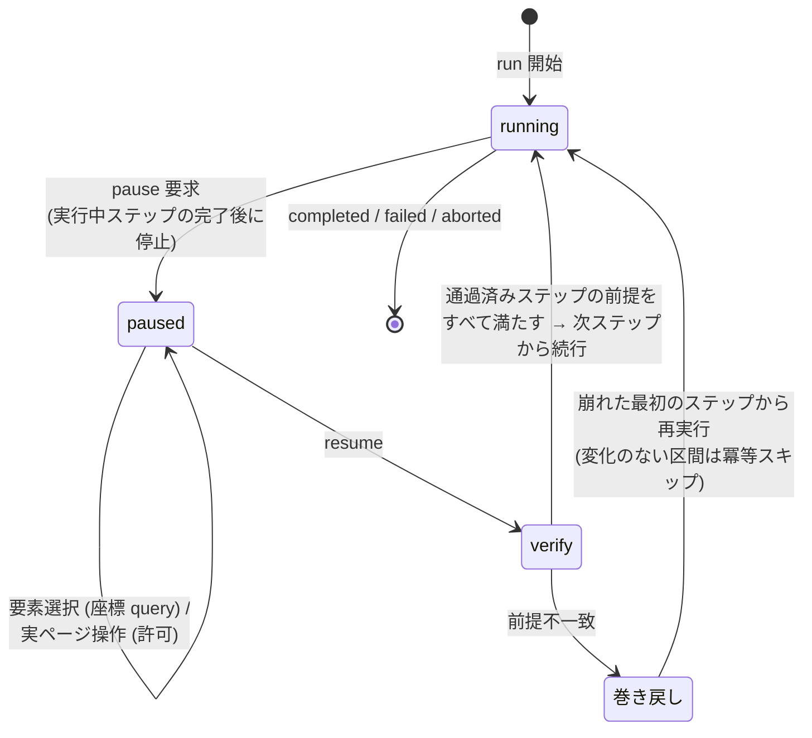

# ADR-0002: 一時停止をステップ境界とし、pause 中の実ページ操作を許可して再開時に再検証する

## 状態

承認

## 決定日

2026-08-04

## 背景

- 再生制御 (一時停止・再開・再実行) は MVP のコア体験だが、DesignDoc の Open Question として「一時停止中の画面操作の扱い」が core/execution 設計前の決定事項になっていた。
- 要素選択そのものは viewport 上の座標を Element Inspector に問い合わせる読み取り操作で実現でき、実ページへの操作転送を必要としない。
- 一方、ドロップダウンを開いた状態の要素を採番したい等、編集中の探索として実ページ操作が必要な場面がある。

## 決定

- 一時停止は**ステップ境界でのみ**効く。pause 要求は実行中ステップの完了後に停止する予約として扱う。
- 一時停止中の**実ページ操作を許可**する。要素選択のための座標問い合わせは操作に含めず常に可能とする。
- **再開時に通過済みステップの期待状態を再評価**し、満たさなくなった最初のステップへ巻き戻して再実行する。冪等スキップにより、変化のない区間は高速に通過する。

決定した挙動を状態遷移図で示す。

## 代替案

- **閲覧のみ (操作を転送しない)**: 再開が最も単純で再現性も高いが、探索的な操作を禁じると「止めて編集する」体験が痩せる。ドロップダウン等の状態はすべて DSL の到達手順として先に書く必要があり、編集ループが長くなるため却下。
- **設定で両モード切り替え**: 実装量と検証パスが倍になる割に、再検証 + 巻き戻しがあれば操作許可モードだけで安全性を担保できるため MVP では却下。
- **命令単位の即時停止**: 応答性は高いが、ステップ内の中途半端な状態からの再開・再検証が複雑化する。再開点が常にステップ境界に揃う単純さを優先して却下。

## 影響

### 良い影響

- 「draft は自由・確定は承認」の思想と揃い、エージェント・利用者の探索を妨げない。
- 再開時の状態保証が「期待状態の再評価」という既存の冪等機構の再利用で済み、専用の状態復元機構が不要。

### 悪い影響 / トレードオフ

- 破壊的な探索操作 (フォーム送信等) を行うと巻き戻しでも復元できない場合がある。復元は DSL の到達手順の再実行に依存する (外部副作用の完全な冪等性は DesignDoc の Non Goals)。
- 長いワークフローでは巻き戻し再実行に時間がかかる (冪等スキップで緩和)。

### 影響範囲

- 対象モジュール / package: execution / web / agent

## 実装・運用への反映

- spec 更新要否: 不要 (spec 未作成)
- context / AI 向け設定更新要否:
  - [design/DesignDoc.md](../design/DesignDoc.md) の Open Question「一時停止中の画面操作の扱い」を解決済みとして削除する — 本 commit で実施
  - 詳細設計は [design/features/execution/DesignDoc_execution.md](../design/features/execution/DesignDoc_execution.md) に反映済み

## 関連ドキュメント / チケット

- [design/DesignDoc.md](../design/DesignDoc.md): 再生制御の成功条件
- [design/features/execution/DesignDoc_execution.md](../design/features/execution/DesignDoc_execution.md)
- spec / PR: なし
