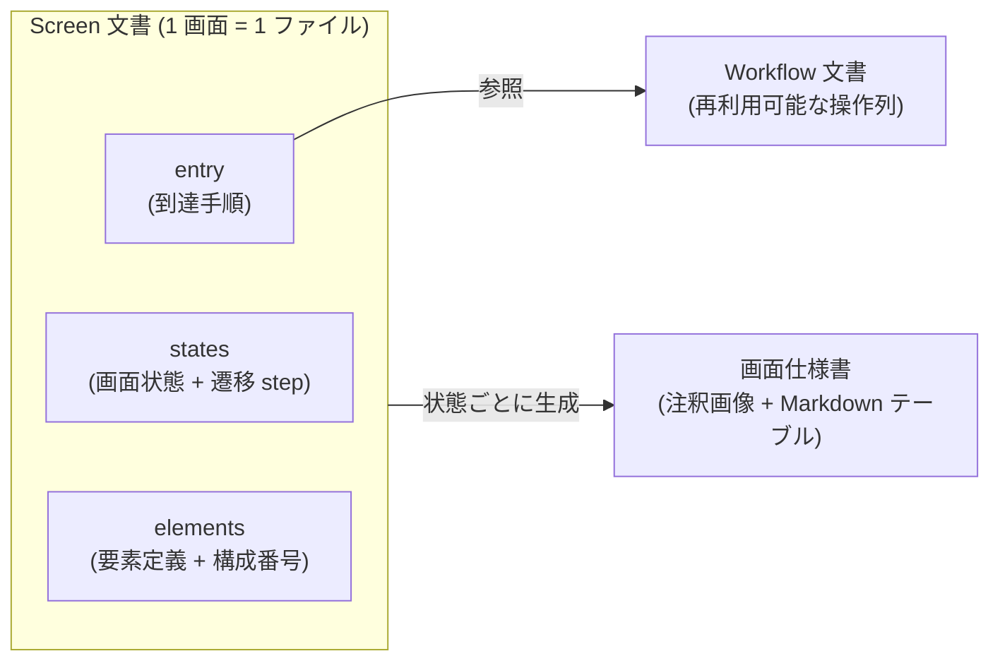

# ADR-0003: DSL を Screen と Workflow に分離し、構成番号を画面単位・永久欠番とする

## 状態

承認 — ただし永久欠番の決定は [ADR-0005](0005-renumbering.md) (読み順の再採番・欠番なし) に置換された

## 決定日

2026-08-04

## 背景

- workflow-dsl feature の設計にあたり、DSL の第一級構造 (1 ファイルの単位) を決める必要があった。
- DesignDoc の Open Question「構成番号の採番スコープ」「削除済み番号の扱い」の期限が DSL Schema v1 確定前であり、DSL のどこに何を書くかに直結する。
- 成果物 (画面仕様書) は画面単位で生成される一方、画面到達の操作列は複数画面で再利用したい。

## 決定

- DSL を **Screen 文書と Workflow 文書の 2 種類に分離**する。Screen は要素定義・構成番号・画面状態を持つ仕様書の生成単位、Workflow は再利用可能な操作列で Screen の entry から参照する。
- **状態遷移の step は Screen 文書内に持つ**。モーダル開閉のような画面内状態は画面の関心事であり、Screen 内で自己完結して宣言する。step の語彙は Workflow と同一とし、実行時は同じ IR ステップに正規化する。
- 構成番号は**画面単位で採番**する。同じ画面の別状態でも同じ要素は同じ番号を保つ。
- ~~削除した要素の番号は永久欠番とし、再利用しない~~ — [ADR-0005](0005-renumbering.md) で「読み順の再採番で欠番を作らない」に置換。

文書の関係を図で示す。

## 代替案

- **Screen 第一級のみ (1 種類)**: 到達手順も画面内に書く。文書は 1 種類で単純だが、複数画面で共通するログイン等の操作列を画面ごとに複製することになり、変更が全画面に波及するため却下。
- **Workflow 第一級のみ**: 画面をまたぐ検証は書きやすいが、要素定義・構成番号の置き場が操作列の中の状態に紐づき、画面仕様書との対応が間接的になるため却下。
- **採番を状態単位にする**: 状態ごとに番号が振り直され、同一要素が状態間で別番号になり追跡性が落ちるため却下。
- **採番を文書単位 (複数画面で通し) にする**: 画面の追加・削除で番号が大きくずれるため却下。
- **削除番号の明示的再利用を許す**: 番号は詰まるが、過去の仕様書・差分履歴との突合で「同じ番号が別要素を指す」事態が起きるため却下。

## 影響

### 良い影響

- Screen 文書と画面仕様書が 1:1 に対応し、成果物生成と差分検知の単位が自明になる。
- 到達手順の変更が Workflow 文書 1 箇所の修正で済む。
- 番号の意味が時間を通じて安定し、仕様書の版間比較ができる。

### 悪い影響 / トレードオフ

- 文書間参照 (entry の Workflow 参照、`ref` の要素参照) の解決と検証が必要になる (core/workflow の正規化で吸収)。
- 永久欠番により番号は増え続ける (画面単位の採番なので実害は小さい)。

### 影響範囲

- 対象モジュール / package: workflow / element / artifact / diff

## 実装・運用への反映

- spec 更新要否: 不要 (spec 未作成)
- context / AI 向け設定更新要否:
  - [design/DesignDoc.md](../design/DesignDoc.md) の Open Question「構成番号の採番スコープ」「削除済み番号の扱い」を解決済みとして削除する — 本 commit で実施
  - 詳細設計は [design/features/workflow-dsl/DesignDoc_workflow-dsl.md](../design/features/workflow-dsl/DesignDoc_workflow-dsl.md) に反映済み
  - 欠番管理の規則詳細は element-mapping feature doc 起案時に定義する — 未実施

## 関連ドキュメント / チケット

- [design/DesignDoc.md](../design/DesignDoc.md): スコープ (ワークフロー定義 / 要素同一性)
- [design/features/workflow-dsl/DesignDoc_workflow-dsl.md](../design/features/workflow-dsl/DesignDoc_workflow-dsl.md)
- spec / PR: なし
