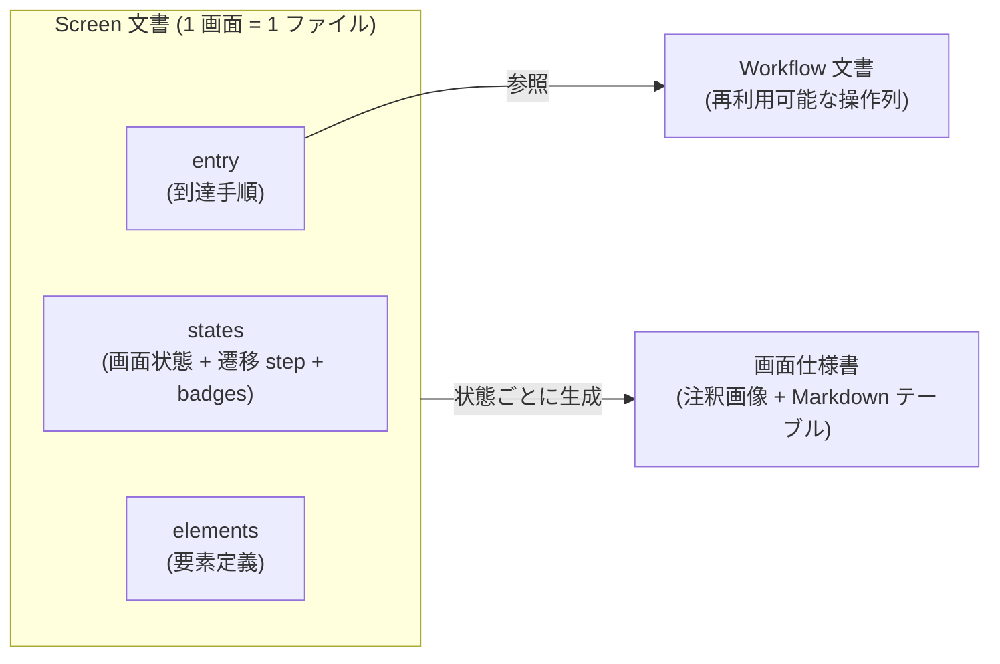

# ADR-0003: DSL を Screen と Workflow の 2 文書に分離する

## 状態

承認

## 決定日

2026-08-04

## 背景

- workflow-dsl feature の設計にあたり、DSL の第一級構造 (1 ファイルの単位) を決める必要があった。
- 成果物 (画面仕様書) は画面単位で生成される一方、画面到達の操作列は複数画面で再利用したい。
- 既存の画面仕様書の運用 (実画面の撮影・文書化) では、一覧の行要素のような同一セレクタの繰り返し、条件付きでしか表示されない要素、ダイアログ単位の切り抜き撮影、別文書化した子画面へのリンク、canvas 描画のため DOM に現れない操作対象が日常的に発生する。これらを表現できない DSL では実画面の文書化が成立しない。

## 決定

- DSL を **Screen 文書と Workflow 文書の 2 種類に分離**する。Screen は要素定義・構成番号・画面状態を持つ仕様書の生成単位、Workflow は再利用可能な操作列で Screen の entry から参照する。
- **状態遷移の step は Screen 文書内に持つ**。モーダル開閉のような画面内状態は画面の関心事であり、Screen 内で自己完結して宣言する。step の語彙は Workflow と同一とし、実行時は同じ IR ステップに正規化する。
- 実画面の文書化に必要な語彙を DSL に持つ:
  - 要素の表示区分: `badges` に載るバッジ要素 / `optional` (条件付き表示。テーブルに番号 `-` と `note` で載る。未実装は `unimplemented` を併記) / どちらでもない補助要素 (テーブル非掲載)
  - Locator の `index` (同一 Locator 複数一致時の 1 始まり nth) と `all` (該当全件に同番号バッジ。繰り返し要素用)
  - state の `clip` (撮影領域のセレクタ指定)
  - 要素の `child_doc` (別文書化した子画面への参照。テーブルでは番号なしのリンク行)
  - action の `clickPoint` (座標クリック。canvas 等 DOM に現れない対象専用)、`hover`、`scroll`
  - 成果物の出力パスの文書ごとの指定

文書の関係を図で示す。

## 代替案

- **Screen 第一級のみ (1 種類)**: 到達手順も画面内に書く。文書は 1 種類で単純だが、複数画面で共通するログイン等の操作列を画面ごとに複製することになり、変更が全画面に波及するため却下。
- **Workflow 第一級のみ**: 画面をまたぐ検証は書きやすいが、要素定義・構成番号の置き場が操作列の中の状態に紐づき、画面仕様書との対応が間接的になるため却下。
- **複数一致 (`ambiguous`) を常にエラーにする**: 一覧・テーブルを含む実画面では同一 testid の行要素が普通に存在し、エラー扱いでは文書が書けないため却下。Semantic Locator での絞り込みを推奨とし、`index` は明示的な逃げ道として残す。
- **任意 JS 実行 (`eval`) の導入**: スクロール等の用途に限られるため専用 action (`scroll`) で代替し、任意 JS 実行は Non Goals を維持する。

## 影響

### 良い影響

- Screen 文書と画面仕様書が 1:1 に対応し、成果物生成と差分検知の単位が自明になる。
- 到達手順の変更が Workflow 文書 1 箇所の修正で済む。
- 一覧・条件付き表示・子画面分割を含む実画面を、語彙の不足で詰まらずに文書化できる。

### 悪い影響 / トレードオフ

- 文書間参照 (entry の Workflow 参照、`ref` の要素参照、`child_doc`) の解決と検証が必要になる (core/workflow の正規化で吸収)。
- `index` は DOM 順に依存する脆い指定であり、乱用すると差分検知のノイズ源になる。Semantic Locator で絞れない場合の逃げ道と位置づける。

### 影響範囲

- 対象モジュール / package: workflow / execution / element / artifact / diff

## 実装・運用への反映

- spec 更新要否: 不要 (spec 未作成)
- context / AI 向け設定更新要否:
  - 詳細設計は [design/features/workflow-dsl/DesignDoc_workflow-dsl.md](../design/features/workflow-dsl/DesignDoc_workflow-dsl.md) に反映済み
  - 採番の規則は [adr/0005](0005-renumbering.md) と element-mapping feature doc を正本とする

## 関連ドキュメント / チケット

- [design/DesignDoc.md](../design/DesignDoc.md): スコープ (ワークフロー定義 / 要素同一性)
- [design/features/workflow-dsl/DesignDoc_workflow-dsl.md](../design/features/workflow-dsl/DesignDoc_workflow-dsl.md)
- [adr/0005-renumbering.md](0005-renumbering.md): 構成番号の採番規則
- spec / PR: なし
