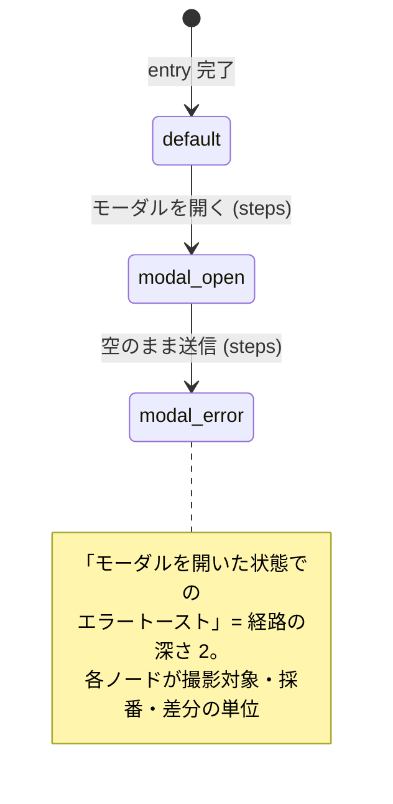
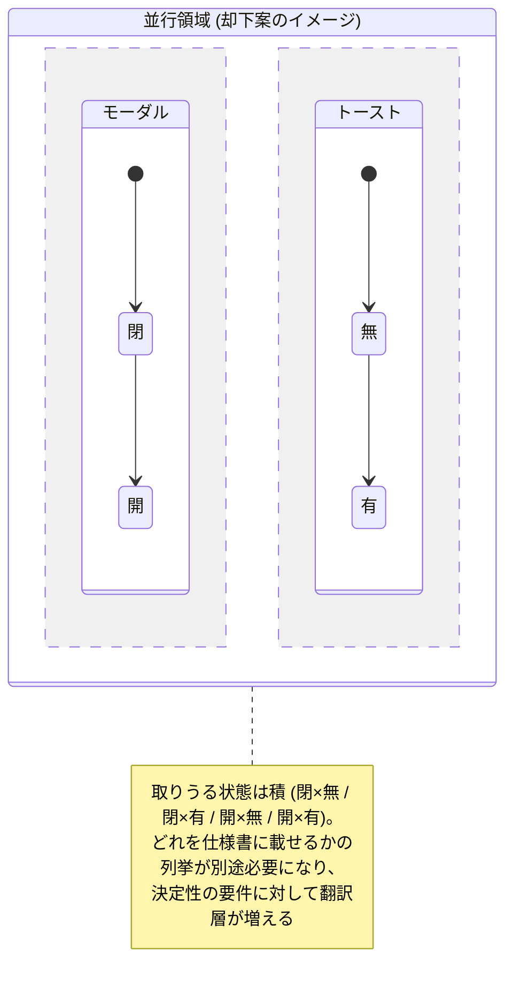

# ADR-0004: 画面状態を default 根の木で表し、statechart と直交合成を採らない

## 状態

承認

## 決定日

2026-08-04

## 用語解説

本 ADR で比較する状態モデルの用語を先に整理する。

- **状態遷移図 (state machine)**: システムを「状態」の集合と「遷移」(ある状態から別の状態への移り変わり) で表すモデル。
- **statechart**: 状態遷移図の拡張。主な拡張は 3 つ。
  - **階層 (compound state)**: 状態の中に子状態を持てる。「モーダル表示中」の中に「入力中」「エラー」を置ける。
  - **並行領域 (parallel region)**: 独立な軸を同時に持てる。「モーダルの開閉」と「トーストの有無」を別々の小さな状態機械として並走させ、組み合わせ (開 × 有、開 × 無、…) を自動的に表現する。
  - **イベント駆動**: 「クリックというイベントが来たらこの遷移が起きる」というリアクティブな振る舞いを記述する。UI の実行時の状態管理エンジンとして動かすのが本来の用途。
- **XState**: statechart を TypeScript で実装した定番ライブラリ。
- **フラグメント合成 (mixin)**: 状態を「オーバーレイ断片」の合成として宣言する方式 (`modal-error = modal-open + toast-error` のような書き方)。
- **木 (tree) モデル**: 本 ADR で採用する方式。各状態が 1 つの遷移元 (`from`) を持ち、根 (`default`) からの経路が到達手順そのものになる。

## 背景

- workflow-dsl の設計中に「ネストした状態 (モーダルを開いた状態でのエラートースト) をどう表現するか」が論点になった。
- 本製品の DSL が表現したいのは **UI の実行時の振る舞いではなく、「文書化する画面状態のカタログと、そこへの到達手順」**である。
  - 成果物 (画面仕様書) の生成には、撮影対象となる**有限で明示的な状態リスト**が必要 (決定性の要件)。
  - 実行は「宣言された経路を線形に再生する」モデルであり、任意のタイミングでイベントが飛ぶリアクティブな意味論を必要としない。
- 将来機能 (ノードベース編集、Playwright 生成、複数画面をまたぐ検証) を含めて、statechart でなければ表現できない要件が存在しない。

## 決定

- 画面状態は **`default` を根とする木**で宣言する。各状態は遷移元 `from` と遷移手順 `steps` を持ち、ネストは `from` 連鎖の深さで表す (`default → modal-open → modal-error`)。
- **要素は遷移元の状態から継承**する。要素定義には初出の状態だけを書き、子孫状態へ自動で引き継ぐ。子孫で消える要素は除外を明示する。
- 操作列の重複は**名前付き step 断片** (`fragments` / `use`) の参照で解消する。断片は単なる展開であり、状態の意味論に影響しない。
- statechart (階層 + 並行領域 + イベント駆動) と、フラグメント合成による直交軸の自動合成は**採用しない**。

採用した木モデルでは、ネストした状態は根からの経路で表す。

却下した statechart の並行領域は、軸を独立に持ち組み合わせを暗黙に生む。

## 代替案

- **statechart (XState 風) を DSL の状態モデルにする**: ネストと直交を形式的に表現でき、TS エコシステムに実装知見も多い。しかし (1) 並行領域の状態空間は軸の積になるため、撮影対象の列挙という決定性要件に対して「どの組み合わせを仕様書に載せるか」の翻訳層が別途必要になる。(2) イベント駆動の意味論は線形再生 + 冪等スキップの実行モデルと噛み合わない。(3) 書き手とエージェントに statechart の意味論 (entry/exit、遷移解決順) の学習を強い、draft 生成のエラー面が広がる。効く場面が要件に存在しないためコストのみが残り、却下。
- **フラグメント合成で直交軸を自動合成する**: 軸を 1 回ずつ定義して組み合わせられるが、実際の UI では「トーストを出す操作はモーダル内の送信ボタン」のように断片の到達手順が文脈依存であることが多く、断片 steps の機械的な連結が到達手順にならない。結合規則を定義し始めると statechart 並みの複雑さに近づくため却下。
- **木のみで断片も継承もなし (初案)**: モデルは最も単純だが、深い状態で操作列と要素列挙のコピーが増える。書き味の欠点だけを断片参照と継承で解消できるため、素の木は採らない。

## 影響

### 良い影響

- 状態 = 仕様書に載る単位 = 差分の単位が常に一致し、採番・成果物・差分の対応が自明に保たれる。
- 将来のノードベース編集は「states をノード、from をエッジ」としてそのまま可視化できる。
- 正規化 (経路の平坦化・継承の展開) が単純で、同じ文書から常に同じ IR が出る。

### 悪い影響 / トレードオフ

- 直交する軸の組み合わせは手で列挙する必要がある。組み合わせが多い画面では宣言が長くなる。
- 直交合成が将来必要になった場合は、木の意味論を保ったまま「組み合わせを展開して木のノードを生成する糖衣」を後方互換で足す (その時点で ADR を起こす)。

### 影響範囲

- 対象モジュール / package: workflow / execution / element / artifact / diff / web

## 実装・運用への反映

- spec 更新要否: 不要 (spec 未作成)
- context / AI 向け設定更新要否:
  - [design/features/workflow-dsl/DesignDoc_workflow-dsl.md](../design/features/workflow-dsl/DesignDoc_workflow-dsl.md) の状態モデル節に反映済み
  - 要素継承の除外構文 (`hidden-in`) の最終名は `hidden-in` で確定する — 実施済み
    - 下流の [workflow-dsl feature](../design/features/workflow-dsl/DesignDoc_workflow-dsl.md) が既に規則として記述しており、暫定名のまま参照が広がっている。読んで意味が通り、他の語彙と衝突しないため、名前を変える利得がない

## 関連ドキュメント / チケット

- [design/features/workflow-dsl/DesignDoc_workflow-dsl.md](../design/features/workflow-dsl/DesignDoc_workflow-dsl.md): 状態モデル
- [adr/0003-dsl-structure.md](0003-dsl-structure.md): Screen / Workflow の分離
- spec / PR: なし
