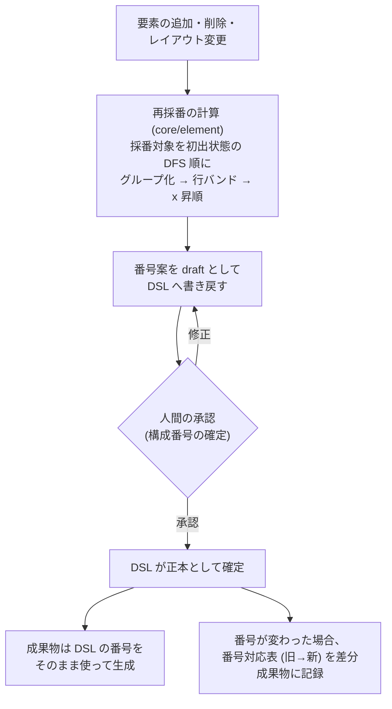

# ADR-0005: 構成番号は DSL に保存し、読み順の再採番で欠番を作らず管理する

## 状態

承認 (ADR-0003 の永久欠番の決定を置換する)

## 決定日

2026-08-05

## 背景

- ADR-0003 では構成番号を画面単位・永久欠番で安定させる方針を採った。
- しかしこの方針には、(1) 削除で欠番が生まれ読み手に「なぜ番号が飛ぶのか」の違和感を与える、(2) 画面の途中 (左上など) に要素を追加しても番号は末尾になり、バッジの並びが読み順から崩れていく、という時間経過で悪化する欠点がある。
- 番号を安定させる価値は「仕様書の番号をテスト項目書やチケットなど外部に書き写して使う」運用があるときに生じる。本プロダクトでは**その運用を想定しない**と判断した (仕様書は常に最新版を参照し、要素の指名は名称・スクリーンショットで行う)。
- 一方、構成番号を DSL に保存せず生成時に導出する案は、**成果物にしか存在しない情報を作り「DSL が唯一の正本」の原則を壊す**ため採れない。
- 番号なし要素 (バッジもテーブル表示も不要な補助要素) の扱いと、採番順の規則性も未定義だった。

## 決定

- **構成番号は DSL (Screen 文書の要素定義) に保存する**。成果物は DSL に書かれた番号をそのまま使い、生成時に番号を計算しない。
- **再採番はシステムが計算して DSL へ書き戻す操作**とする。要素の追加・削除・レイアウト変更の後、採番対象の要素へ読み順で 1..N を振り直した番号案を draft として DSL に反映し、承認 (構成番号の確定) を経て正本になる。**毎版の再採番を許容し、欠番を作らない**。
- **採番順序は読み順**とする: 要素の初出状態を状態木の DFS 順 (default → 宣言順の子孫) でグループ化し、グループ内は撮影時の bounding box から「y 座標を許容幅で行バンドにまとめ、行内は x 昇順」(左上 → 右 → 下) で決定的に並べる。許容幅は固定の設定値とし、同じ撮影結果からは常に同じ順序を導出する。
- **手動編集も許す**: DSL が正本なので、利用者は番号を直接編集できる。検証は重複の禁止のみで、連番性は要求しない (再採番操作を使えば連番に揃う)。
- **番号なし要素**を導入する: 要素定義にフラグを持たせ、DSL 上は存在して `ref` 参照 (Locator / Expectation / 操作対象) に使えるが、バッジ付与・テーブル表示・採番の対象外とする。
- **版間の追跡は永続要素 ID で行う**。再採番で番号が変わった場合、差分成果物に番号対応表 (旧番号 → 新番号、要素 ID 基準) を含める。

再採番の流れ:

## 代替案

- **安定番号 + 永久欠番 (ADR-0003 の旧決定)**: 番号への外部引用が壊れない利点があるが、その運用を想定しない以上、欠番の違和感と途中挿入による順序崩れのコストだけが残るため置換。
- **ハイブリッド (既定は安定、明示操作でのみ再採番)**: 「いつ番号が変わるか」を人間が制御できるが、外部引用がない前提では守る対象がなく、欠番管理 (tombstone / カウンタ) という管理状態が増えるだけのため却下。
- **構成番号を DSL に保存せず生成時に導出する**: 採番管理が DSL から消えて最も単純だが、成果物にしか存在しない情報が生まれ「画像・テーブルを個別に編集可能な正本にしない」という DesignDoc の原則と矛盾するため却下。番号の承認ゲート (構成番号の確定) の対象も失われる。
- **tombstone / カウンタによる欠番管理**: 永久欠番の実現手段として比較したが、欠番を作らない方針にしたことで前提ごと不要になった。

## 影響

### 良い影響

- 仕様書の番号が常に連番・読み順になり、人間の読解に違和感がない。
- DSL が番号を含めて唯一の正本であり続け、成果物生成は決定的な写像のまま。
- 再採番の結果も draft → 承認のゲートを通るため、番号の変更が黙って起きない。

### 悪い影響 / トレードオフ

- 再採番すると同じ要素の番号が版間で変わりうる。仕様書の番号を外部へ書き写す運用を将来始める場合は、本 ADR の再検討が必要 (番号対応表がその移行の入力になる)。
- 読み順の計算が撮影結果 (幾何情報) に依存するため、レイアウトの微小な揺れが行バンドの境界で順序案を変えるリスクがある。許容幅の設定と、承認時の手動修正で緩和する。
- 要素の追加・削除のたびに再採番 → 承認の一手間が挟まる (再採番案の自動生成で作業自体は軽い)。

### 影響範囲

- 対象モジュール / package: workflow / element / artifact / diff / web

## 実装・運用への反映

- spec 更新要否: 不要 (spec 未作成)
- context / AI 向け設定更新要否:
  - [adr/0003-dsl-structure.md](0003-dsl-structure.md) の状態に置換の印を付ける — 本 commit で実施
  - [design/features/workflow-dsl/DesignDoc_workflow-dsl.md](../design/features/workflow-dsl/DesignDoc_workflow-dsl.md) の要素定義・正規化の記述を更新する — 本 commit で実施
  - 読み順導出・再採番・番号なし要素の規則詳細は element-mapping feature doc に定義する — 本 commit で実施

## 関連ドキュメント / チケット

- [adr/0003-dsl-structure.md](0003-dsl-structure.md): 置換対象 (永久欠番の決定)
- [design/features/element-mapping/DesignDoc_element-mapping.md](../design/features/element-mapping/DesignDoc_element-mapping.md): 採番規則の正本
- spec / PR: なし
