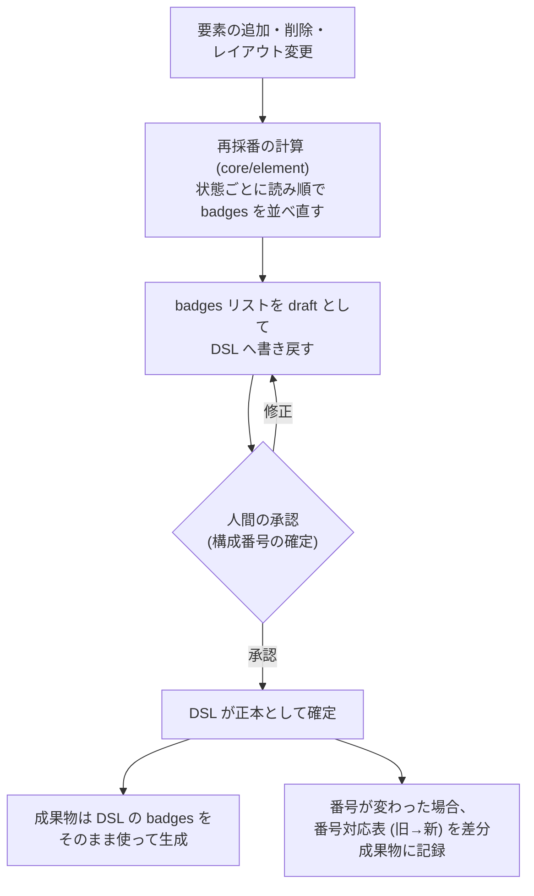

# ADR-0005: 構成番号は状態単位で採番し、badges リストを正本に読み順の再採番で管理する

## 状態

承認

## 決定日

2026-08-05

## 背景

- 構成番号の管理には、(1) どの範囲で番号を振るか (スコープ)、(2) 削除・追加で番号がどう動くか、(3) 番号を DSL と成果物のどちらが持つか、の 3 つの決定が必要だった。
- 番号を固定して安定させる価値は「仕様書の番号をテスト項目書やチケットなど外部に書き写して使う」運用があるときに生じる。本プロダクトでは**その運用を想定しない**と判断した (仕様書は常に最新版を参照し、要素の指名は名称・スクリーンショットで行う)。
- 番号を安定させる方式 (欠番の許容) には、削除で生まれる欠番が読み手に「なぜ番号が飛ぶのか」という違和感を与え、画面の途中に要素を追加すると番号が読み順から崩れていく、という時間経過で悪化する欠点がある。
- 既存の画面仕様書の運用では、画像 1 枚 + 構成要素テーブル 1 つを状態ごとのセットとして生成し、番号は状態内で 1 からの連番にするのが慣行である。画面全体で番号を通すと、後発状態の画像のバッジが途中番号から始まり、同じ違和感が状態方向にも発生する。
- 構成番号を DSL に保存せず生成時に導出する案は、**成果物にしか存在しない情報を作り「DSL が唯一の正本」の原則を壊す**ため採れない。

## 決定

- **構成番号は状態単位で採番する**。各状態が画像 + テーブルのセットを生成し、番号は常に 1..N の連番で欠番を作らない。同じ要素でも状態が違えば番号は変わりうる (状態間・版間の追跡は永続要素 ID で行う)。
- **DSL 上の番号の正本は、state ごとの `badges` 順序リスト**とする。リストの位置がそのまま構成番号であり、要素定義側に `number` フィールドは持たない。成果物は DSL の badges をそのまま使い、生成時に番号を計算しない。
- **再採番はシステムが計算して DSL へ書き戻す操作**とする。読み順 (撮影結果の bounding box から、y 座標を許容幅で行バンドにまとめ、バンド順 → バンド内 x 昇順。左上 → 右 → 下) で並べた badges リストを draft として反映し、承認 (構成番号の確定) を経て正本になる。同じ撮影結果と設定からは常に同じ並びを導出する。
- **手動編集も許す**: DSL が正本なので、利用者は badges の並びを直接編集できる。検証は参照解決と重複の禁止のみ。
- **番号が変わった場合、差分成果物に番号対応表 (旧 → 新、要素 ID 基準) を含める**。

再採番の流れ:

## 代替案

- **画面単位の採番 (状態間で同じ要素は同じ番号)**: テーブルを画面 1 つに統合でき、状態をまたいだ番号が安定する。しかし後発状態の画像バッジが途中番号から始まる違和感が残り、既存の仕様書の慣行 (状態内 1..N) とも合わない。「状態間で同番号」の利点は番号の外部参照がない前提では働かず、追跡は要素 ID が担うため却下。
- **番号を安定させ欠番を許容する (永久欠番)**: 番号への外部引用が壊れない利点があるが、その運用を想定しない以上、欠番の違和感と途中挿入による順序崩れのコストだけが残るため却下。欠番管理の実現手段 (tombstone / カウンタ) も前提ごと不要になる。
- **既定は安定・明示操作でのみ再採番するハイブリッド**: 「いつ番号が変わるか」を人間が制御できるが、外部引用がない前提では守る対象がなく、欠番管理という状態が増えるだけのため却下。
- **構成番号を DSL に保存せず生成時に導出する**: 採番管理が DSL から消えて最も単純だが、成果物にしか存在しない情報が生まれ「画像・テーブルを個別に編集可能な正本にしない」という DesignDoc の原則と矛盾するため却下。構成番号の確定という承認ゲートの対象も失われる。

## 影響

### 良い影響

- 各状態の画像とテーブルが 1..N で自己完結し、既存の仕様書の読まれ方と一致する。
- DSL が番号を含めて唯一の正本であり続け、成果物生成は決定的な写像のまま。
- badges リストにより「番号・表示順・バッジ対象」が 1 箇所で表現され、番号の重複検査が単純になる。
- 再採番の結果も draft → 承認のゲートを通るため、番号の変更が黙って起きない。

### 悪い影響 / トレードオフ

- 同じ要素が状態間・版間で別番号になりうる。状態をまたいだ要素の言及は名称・要素 ID で行う (番号対応表が補助する)。仕様書の番号を外部へ書き写す運用を将来始める場合は、本 ADR の再検討が必要。
- テーブルが状態ごとに分かれ、複数状態に現れる要素は各状態の表に重複して載る。
- 読み順の計算が撮影結果 (幾何情報) に依存するため、レイアウトの微小な揺れが行バンドの境界で順序案を変えるリスクがある。許容幅の設定と、承認時の手動修正で緩和する。

### 影響範囲

- 対象モジュール / package: workflow / element / artifact / diff / web

## 実装・運用への反映

- spec 更新要否: 不要 (spec 未作成)
- context / AI 向け設定更新要否:
  - 読み順導出・再採番の規則詳細は [design/features/element-mapping/DesignDoc_element-mapping.md](../design/features/element-mapping/DesignDoc_element-mapping.md) に反映済み
  - badges の記述規則は [design/features/workflow-dsl/DesignDoc_workflow-dsl.md](../design/features/workflow-dsl/DesignDoc_workflow-dsl.md) に反映済み
  - 状態ごとのテーブル生成は [design/features/artifact-generation/DesignDoc_artifact-generation.md](../design/features/artifact-generation/DesignDoc_artifact-generation.md) に反映済み
  - [context/project.yml](../context/project.yml) glossary の構成番号 — 反映済み

## 関連ドキュメント / チケット

- [adr/0003-dsl-structure.md](0003-dsl-structure.md): DSL の文書構造と語彙
- [design/features/element-mapping/DesignDoc_element-mapping.md](../design/features/element-mapping/DesignDoc_element-mapping.md): 採番規則の正本
- spec / PR: なし
