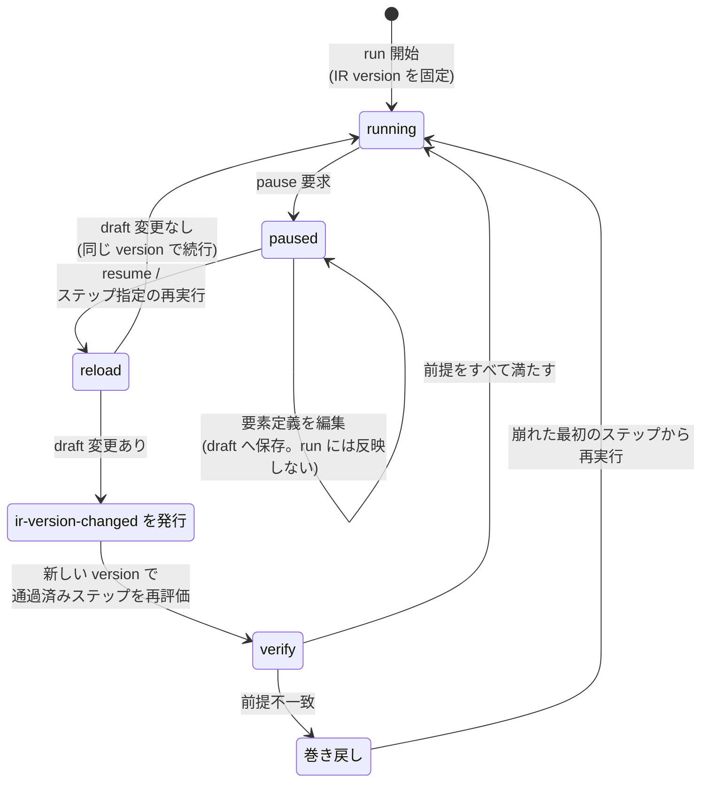

# ADR-0018: 再生中の要素定義編集を run 単位の IR version 固定で反映する

## 状態

承認

## 決定日

2026-08-11

## 背景

- DesignDoc の Open Question「再生中に編集した要素定義の反映タイミング」が Web UI 実装前の決定事項として残っていた。提示されていた選択肢は「即時 DSL 反映」と「再生完了後に一括反映」の 2 つ。
- [design/features/web-editor/DesignDoc_web-editor.md](../design/features/web-editor/DesignDoc_web-editor.md) は既に `screen.save_draft` による即時 draft 保存を前提にしている。したがって実際の論点は「draft をいつ書くか」ではなく、**実行中の run が使う評価基準をいつ差し替えるか**である。
- [design/features/execution/DesignDoc_execution.md](../design/features/execution/DesignDoc_execution.md) は「同じ Snapshot に対する評価結果は常に同じ」を再現性の要とし、テスト観点に「履歴から run を再構成できること」を挙げている。要素定義は Locator を通じて Expectation の評価に影響するため、run 中に差し替えるとこの 2 つが同時に崩れる。

## 決定

- 編集は即時 draft へ保存する。
- **実行中の run は開始時の Workflow IR version を固定し、`running` の間は差し替えない**。
- pause 中に draft が変わった状態で `resume` またはステップ指定の再実行を要求された場合、その時点で新しい IR version を読み込み、`ir-version-changed` イベントを発行してから [adr/0002](0002-pause-semantics.md) の前提再検証と巻き戻しを行う。
- ExecutionEvent 列に version 境界が残るため、「履歴から run を再構成できる」性質を保つ。

差し替えの契機は `resume` とステップ指定の再実行の 2 点だけである。状態遷移を示す。

## 代替案

- **完全即時反映** (`save_draft` の時点で実行中 run の IR を差し替える): 反映は最速だが、`running` 中にも Expectation の評価基準が変わり、同一 run 内で決定性が崩れる。ExecutionEvent 列から run を再現できなくなり、execution feature のテスト観点を満たせないため却下。
- **再生完了後に一括反映** (run 中の編集を UI のバッファに溜め、`completed` 後に draft へ書く): 決定性は最も高い。しかし DesignDoc の成功条件「再生を任意のステップで一時停止し、要素定義を編集した後、そのステップから再開または再実行できる」を満たせない。加えてエージェントの `screen.save_draft` はいつでも draft を書けるため、同じ use case に対して人間とエージェントで挙動が二重化する。却下。

## 影響

### 良い影響

- 決定性を保ったまま「止めて直して再開」が成立する。
- version 境界がイベント列に残るため、差分調査時にどの IR version で評価した結果かを追跡できる。
- 差し替えの契機が 2 点に限定され、再検証の発火条件が明示的になる。

### 悪い影響 / トレードオフ

- `resume` の応答時間が編集の有無に依存して変わる。編集ありの場合は IR の再読込と前提再検証が入る。web-editor が「操作モード中は再開時に再検証が走る」ことを明示しているのと同様に、編集後の再開でも再検証が走ることを UI 上に明示する必要がある。

### 影響範囲

- 対象モジュール / package: execution / workflow / web

## 実装・運用への反映

- spec 更新要否: 不要 (spec 未作成)
- context / AI 向け設定更新要否:
  - [design/DesignDoc.md](../design/DesignDoc.md) の Open Question「再生中に編集した要素定義の反映タイミング」を削除する
  - [design/features/execution/DesignDoc_execution.md](../design/features/execution/DesignDoc_execution.md) の実行イベントに `ir-version-changed` を追加し、再開時の version 差し替えを状態遷移に反映する — 実施済み
  - [design/features/web-editor/DesignDoc_web-editor.md](../design/features/web-editor/DesignDoc_web-editor.md) に、編集後の再開でも前提再検証が走ることの UI 上の明示を追加する — 実施済み

## 関連ドキュメント / チケット

- [adr/0002](0002-pause-semantics.md): 一時停止の意味論と再開時の前提再検証
- [design/features/execution/DesignDoc_execution.md](../design/features/execution/DesignDoc_execution.md): 実行状態と再生制御、実行イベント
- [design/features/web-editor/DesignDoc_web-editor.md](../design/features/web-editor/DesignDoc_web-editor.md): 要素選択から draft 反映までのフロー
- spec / PR: なし
