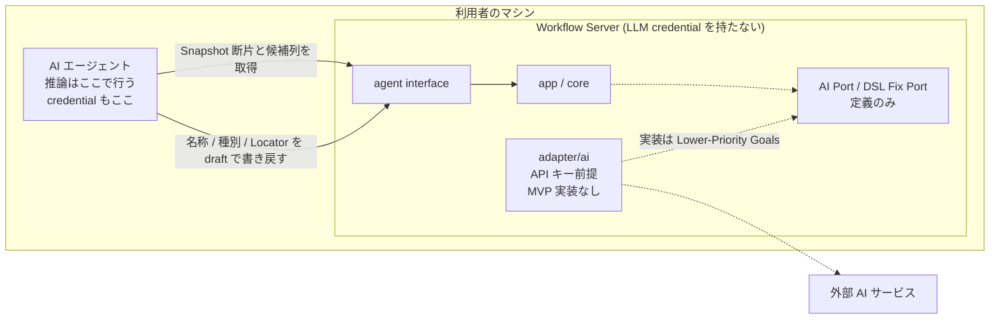

# ADR-0019: AI 候補生成をエージェント主導とし adapter/ai を MVP 実装対象外とする

## 状態

承認

## 決定日

2026-08-11

## 背景

- [adr/0009](0009-ai-adapter-auth.md) は adapter/ai の認証を API キーと OAuth (サブスクリプション連携) の両対応と決め、未確認事項として「サブスクリプション credential のプログラム利用に関する利用規約の確認」を残していた。想定利用者の主要動線がサブスクリプション保有者である以上、この確認結果が adapter/ai の設計前提を左右する状態だった。
- MVP はローカル実行・単一利用者を前提とし、チーム利用とクラウド利用、CI 実行はスコープ外である ([context/infrastructure.md](../context/infrastructure.md)、DesignDoc の Future Work)。
- 未確認事項を確認した結果、次の 3 点が判明した。出典は末尾の参考リンク。
  - Anthropic は、事前承認がない限り、サードパーティ開発者が自社製品に claude.ai のログインおよびレート制限を提供することを認めていない。Claude Agent SDK を用いて構築したエージェントも対象に含まれ、API キー認証を使うよう指示されている。
  - スクリプト / SDK 呼び出しの推奨モードである `--bare` は OAuth credential とシステムキーチェーンを読まず `ANTHROPIC_API_KEY` を要求する。将来 `-p` の既定になる予定である。
  - MCP の sampling (サーバがクライアントへ推論を依頼する機能) は仕様版 2026-07-28 で deprecated となり、移行先は「LLM provider API を直接統合する」と示されている。新規実装は採用すべきでないとされる。
- したがって「本システムが利用者のサブスクリプション枠を消費して AI 補完を提供する」構成は、規約上も MCP の仕様上も成立しない。

## 決定

- **AI 候補生成の主動線を「エージェント自身の推論」とする**。エージェントは agent interface から Snapshot 断片と機械抽出済みの要素候補列を取得し、名称・種別・Locator の判断を自身のコンテキストで行い、draft として書き戻す。本システムは LLM credential を保持しない。
- **adapter/ai は MVP の実装対象外とする**。core/element の AI Port と core/workflow の DSL Fix Port は定義のみ残し、実装は Lower-Priority Goals へ移す。
- adapter/ai を実装する場合の認証は **API キーのみ**とする。利用者のサブスクリプションを本システムが消費する構成は採らない。
- **AI なしでも要素マッピングが完結することを MVP の必須要件とする**。要素候補は Accessibility Snapshot と DOM からの機械抽出だけで構成でき、AI はその上に載る補完に位置づける。DesignDoc の Goal も「システムまたは AI が候補を提示する」と規定している。

推論がどこで行われ、credential がどこに置かれるかを示す。

Workflow Server は LLM credential を持たない。破線は MVP で実装しない経路を示す。

## 代替案

- **OAuth によるサブスクリプション直接利用** ([adr/0009](0009-ai-adapter-auth.md) の決定): 技術的には成立する。Claude Agent SDK の Streaming Input Mode は常駐セッションと `--json-schema` による構造化出力を提供しており、AI Port の契約 (入力 + 出力 Schema から検証済みオブジェクトを得る) にそのまま嵌る。しかし背景に挙げた規約が禁じる形に該当するため却下。
- **CLI をサーバから駆動する** (Codex App Server への接続、または `claude -p` の subprocess 起動): サーバが利用者の CLI を起動し、自製品の機能のためにサブスクリプション枠を消費する形であり、同じ規約の対象と解釈される。加えて Claude Code と Codex で機構が異なる (常駐 JSON-RPC と一発起動) ため provider 抽象が再発生し、実装量が当初想定を超える。さらにサーバと CLI が同一マシンにいる必要があり、クラウド化の経路を塞ぐ。却下。
  - 未確認事項: OpenAI (Codex) におけるサブスクリプションのプログラム利用規定。仮に Codex 側で許容されても、Claude Code 利用者に提供できない機能となるため本決定は変わらない。
- **MCP sampling でクライアントへ推論を委譲する**: サーバが credential を持たずに済み、目的には最も適合する。しかし仕様上 deprecated であり、新規実装は非推奨、将来の削除対象でもあるため却下。
- **API キーのみで adapter/ai を MVP に実装する**: 規約上の問題はない。しかしサブスクリプション保有者に API 従量課金の二重負担を強いる。かつチーム利用と CI 実行が MVP 外である以上、API キー運用を前提とする利用者が MVP 時点で存在しない。却下。

## 影響

### 良い影響

- 本システムが LLM credential を保持しないため、credential の保存・失効・漏えいに関する設計と運用が MVP から消える。
- [adr/0010](0010-ai-data-boundary.md) が扱う送信境界の相手が「外部 AI サービス」から「利用者のマシン上で動くエージェント」に変わり、データが利用者の手元を出ない。
- エージェントが動いていない環境でも要素マッピングが完結するため、AI サービスの障害・規約変更・レート制限がコア機能を止めない。
- adapter/ai の実装 (provider 抽象、credential 解決層、エラー分類) が MVP から外れ、core と interface の実装に集中できる。
- 本経路はエージェントが利用者側で動くため、将来サーバをリモート化しても成立する。CLI 駆動型の代替案はこの性質を持たない。

### 悪い影響 / トレードオフ

- Web UI だけを操作している利用者は、機械抽出の候補を自分で名付けることになる。この緩和は [adr/0020](0020-suggestion-pull-queue.md) で扱う。
- [design/features/ai-suggestions/DesignDoc_ai-suggestions.md](../design/features/ai-suggestions/DesignDoc_ai-suggestions.md) の設計 (provider 抽象、credential 解決層、API キーと OAuth の両対応) が MVP では使われない。同 doc の改訂が必要になる。

### 影響範囲

- 対象モジュール / package: element / workflow / agent / infra

## 実装・運用への反映

- spec 更新要否: 不要 (spec 未作成)
- context / AI 向け設定更新要否:
  - [adr/0009](0009-ai-adapter-auth.md) の状態を「ADR-0019 に置換」へ変更する
  - [adr/0010](0010-ai-data-boundary.md) の送信境界の理由付けを、送信先がローカルのエージェントである前提に見直す
  - [design/DesignDoc.md](../design/DesignDoc.md): モジュール責務表の adapter/ai を MVP 実装対象外と明記、Container 図から AI サービスへの線を削除、スコープの「AI による要素名、種別、Locator 候補の提案」の位置づけを修正、ADR 表に本 ADR を追加する
  - [design/features/ai-suggestions/DesignDoc_ai-suggestions.md](../design/features/ai-suggestions/DesignDoc_ai-suggestions.md) を改訂する (provider 抽象と credential 解決層を落とし、AI Port の実装候補と適用時期の整理へ差し替える)
  - [design/features/element-mapping/DesignDoc_element-mapping.md](../design/features/element-mapping/DesignDoc_element-mapping.md) に AI 提案の取得経路を反映する
- 未確認事項: OpenAI (Codex) のサブスクリプションのプログラム利用規定。将来 adapter/ai を実装する際に確認する。

## 関連ドキュメント / チケット

- [adr/0009](0009-ai-adapter-auth.md): 本 ADR が置換する決定
- [adr/0010](0010-ai-data-boundary.md): AI への送信情報の境界
- [adr/0020](0020-suggestion-pull-queue.md): Web UI 利用者からの提案依頼の扱い
- [design/features/agent-interface/DesignDoc_agent-interface.md](../design/features/agent-interface/DesignDoc_agent-interface.md): エージェントが呼ぶ tool 語彙
- Agent SDK overview: https://code.claude.com/docs/en/agent-sdk/overview
- Run Claude Code programmatically (headless): https://code.claude.com/docs/en/headless
- MCP Deprecated Features: https://modelcontextprotocol.io/specification/2026-07-28/deprecated
- spec / PR: なし
