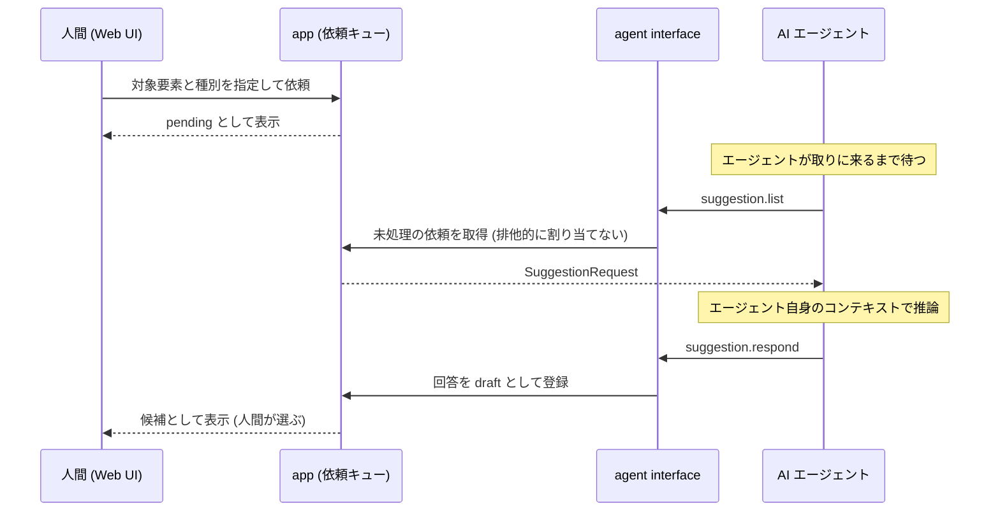

# ADR-0020: 人間起点の提案依頼を pull 型キューで実現する

## 状態

承認

## 決定日

2026-08-11

## 背景

- [adr/0019](0019-agent-led-ai-suggestions.md) により、AI 候補生成の主動線はエージェント自身の推論になった。この経路はエージェントが起点となるため、Web UI だけを操作している利用者が AI の補完を受け取る手段がない。
- 同 ADR により本システムは LLM credential を保持しない。サーバから AI サービスを呼んで補完する経路は選べない。
- agent interface は MCP と App Server 型 JSON-RPC の両方を提供する ([adr/0016](0016-dual-agent-protocol.md))。App Server 型は双方向ストリームを持つため、サーバからエージェントへ要求を送る余地がある。
- 一方 MCP は現行仕様でサーバからクライアントへの任意の要求を持たない。sampling は deprecated で、push は `subscriptions/listen` のリスト変更とリソース購読に限定される。したがって push 型は 2 プロトコル間で非対称になる。

## 決定

- **人間起点の提案依頼を pull 型のキューで実現する**。app 層に依頼のキューを置き、agent interface に読み取り用の `suggestion.list` と回答用の `suggestion.respond` を公開する。エージェントが取りに来て、回答を draft として書き戻す。
- **サーバからエージェントへ要求を push する方式は採らない**。
- **依頼を特定のエージェントへ排他的に割り当てない**。複数のエージェントが同じ依頼に回答した場合、回答は複数の draft として並び、人間が選ぶ。
- 依頼が回答されないまま期限を過ぎた場合は `expired` とし、Web UI は手動で名付ける導線へ戻す。これにより [adr/0019](0019-agent-led-ai-suggestions.md) の「AI なしでも要素マッピングが完結する」要件を、この経路が壊さないことを保証する。

依頼から回答までの流れを示す。

期限内に回答が来ない場合は `expired` となり、Web UI は手動で名付ける導線へ戻す。

## 代替案

- **push 型 (サーバからエージェントへ要求を送る)**: 応答性は最も良い。しかし汎用の Claude Code / Codex は本システム独自の逆方向メソッドを実装していないため、受け口となるエージェント側コンポーネントの配布が必要になる。MVP のスコープを本システムの外へ広げるため却下。加えて MCP では現行仕様上そもそも実装できず、App Server 型でしか成立しないという非対称を生む。
- **adapter/ai を実装して Web UI から同期的に補完する**: [adr/0019](0019-agent-led-ai-suggestions.md) で却下済み。
- **依頼機能を設けない (エージェント起点のみ)**: 実装は最小。しかし Web UI 利用者が AI を使う手段が「エージェントに口頭で頼む」しかなくなり、Web UI で選択した要素とエージェントへの依頼内容を人間が言葉で橋渡しすることになる。操作の起点と対象が分離するため却下。
- **依頼を 1 つのエージェントへ排他的に割り当てる**: 重複回答を防げる。しかし割り当ての期限管理と、停止したエージェントが抱えた依頼の再割り当てが必要になる。draft は元来複数並ぶ設計であり ([adr/0017](0017-agent-draft-boundary.md))、MVP は単一利用者・単一エージェントを想定するため、複雑さに見合わないと判断して却下。

## 影響

### 良い影響

- Web UI 利用者も AI 補完を受け取れる。その間も本システムは LLM credential を保持しない。
- `approval.request` / `approval.status` (エージェントから人間への依頼) と対称な語彙になり、agent interface の tool 語彙が一貫する。
- エージェント非依存である。接続するエージェントの種類を問わず動く。
- エージェントが利用者側で動く構成を保つため、将来サーバをリモート化しても成立する。

### 悪い影響 / トレードオフ

- エージェントが `suggestion.list` を呼びに来ない限り依頼は処理されない。**応答までの時間が保証されない**。緩和策として次の 2 つを想定する。
  - 利用者へ配布する skill に「作業中は定期的に `suggestion.list` を確認する」と記載する。
  - App Server 型 JSON-RPC では `suggestion.list` をロングポーリングで待たせる。
- 複数のエージェントが接続している場合、同じ依頼に対して回答が重複する。MVP の想定 (単一利用者・単一エージェント) では実害がないが、承認キューに並ぶ draft は増える。

### 影響範囲

- 対象モジュール / package: element / agent / web

## 実装・運用への反映

- spec 更新要否: 不要 (spec 未作成)
- context / AI 向け設定更新要否:
  - [design/features/agent-interface/DesignDoc_agent-interface.md](../design/features/agent-interface/DesignDoc_agent-interface.md) の tool 語彙に `suggestion` namespace (`suggestion.list` / `suggestion.respond`) を追加する
  - [design/features/web-editor/DesignDoc_web-editor.md](../design/features/web-editor/DesignDoc_web-editor.md) に依頼の導線と `expired` 時の手動フォールバックを追加する
  - [design/features/element-mapping/DesignDoc_element-mapping.md](../design/features/element-mapping/DesignDoc_element-mapping.md) に AI 提案の取得経路を反映する
  - [design/features/ai-suggestions/DesignDoc_ai-suggestions.md](../design/features/ai-suggestions/DesignDoc_ai-suggestions.md) にキューのデータモデルと状態遷移を追加する
  - [adr/0016](0016-dual-agent-protocol.md) に、App Server 型 JSON-RPC を採る根拠として `suggestion.list` のロングポーリングを追記する
- 未確認事項: MCP の `subscriptions/listen` で未処理依頼リストを購読可能リソースとして公開できるか。成立すれば pull を near-push にできる。agent 実装時に仕様を確認する。

## 関連ドキュメント / チケット

- [adr/0019](0019-agent-led-ai-suggestions.md): AI 候補生成をエージェント主導とする決定
- [adr/0016](0016-dual-agent-protocol.md): MCP と App Server 型 JSON-RPC の併用
- [adr/0017](0017-agent-draft-boundary.md): draft と確定の境界
- [design/features/agent-interface/DesignDoc_agent-interface.md](../design/features/agent-interface/DesignDoc_agent-interface.md): tool 語彙と承認依頼のフロー
- spec / PR: なし
