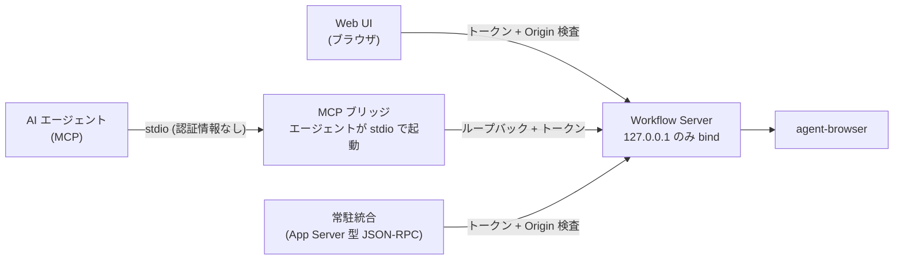

# ADR-0021: agent interface の認可をループバック限定とローカルトークンで行う

## 状態

承認

## 決定日

2026-08-11

## 背景

- DesignDoc の Open Question「agent interface の認可方式」が agent 実装前の決定事項として残っていた。提示されていた選択肢はローカル無認証、トークン、OAuth の 3 つ。
- MVP はローカル実行を前提とする ([context/infrastructure.md](../context/infrastructure.md))。クラウド利用は MVP のスコープ外である。
- Web UI と agent interface は**同一の常駐サーバ**を見る必要がある。agent-browser のセッションとライブ映像を共有するためである。したがって MCP の stdio 単独 (エージェントがサーバ本体をプロセスとして起動する形) では構成が成立しない。
- [adr/0008](0008-stream-proxy.md) はライブ映像を Workflow Server 経由の Proxy に寄せた。理由の一つは無認証ポートを公開しないことだった。認可方式はこの判断と整合する必要がある。

## 決定

- 常駐サーバは **127.0.0.1 にのみ bind する**。
- **MCP は stdio transport を既定とする**。薄いブリッジプロセスがループバック経由で常駐サーバへ転送する。ブリッジはエージェントが起動するため、MCP 側の設定に認証情報を要求しない。
- **HTTP / App Server 型 JSON-RPC と Stream Proxy は、サーバ起動時に生成するローカルトークンを要求する**。トークンはファイルへ書き出し、クライアントが読む。
- ブラウザ由来の呼び出しと DNS rebinding を防ぐため、**Origin を検査する**。
- OAuth / OIDC はリモート公開時に、MCP 現行仕様 (標準 OAuth / OIDC 準拠、Client ID Metadata Documents) に沿って追加する。MVP では実装しない。

接続経路ごとの認証要件を示す。

MCP 利用者だけがトークンの取り回しを負わない。ブリッジがループバック側でトークンを付与する。

## 代替案

- **ループバック限定の無認証**: 実装は最小。しかし同一マシン上の任意のプロセスから、また Origin 検査がなければ任意の Web ページから `run.start` や `screen.save_draft` を呼べる。[adr/0008](0008-stream-proxy.md) が避けた「無認証ポートの公開」と実質同じ状態を作るため却下。
- **最初から OAuth / OIDC**: リモート利用へ即対応できる。しかし Authorization Server、Client ID Metadata Documents、token 更新、scope 設計が必要になり、ローカル単一利用者の MVP に対して実装量と検証パスが過大。却下。認可の実装は interface 層に閉じるため、後から追加しても app / core へ波及しない。
- **MCP を stdio 単独で完結させる (エージェントがサーバ本体を起動する)**: 認証が不要になり最も単純。しかし Web UI と agent が同じ agent-browser セッションを共有できず、本システムの構成が成立しないため却下。

## 影響

### 良い影響

- Web UI・agent interface・Stream Proxy の接続先が Workflow Server の 1 点に揃い、[adr/0008](0008-stream-proxy.md) の経路設計と整合する。
- MCP 利用者はエージェント設定に 1 行加えるだけでよく、トークンの取り回しを負わない。
- 認可の実装が interface 層に閉じるため、リモート化時に app / core を変更せずに OAuth を追加できる。

### 悪い影響 / トレードオフ

- MCP と HTTP / JSON-RPC で認証の要否が異なる。差を吸収するブリッジプロセスが増えるため、実装と障害調査の対象が 1 つ増える。
- トークンをファイルへ書き出すため、そのファイルの権限管理が運用上の前提になる。置き場と権限は [context/infrastructure.md](../context/infrastructure.md) に記載する。

### 影響範囲

- 対象モジュール / package: agent / web / infra

## 実装・運用への反映

- spec 更新要否: 不要 (spec 未作成)
- context / AI 向け設定更新要否:
  - [design/DesignDoc.md](../design/DesignDoc.md) の Open Question「agent interface の認可方式」を削除する
  - [design/features/agent-interface/DesignDoc_agent-interface.md](../design/features/agent-interface/DesignDoc_agent-interface.md) の「やらないこと」から認可方式の項を外し、決定内容を本文へ反映する — 実施済み
  - [design/features/web-editor/DesignDoc_web-editor.md](../design/features/web-editor/DesignDoc_web-editor.md) の「やらないこと」から認可の項を外す — 実施済み
  - [context/infrastructure.md](../context/infrastructure.md) に bind アドレス、トークンの置き場と権限、Origin 検査を記載する — 実施済み

## 関連ドキュメント / チケット

- [adr/0008](0008-stream-proxy.md): ライブ映像を Workflow Server 経由の Proxy で配信する判断
- [adr/0016](0016-dual-agent-protocol.md): MCP と App Server 型 JSON-RPC の併用
- [design/features/agent-interface/DesignDoc_agent-interface.md](../design/features/agent-interface/DesignDoc_agent-interface.md): プロトコル対応表
- [context/infrastructure.md](../context/infrastructure.md): secret の置き場と扱い
- spec / PR: なし
