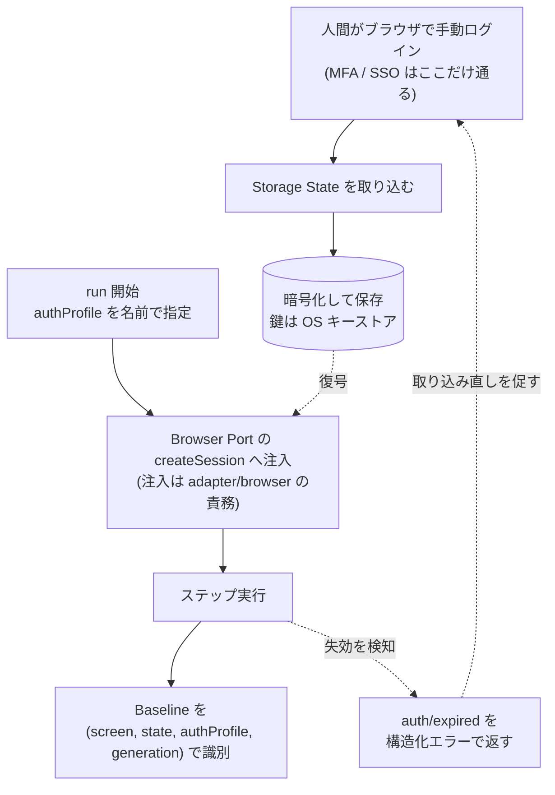

# ADR-0022: 認証状態を暗号化 Storage State で保持し実行時パラメータで指定する

## 状態

承認

## 決定日

2026-08-11

## 背景

- DesignDoc の Open Question「認証状態の保存方式」が認証画面対応前の決定事項として残っていた。提示されていた選択肢はローカル Profile、暗号化 Storage State、外部 Secrets の 3 つ。
- DesignDoc の設計上の前提として、認証情報を DSL・ログ・Snapshot・生成成果物へ平文で保存しないことは確定している。
- MVP はローカル実行・単一利用者を前提とし、クラウド利用とチーム / CI 実行はスコープ外である。したがって外部 Secrets Manager 連携は MVP では必要にならない。
- 対象アプリが MFA / SSO を要求する可能性は排除できない。汎用のプロダクトである以上、毎回ログイン手順を実行する方式は既定にできない。
- **ログインする利用者が変わると画面が変わる**。Baseline を認証プロファイルで区別しない場合、権限差に由来する差分が core/diff の検知結果を占め、検知したい変更が埋もれる。
- 認証プロファイルを DSL に持たせるか実行時パラメータにするかは、core/workflow の Schema に直接効く。実装開始前に決める必要がある。

## 決定

- 認証状態は **Storage State (cookie / localStorage の JSON) として保持する**。実体は OS のキーストア (macOS Keychain / libsecret / DPAPI) から得た鍵で暗号化してローカルに保存し、キーストアには鍵のみを置く。キーストアは小さい secret 向けであり、Storage State の JSON をそのまま格納する用途に適さないためこの分離を採る。
- 初回は、**人間がブラウザで手動ログインし、その時点の Storage State を取り込む導線**を用意する。MFA / SSO がある場合も初回だけ人間が通れば以降は再現できる。
- **認証プロファイルは実行時パラメータとする**。run の開始時に名前で指定し、DSL には書かない。
- **Baseline は `(screen, state, authProfile)` で識別する**。ただし `authProfile` は名前だけでなく **generation (取り込みの世代) を伴う**。
- **Storage State の失効判定は、プロファイルごとに宣言した認証検証条件で行う**。汎用のブラウザ基盤だけでは判定できない。
- Browser Port の `createSession` は認証コンテキストを受け取る。実際の注入は adapter/browser の責務とする。
- Storage State の失効は `auth/expired` の機械可読コードを持つ構造化エラーとして返す。

取得から利用、失効までの流れを示す。

DSL には認証への参照を持たせない。同じ Screen 文書を複数の `authProfile` で実行できる。

### プロファイル名だけでは Baseline を分けきれない

プロファイル名は**可変**である。失効時は「取り込み直して中身を差し替える」運用であり、同じ名前へ**別のアカウント**の Storage State を入れることもできる。名前だけを識別子にすると、その瞬間から権限の違う結果が同じ Baseline へ混ざる。

**取り込みのたびに generation を 1 つ進める。** Baseline の識別子は `(screen, state, authProfile, generation)` とする。

| 起きること                       | 扱い                                                          |
| -------------------------------- | ------------------------------------------------------------- |
| 同じアカウントを取り込み直す     | generation が進む。前の Baseline は残るが、比較対象は最新のみ |
| 別のアカウントを同じ名前で入れる | 同上。**古い Baseline を上書きしない**ため権限差が混ざらない  |

古い generation の Baseline は保持する。捨てると、取り込み直した直後に「Baseline 未作成」へ戻り、差分検知が一度使えなくなる。

### 失効の判定条件

サーバ側の失効や SSO の期限切れは、**ログイン画面への遷移**として現れる。これは通常の画面変更や Locator の解決失敗と見分けがつかない。判定条件なしに `auth/expired` と断定すると、単なる画面改修を認証エラーとして報告する。

プロファイルごとに**認証済みであることの検証条件**を宣言する。実行前にこれを評価し、満たさないときだけ `auth/expired` とする。

| 状況                                   | 返すもの                                                  |
| -------------------------------------- | --------------------------------------------------------- |
| 検証条件を満たさない                   | `auth/expired`                                            |
| 検証条件を宣言していない               | **`auth/expired` と断定しない**。通常の実行失敗として返す |
| 検証条件を満たすが、その後の操作が失敗 | 通常の実行失敗として返す                                  |

検証条件は Expectation と同じ語彙で書く。新しい語彙を増やさないためである。

## 代替案

- **ブラウザ Profile ディレクトリを丸ごと使い回す**: 実装はほぼ不要。しかしプロファイルの中身が不透明で、キャッシュ・拡張機能・履歴など認証と無関係な状態まで再現結果へ混入する。DesignDoc の成功条件「同じ DSL と同じ画面状態からは同じ成果物を生成する」と、[context/project.yml](../context/project.yml) の `decision_priority` 第 1 位である再現性・決定性に反するため却下。環境間で移植もできない。
- **credential を環境変数から渡して毎回ログイン手順を実行する**: 保存状態を持たないため監査は容易。しかし run のたびにログイン往復が入って遅く、MFA / SSO のある画面では成立しない。汎用の既定にはできないため却下。補助手段としては成立するため、将来の選択肢としては残す。
- **認証プロファイルを DSL (Workflow 文書または Screen 文書) に書く**: [adr/0011](0011-dsl-as-source-of-truth.md) の「DSL が正本」と最も一貫する。しかし同じ画面を別の権限で見る場合に文書が重複する。Screen 文書に書く場合は、要素 ID の同一性管理が文書をまたいで複雑になる。**認証コンテキストは実行環境の設定であり画面仕様ではない**という整理を採って却下。DesignDoc の前提「動的データは Fixture、Mock、固定入力のいずれかによって再現可能にする」と同じ扱いになる。
- **外部 Secrets Manager に置く**: チーム利用と CI 実行を前提にすれば妥当。しかしいずれも MVP のスコープ外であり、ローカル単一利用者に対して過剰。却下し、Future Work とする。

## 影響

### 良い影響

- 保存内容が Storage State の JSON に限定されるため、何が再現に寄与しているかを検査でき、環境間で移植できる。
- 認証プロファイルを実行時パラメータにしたことで、1 つの Screen 文書を複数の権限で実行して差分を見る使い方が、文書を複製せずに書ける。
- Baseline を認証プロファイルで区別するため、権限差に由来する差分がノイズとして混入しない。
- 平文の認証情報がリポジトリと生成成果物に入らない。

### 悪い影響 / トレードオフ

- 初回の取り込み導線を実装する必要がある。ブラウザ Profile を使い回す案にはないコストである。
- Storage State には期限がある。失効時は run が失敗するため、`auth/expired` を検知して取り込み直しを促す導線が要る。
- OS ごとにキーストアの API が異なるため、3 系統の実装または抽象化ライブラリの採用が必要になる。

### 影響範囲

- 対象モジュール / package: execution / diff / artifact / infra

## 実装・運用への反映

- spec 更新要否: 不要 (spec 未作成)
- context / AI 向け設定更新要否:
  - [design/DesignDoc.md](../design/DesignDoc.md) の Open Question「認証状態の保存方式」を削除する
  - [design/features/workflow-dsl/DesignDoc_workflow-dsl.md](../design/features/workflow-dsl/DesignDoc_workflow-dsl.md) に、DSL が認証を持たない決定とその理由を記載する (Schema の決定事項) — 実施済み
  - [design/features/execution/DesignDoc_execution.md](../design/features/execution/DesignDoc_execution.md) の Browser Port 契約に認証コンテキストを追加し、エラーコードに `auth/expired` を追加する — 実施済み
  - [design/features/change-detection/DesignDoc_change-detection.md](../design/features/change-detection/DesignDoc_change-detection.md) と [design/features/artifact-generation/DesignDoc_artifact-generation.md](../design/features/artifact-generation/DesignDoc_artifact-generation.md) の Baseline 識別子に `authProfile` を反映する — 実施済み
  - [context/infrastructure.md](../context/infrastructure.md) に保存場所、暗号化方式、取り込み導線、失効時の扱いを記載する — 実施済み
  - [design/features/execution/DesignDoc_execution.md](../design/features/execution/DesignDoc_execution.md) に認証検証条件の評価と `auth/expired` の判定規則を追加する — 実施済み
  - [design/features/change-detection/DesignDoc_change-detection.md](../design/features/change-detection/DesignDoc_change-detection.md) の Baseline 識別子に generation を反映する — 実施済み

## 関連ドキュメント / チケット

- [adr/0011](0011-dsl-as-source-of-truth.md): YAML DSL を唯一の正本とする判断
- [adr/0013](0013-agent-browser-runtime.md): MVP のブラウザ実行基盤
- [design/features/execution/DesignDoc_execution.md](../design/features/execution/DesignDoc_execution.md): Browser Port の契約
- [context/infrastructure.md](../context/infrastructure.md): secret の置き場と扱い
- spec / PR: なし
