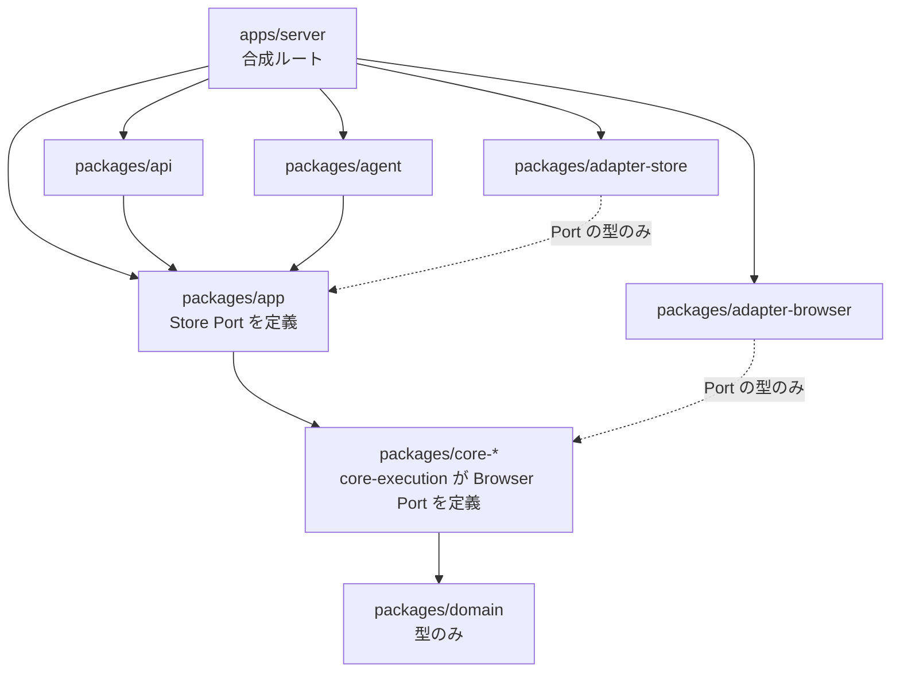

# ADR-0023: 合成ルートを apps/server に置き app から adapter への依存を禁じる

## 状態

承認

## 決定日

2026-08-13

## 背景

- [context/architecture.md](../context/architecture.md) は「Store Port: app (保存が機能横断のため。例外はこの 1 つに限る)」と「app → core と adapter に依存する」を同時に定めている。この 2 つを実装すると `adapter/store` と `app` が相互に参照し、パッケージ境界を引いたときにビルド順が決まらない。
  - `adapter/store` は Store Port の型を得るために `app` を参照する
  - `app` は Store Port の実装を得るために `adapter/store` を参照する
- **Browser Port はこの問題を持たない**。`core/execution` が定義し `adapter/browser` がそれだけを参照するため一方向である。循環は Store Port が `app` にあることだけに起因する。
- [context/testing.md](../context/testing.md) は E2E で Browser Port を fake へ置き換えると定めている。`app` が adapter を直接参照していると、この差し替えは `app` 内部の実行時分岐になり、テスト専用の経路が本番のコードに残る。
- monorepo の構成は pnpm workspace とする ([adr/0001](0001-tech-stack.md))。`apps/` と `packages/` の役割は、採用するツールの公式ドキュメントが次のように定めている。
  - Turborepo は Application Package を「will be deployed from your workspace」、Library Package を「aren't independently deployable. Instead, they support the Application Packages to create the final deployables」と定義する ([Package types](https://turborepo.dev/docs/core-concepts/package-types))。
  - Vercel が turborepo リポジトリに同梱する skill は「**Apps shouldn't be dependencies of other packages**」「Applications are the 'endpoints' of your package graph」と明記する ([RULE.md](https://github.com/vercel/turborepo/blob/main/skills/turborepo/references/best-practices/RULE.md))。
  - Nx は「an application project contains the deployable shell: entry point, configuration, and **composition** of features. The features themselves live in libraries」「the majority of your code in `libs/`, with **`apps/` reduced to wiring**」と定める ([Folder Structure](https://nx.dev/docs/kb/folder-structure))。

つまり「合成 (composition) と配線 (wiring) を担い、他から依存されない層」は、`apps/` に置かれるものの定義そのものである。

## 決定

- **`app` は adapter を参照しない**。Port の実装は合成ルートが注入する。`app` が公開するのは `createUseCases(deps)` の形の factory であり、`deps` の型は Port だけで構成する。
- **合成ルートを `apps/server` に置く**。adapter の具象を選ぶ唯一の場所とする。
- `apps/server` は全層を参照してよい。これは `apps/` が「他から依存されない終端」であることと引き換えに成立する。
- [context/architecture.md](../context/architecture.md) の依存方向と禁止経路を書き換える。

依存の向きを示す。実線は実装への依存、破線は Port の型だけへの依存である。

adapter は自身が実装する Port の定義元へ向かって依存し、誰からも依存されない。`apps/server` だけが adapter を知る。この形で循環が消える。

### 書き換える規約

| 対象       | 現行                                                  | 変更後                                                                              |
| ---------- | ----------------------------------------------------- | ----------------------------------------------------------------------------------- |
| interface  | app のみに依存する                                    | 変更なし                                                                            |
| **app**    | **core と adapter に依存する**                        | **core に依存する。adapter へは依存しない。Port の実装は合成ルートから注入される**  |
| core       | 他の core へは型の参照のみ許可する                    | 他の core と domain へは型の参照のみ許可する                                        |
| adapter    | core が定義する Port の型を通じてのみ core に依存する | 自身が実装する Port を定義するモジュール (core または app) の型を通じてのみ依存する |
| 合成ルート | 記述なし                                              | **`apps/server` は全層に依存してよい。adapter の具象を選ぶ唯一の場所とする**        |

禁止経路に次の 1 行を追加する。

- **app から adapter への依存** (Store Port の循環を生み、fake の差し替えが実行時分岐になるため)

## 代替案

- **Store Port を core のどれかへ移す**: 循環は消える。しかし [context/architecture.md](../context/architecture.md) が「保存が機能横断のため」を理由に app へ置いており、core の 1 つに置くと他の core から参照できない。「例外はこの 1 つに限る」という但し書きの前提が失われるため却下。
- **Port の型だけを持つパッケージ (`app-contract`) を切り出す**: `adapter/store → app-contract ← app` の形になり循環は消える。しかし E2E での fake 差し替えのために合成ルートはどのみち必要であり、合成ルートがあれば `app-contract` は不要になる。パッケージを 1 つ増やす利得がないため却下。
- **adapter を `app` パッケージの内部ディレクトリに入れる**: パッケージ間の循環は消える。しかし adapter が差し替え可能な独立単位でなくなり、Ports and Adapters を採った意義 ([adr/0014](0014-core-split-ports-adapters.md)) が薄れる。将来の実行基盤差し替え (Browser Port の別実装) が pnpm の依存グラフに現れなくなるため却下。
- **現行規約のまま `app` が adapter を参照する**: 循環に加えて、E2E の fake 差し替えが `app` 内部の実行時分岐になる。[context/testing.md](../context/testing.md) の「Browser Port は fake へ置換する」がテスト専用コードを本番経路へ持ち込むため却下。

## 影響

### 良い影響

- パッケージの依存グラフに循環がなくなり、pnpm と turborepo がビルド順を決定できる。
- fake の差し替えが合成ルートの引数だけで済み、`app` と `api` と `agent` にテスト専用の分岐が入らない。
- 4 層の依存規約が `apps/` と `packages/` の公式な役割分担と一致するため、規約を独自に説明せずに済む。
- adapter の具象を選ぶ場所が 1 箇所に閉じるため、実行基盤や保存方式の差し替えが `apps/server` の変更だけで完結する。

### 悪い影響 / トレードオフ

- `app` の公開 API が factory 形式に固定される。use case を呼ぶ側は依存を組み立ててから使うことになり、素朴な import と比べて 1 段増える。
- 依存の注入漏れがコンパイル時に検出されるとは限らない。`deps` の型を Port だけで構成し、省略可能な依存を作らない運用が要る。
- `apps/server` が全層を知るため、この 1 パッケージだけは依存検査の対象外になる。ここに use case のロジックが混入していないことは、別の手段 (行数の監視、レビュー) で見る必要がある。

### 影響範囲

- 対象モジュール / package: workflow / execution / element / artifact / diff / web / agent / infra

## 実装・運用への反映

- spec 更新要否: 不要 (spec 未作成)
- context / AI 向け設定更新要否:
  - [context/architecture.md](../context/architecture.md) の Package Boundary を、上表の依存方向と追加した禁止経路で書き換える。合成ルートの位置づけを追記する
  - [context/architecture.md](../context/architecture.md) の Port の定義場所に、adapter がどのモジュールを参照するかを追記する
  - [context/project.yml](../context/project.yml) の `repos.layout` を `apps/` と `packages/` の構成へ更新する
  - [design/DesignDoc.md](../design/DesignDoc.md) のモジュール責務の表と依存方向の図に、合成ルートを追記する
  - [context/engineering.md](../context/engineering.md) の Repository Quality Gate に、追加した禁止経路の検査を記載する

## 関連ドキュメント / チケット

- [adr/0001](0001-tech-stack.md): pnpm workspace と turborepo の採用
- [adr/0014](0014-core-split-ports-adapters.md): core を機能単位に分割し Ports and Adapters を採用する判断
- [context/architecture.md](../context/architecture.md): 依存方向と Port の定義場所
- [context/testing.md](../context/testing.md): E2E で Browser Port を fake へ置換する方針
- Turborepo Package types: https://turborepo.dev/docs/core-concepts/package-types
- Turborepo best practices (Vercel 公式 skill): https://github.com/vercel/turborepo/blob/main/skills/turborepo/references/best-practices/RULE.md
- Nx Folder Structure: https://nx.dev/docs/kb/folder-structure
- spec / PR: なし
