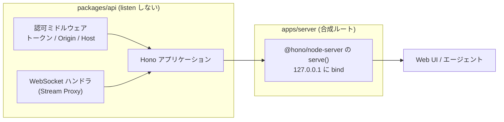

# ADR-0024: HTTP / WebSocket framework に Hono を採用する

## 状態

承認

## 決定日

2026-08-15

## 背景

- [adr/0001](0001-tech-stack.md) は Hono を第一候補としつつ、確定を「feature 設計 (execution / agent-interface) 時」としていた。feature 設計は完了したが、framework を分ける判断材料が出なかったため未確定のまま残っていた。
- 未確定のまま実装へ入ると、`packages/api` の公開面 (ハンドラの型・ミドルウェアの形) が決まらず、interface 層の設計を 2 度書くことになる。
- 要求は次の 3 つである。
  - **同一プロセスで HTTP と WebSocket を扱う。** Web UI・agent interface・Stream Proxy はすべて 1 つの常駐サーバへ繋ぐ ([adr/0021](0021-agent-interface-authz.md))。
  - **listen しない形で組み立てられる。** プロセスにするのは合成ルートであり、`packages/api` はアプリケーションを返すだけである ([adr/0023](0023-composition-root.md))。
  - **TypeScript 7 で型が通る。** 言語サービス用に TypeScript 6 を併置する構成で動く ([context/toolchain.md](../context/toolchain.md))。

## 決定

- **`packages/api` の HTTP / WebSocket framework を Hono とする。**
- `packages/api` は Hono のアプリケーションを組み立てて返すだけとし、**listen しない**。プロセス化は `apps/server` が `@hono/node-server` で行う。
- **WebSocket は `@hono/node-server` の組み込み機能を使う。** かつて別パッケージだった `@hono/node-ws` は非推奨で、Node アダプタ v2 が `upgradeWebSocket` を内蔵する。
- 認可 (ローカルトークン検証・Origin 検査・Host 検査) は Hono のミドルウェアとして実装し、interface 層に閉じる ([adr/0021](0021-agent-interface-authz.md))。

層とプロセスの関係を示す。

`packages/api` が返すのはアプリケーションだけである。ポートを開く判断は合成ルートが持つ。

## 代替案

- **Fastify**: Node に特化しており、プラグインと WebSocket の実績が厚い。しかし Web 標準の `Request` / `Response` を扱わないため、テストでハンドラを直接呼ぶときに Node の `req` / `res` を模す必要がある。`packages/api` を「listen しない組み立て」に閉じる設計と噛み合わないため却下。
- **Elysia**: 型推論が強く記述量も少ない。しかし Bun を主対象とし Node は副次的で、TypeScript 7 と Node LTS で固めた本プロジェクトのランタイム前提と合わない。却下。
- **素の `node:http` + 自前ルーティング**: 依存が増えない。しかしルーティング・ミドルウェア・WebSocket のアップグレード処理を自作することになり、認可を確実に全経路へ掛ける仕組みも自前になる。認可の掛け漏れは直接セキュリティ欠陥になるため、既製のミドルウェア機構に載せる利得が大きい。却下。
- **確定を実装 issue まで先送りする**: 判断を遅らせても材料は増えない。先送りしている間、`packages/api` の公開面が決まらず interface 層の設計が進まない。却下。

## 影響

### 良い影響

- HTTP と WebSocket が 1 つのアプリケーションに載るため、認可ミドルウェアを両方へ同じ形で掛けられる。経路ごとに認可の実装が分かれない。
- Web 標準の `Request` / `Response` を扱うため、`packages/api` のハンドラを **listen せずにテストから直接呼べる**。統合テストが api を直接叩く方針 ([context/testing.md](../context/testing.md)) と噛み合う。
- ランタイムに依存しない形で組み立てられるため、将来 Node 以外へ載せ替える場合も `packages/api` を書き換えずに済む。

### 悪い影響 / トレードオフ

- WebSocket は `ws` パッケージに依存する。純粋な Web 標準だけでは完結せず、Node アダプタ固有の設定が `apps/server` に入る。
- Hono の Node アダプタは v2 で WebSocket の扱いが変わった経緯がある。アダプタの版に追随する保守が要る。

### 影響範囲

- 対象モジュール / package: web / agent / infra

## 実装・運用への反映

- spec 更新要否: 不要 (spec 未作成)
- context / AI 向け設定更新要否:
  - [context/toolchain.md](../context/toolchain.md) の標準スタック表へ HTTP framework の行を足し、「未確定」の記述を外す
  - [context/project.yml](../context/project.yml) の layout の `api/` 注釈を確定後の表現へ戻す
  - [context/architecture.md](../context/architecture.md) の「HTTP framework は未確定」を外す
  - [design/DesignDoc.md](../design/DesignDoc.md) の Open Questions から本件を外す
- 未確認事項: なし

## 関連ドキュメント / チケット

- [adr/0001](0001-tech-stack.md): 技術スタックの選定 (本 ADR で framework を確定)
- [adr/0021](0021-agent-interface-authz.md): 認可をループバック限定とローカルトークンで行う判断
- [adr/0023](0023-composition-root.md): 合成ルートを apps/server に置く判断
- [adr/0008](0008-stream-proxy.md): ライブ映像を Workflow Server 経由の Proxy で配信する判断
- 参考: [Hono Node.js アダプタ](https://hono.dev/docs/getting-started/nodejs) / [WebSocket Helper](https://hono.dev/docs/helpers/websocket) / [honojs/node-server](https://github.com/honojs/node-server)
- spec / PR: なし
