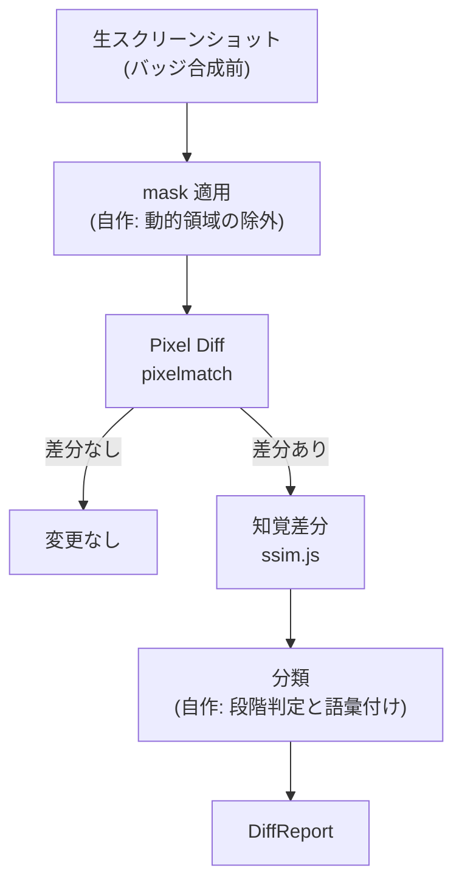

# ADR-0025: 画像差分に pixelmatch と ssim.js を採用する

## 状態

承認

## 決定日

2026-08-15

## 背景

- [adr/0007](0007-visual-diff.md) は画像差分を「Pixel Diff で粗く拾い、知覚差分で仕分ける」2 段階と決めたが、**どのライブラリで計算するかは決めていない**。
- 選定は [change-detection feature doc](../design/features/change-detection/DesignDoc_change-detection.md) の本文にだけ書かれており、ADR も [context/toolchain.md](../context/toolchain.md) の標準スタック表も持っていなかった。**依存の追加を伴う選定が、判断の記録なしに feature doc へ埋もれていた。**
- 本プロダクトの判断優先度の筆頭は再現性・決定性である ([context/project.yml](../context/project.yml))。同じ画像の組から常に同じ判定が出ることが、速度より優先する。
- 比較する画像は 1 画面の状態ごとのスクリーンショットで、**1 回の実行あたり数枚から数十枚**である。数千枚を一括比較する用途ではない。

## 決定

- **Pixel Diff は [pixelmatch](https://github.com/mapbox/pixelmatch)、知覚差分は ssim.js を使う。**
- 比較アルゴリズムを自作しない。自作するのは mask 適用 → 段階判定 → 分類という**編成ロジックだけ**とする。
- **速度が問題になってから差し替える。** 差し替えの判断基準を次のとおり定める。
  - 1 回の差分検知にかかる時間が、実行全体の体感を損なう水準に達した
  - かつ、その原因が画像比較であることを実測で確かめた
- 差し替え先の候補は odiff と BlazeDiff とする。どちらもネイティブ実装で pixelmatch より速い。**採用時は再現性を先に確かめる** (同じ入力から同じ判定が出るか、環境差でぶれないか)。

選定の位置づけを示す。

ライブラリが担うのは 2 つの数値を出すところまでで、**それをどう解釈するかは自作する**。

## 代替案

- **最初から odiff を採る**: SIMD を使うネイティブ実装で pixelmatch より大幅に速い。しかしネイティブバイナリを配布物に持ち込むため、対応プラットフォームの検証が要る。本プロダクトは利用者の開発マシンで動くローカルツールであり、環境が揃わない。比較枚数も数十枚規模で、速度が先に問題になる見込みが薄い。却下 (差し替え候補としては残す)。
- **最初から BlazeDiff を採る**: pixel diff と SSIM 系の指標を 1 つのパッケージで揃えられ、4K 画像で odiff より速いとされる。しかし新しく、本プロダクトが最優先する再現性の実績が pixelmatch ほど積まれていない。同じ理由で却下 (差し替え候補としては残す)。
- **reg-suit 等のワークフロー製品を使う**: Baseline 管理・承認・レポートまで揃う。しかしそれらは**本プロダクトの中核機能そのもの**であり、二重に持つことになる。却下。
- **比較アルゴリズムを自作する**: 依存が増えない。しかし画像比較の実装は誤りが表面化しにくく、検証コストが選定コストを大きく上回る。中核価値でもない。却下。

## 影響

### 良い影響

- pixelmatch は依存を持たない小さな実装で、生の型付き配列を入力に取る。**環境差で結果がぶれる余地が小さく**、再現性の要件と噛み合う。
- どちらも純粋な JavaScript であり、ネイティブバイナリを配布物に持ち込まない。利用者のプラットフォームを選ばない。
- ライブラリの責務を「2 つの数値を出すところまで」に限ったため、差し替えても編成ロジックと判定の語彙は変わらない。

### 悪い影響 / トレードオフ

- ネイティブ実装より遅い。画像枚数が大きく増える使い方では先に頭打ちになる。
- 指標が 2 つのライブラリに分かれるため、依存が 1 つ増える。

### 影響範囲

- 対象モジュール / package: diff

## 実装・運用への反映

- spec 更新要否: 不要 (spec 未作成)
- context / AI 向け設定更新要否:
  - [context/toolchain.md](../context/toolchain.md) の標準スタック表へ画像差分の行を足す
  - [design/features/change-detection/DesignDoc_change-detection.md](../design/features/change-detection/DesignDoc_change-detection.md) の選定の記述を本 ADR への参照に置き換える
- 未確認事項: ssim.js の保守状況。実装時に、代替 (BlazeDiff の SSIM 実装) と併せて確認する

## 関連ドキュメント / チケット

- [adr/0007](0007-visual-diff.md): 画像差分を 2 段階判定にする決定
- [design/features/change-detection/DesignDoc_change-detection.md](../design/features/change-detection/DesignDoc_change-detection.md): 判定規則と分類語彙
- 参考: [pixelmatch](https://github.com/mapbox/pixelmatch) / [odiff](https://github.com/dmtrKovalenko/odiff) / [BlazeDiff](https://github.com/teimurjan/blazediff)
- spec / PR: なし
