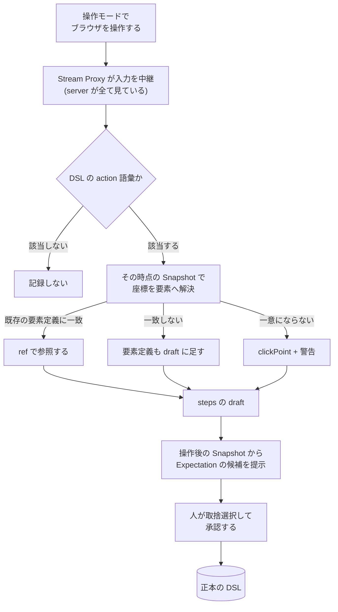

# ADR-0026: 操作の記録を DSL の draft を書く手段として提供する

## 状態

承認

## 決定日

2026-08-15

## 背景

- DSL を書く手段は、現状「人が YAML を手で書く」か「エージェントが `screen.save_draft` で書く」の 2 つだけである。**ブラウザを操作した結果を DSL として残す経路が無い。**
- 画面仕様を新規に起こす場面では、対象アプリの操作列を先に知っている人 (その画面を作った開発者、業務担当者) が YAML を書けるとは限らない。**操作はできるが DSL は書けない**という状態が普通にありうる。
- [adr/0011](0011-dsl-as-source-of-truth.md) は「操作をコマンド列や一時的なスクリプトとして記録するだけでは、操作対象・期待状態・構成番号・変更差分の意味が残らない」ことを DSL 正本化の根拠にしている。**記録そのものを否定してはいないが、記録の位置づけは決めていない。**
- [adr/0008](0008-stream-proxy.md) により、操作モード中の入力はすべて Workflow Server の Stream Proxy を通る。**server が全ての入力を見ている**状態が既にできている。

## 決定

- **操作の記録を、DSL の draft を書く手段の 1 つとして提供する。** 記録は正本を作らない。出力は draft であり、正本への反映は人間の承認を経る ([adr/0017](0017-agent-draft-boundary.md))。
- **記録は Workflow Server 側で行う。** 操作モードの入力は Stream Proxy を通るため、ブラウザへの JS 注入も agent-browser への依存追加も要らない。
- **座標をそのまま残さない。** 各操作について、その時点の Snapshot に対して座標を解決し、Semantic Locator を持つ要素定義へ対応づける。
  - 既存の要素定義に一致すれば、その `ref` を使う。
  - 一致しなければ、要素候補を作って**新規の要素定義も draft に含める** (規則は element-mapping feature)。
  - 一意な Locator へ解決できない場合に限り `clickPoint` として残し、**警告を付ける**。
- **Expectation は自動生成しない。候補として提示し、人が選ぶ。** 操作後の Snapshot から URL・可視要素などの候補を出し、採否は人が決める。
- **記録していることを UI に明示する。** 黙って記録しない。開始と停止は明示操作とする。
- 記録する操作は **DSL の action 語彙に対応するものだけ**とする (`open` / `click` / `fill` / `hover` / `scroll`)。生の入力イベントを残さない。

記録から正本までの流れを示す。

**記録は DSL を書く手段であって、別の正本を作らない。** ADR-0011 の「唯一の正本は DSL」は変わらない。

## 代替案

- **記録を提供しない (現状維持)**: 実装が増えない。しかし DSL を手で書ける人にしか使えず、「操作はできるが DSL は書けない」利用者を排除する。画面仕様を起こす初回のコストが最も高い場面をそのまま残すため却下。
- **生の座標・入力イベントをそのまま記録する** (Playwright の trace に近い形): 実装は最小。しかし再現性が座標に依存し、画面が少し変わるだけで壊れる。**Semantic Locator を優先するという本プロダクトの前提**と正面から矛盾するため却下。
- **記録から Expectation を自動生成する**: 人手が減る。しかし操作後の Snapshot から機械的に条件を起こすと、無関係な要素まで期待状態に入り、**壊れやすいステップが量産される**。冪等スキップの判定も鈍る。候補提示に留めて却下。
- **ブラウザへ JS を注入して DOM イベントを拾う**: Playwright codegen と同じ方式で、取れる情報は多い。しかし対象アプリのページへスクリプトを入れることになり、Non Goals の「任意の JavaScript を無制限に実行しない」と整合しない。Stream Proxy を通る入力だけで足りるため却下。
- **記録結果を正本へ直接書く**: 承認の手間が減る。しかし ADR-0017 の draft 境界を壊し、誤った記録が正本を汚す。却下。

## 影響

### 良い影響

- **DSL を書けない利用者でも画面仕様を起こせる。** 操作して、Expectation を選び、承認するだけで正本ができる。
- 記録が Stream Proxy に乗るため、**agent-browser への依存を増やさない**。実装が interface と app に閉じる。
- 記録の出力が draft であるため、既存の承認フロー・差分表示・エージェントの自己修正がそのまま使える。**新しい経路を作らない。**
- 座標を Locator へ解決してから残すため、記録した DSL がそのまま**再現可能な資産**になる。生の座標列より寿命が長い。

### 悪い影響 / トレードオフ

- 操作モードの意味が増える。従来は「探索のため」だけだったが、記録の有無で結果が変わる。UI で明示しないと混乱する。
- 一意な Locator へ解決できない操作は `clickPoint` として残り、再現性が下がる。警告は出すが、利用者が無視すれば脆い DSL ができる。
- 記録した steps をどの状態の遷移として扱うかは機械的に決まらない。人が決める操作が 1 つ増える。
- Expectation を人が選ぶため、記録しただけでは冪等スキップが効かない。**選ばずに承認すると、毎回実行されるステップになる。**

### 影響範囲

- 対象モジュール / package: workflow / element / web / agent

## 実装・運用への反映

- spec 更新要否: 不要 (spec 未作成)
- context / AI 向け設定更新要否:
  - [design/features/web-editor/DesignDoc_web-editor.md](../design/features/web-editor/DesignDoc_web-editor.md) にモードと記録の導線、Expectation 候補の提示を追加する — 実施済み
  - [design/features/workflow-dsl/DesignDoc_workflow-dsl.md](../design/features/workflow-dsl/DesignDoc_workflow-dsl.md) に、記録が draft を書く手段であること (正本の扱いは変わらないこと) を記載する — 実施済み
  - [design/features/element-mapping/DesignDoc_element-mapping.md](../design/features/element-mapping/DesignDoc_element-mapping.md) に、記録時の座標解決が要素選択と同じ規則を使うことを記載する — 実施済み
  - [design/DesignDoc.md](../design/DesignDoc.md) のスコープと ADR 表を更新する — 実施済み
- 未確認事項: agent-browser が入力転送でどこまでの操作種別を扱えるか (`hover` / `scroll` の扱い)。skeleton の実装で確認する

## 関連ドキュメント / チケット

- [adr/0011](0011-dsl-as-source-of-truth.md): YAML DSL を唯一の正本とする判断 (本 ADR は記録を「書く手段」として位置づけ、正本の扱いを変えない)
- [adr/0008](0008-stream-proxy.md): 入力が Stream Proxy を通る経路
- [adr/0017](0017-agent-draft-boundary.md): draft と確定の境界
- [design/features/web-editor/DesignDoc_web-editor.md](../design/features/web-editor/DesignDoc_web-editor.md): モードと導線
- spec / PR: なし
