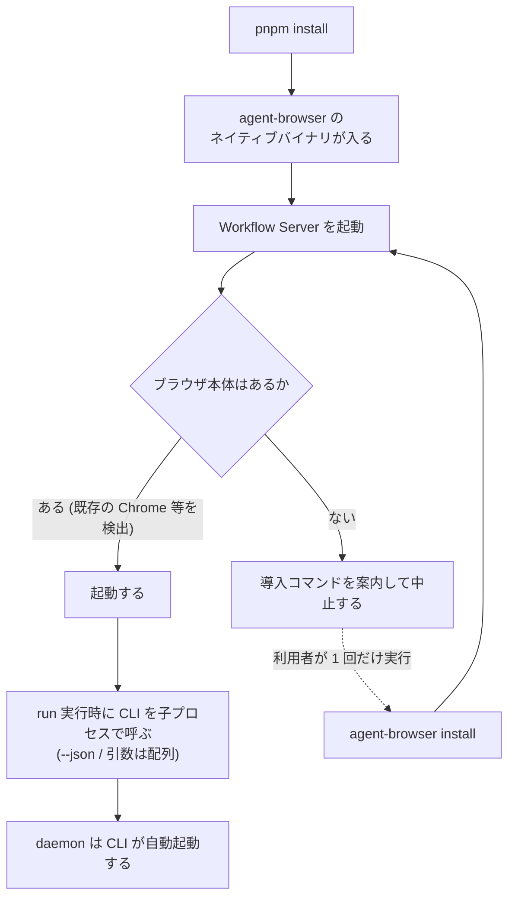

# ADR-0027: agent-browser を npm 依存として同梱しブラウザは起動時に検査する

## 状態

承認

## 決定日

2026-08-16

## 背景

- [adr/0013](0013-agent-browser-runtime.md) は「本システムが同梱し adapter/browser が管理する。利用者は agent-browser を直接導入・操作しない」と決めたが、**同梱の具体的な手段を決めていない**。
- 実装に入る最初の段階でこれが決まっていないと、`adapter/browser` が CLI をどう呼ぶかも、利用者が何を用意すればよいかも定まらない。
- agent-browser の配布形態を調べた結果、次が分かった。
  - **npm パッケージとして配布されている** (`agent-browser`)。実体は Rust のネイティブバイナリで、macOS (ARM64 / x64)・Linux (ARM64 / x64)・Windows x64 に対応する。
  - Homebrew と cargo でも入るが、どちらもリポジトリの依存管理から外れる。
  - **ブラウザ本体は同梱されない。** `agent-browser install` が Chrome for Testing を取得する。既存の Chrome / Brave / Playwright / Puppeteer のインストールを自動検出する経路もある。
  - client-daemon 構成で、daemon は最初のコマンドで自動起動し、1 時間アイドルで終了する。
  - 機械可読な出力は `--json` で得る。

## 決定

- **`agent-browser` を npm の依存として `packages/adapter-browser` に宣言する。** Homebrew と cargo は使わない。リポジトリの依存管理 (lockfile) の外に出ると、再現性を最優先とする方針 ([context/project.yml](../context/project.yml)) を満たせない。
- **バージョンを範囲指定せず固定する。** ブラウザ操作の挙動が変わると成果物と差分判定が変わるためである。更新は動作確認を伴う明示的な操作とする。
- **ブラウザ本体を `postinstall` で自動取得しない。** 代わりに **Workflow Server の起動時に検査し、無ければ導入コマンドを案内して中止する**。
- **daemon の起動は CLI の自動起動に任せる。** 本システムから daemon を明示的に終了させない。
- CLI の呼び出しは `--json` を使い、**引数は配列で渡す**。文字列を連結してシェルに解釈させない。
- ブラウザ本体の取得だけは利用者の 1 回の明示操作とする。ADR-0013 の「利用者は agent-browser を直接導入・操作しない」は、**日常の操作に agent-browser が現れない**という意味に限定する。

導入から実行までの流れを示す。

## 代替案

- **`postinstall` でブラウザ本体を自動取得する**: 利用者の手順が 1 つ減る。しかし数百 MB のダウンロードが `pnpm install` に入り、**CI・オフライン・プロキシ配下で install 全体が壊れる**。加えて agent-browser は既存の Chrome / Brave / Playwright / Puppeteer を検出するため、多くの環境では取得自体が不要である。得るものに対して壊し方が大きいため却下。
- **Homebrew か cargo で導入させる**: 利用者の環境に合わせやすい。しかし lockfile の外に出るため、**どの版で動かしたかが記録に残らない**。再現性を最優先とする方針と噛み合わないため却下。
- **バージョンを範囲指定 (`^`) にする**: 修正を自動で取り込める。しかしブラウザ操作の挙動が変わると成果物と差分判定が変わり、**利用者から見ると「何もしていないのに差分が出た」**ことになる。差分検知が中核機能である以上、実行基盤を勝手に動かさない。却下。
- **ブラウザ本体が無いときに自動取得して続行する**: 起動が止まらない。しかし起動のたびに大きなダウンロードが走りうるうえ、**利用者が何が起きているか分からないまま待たされる**。起動を止めて案内する方が、原因と対処が同時に伝わる。却下。
- **daemon を本システムが起動・終了まで管理する**: 生存を完全に制御できる。しかし daemon は他のプロセスとも共有される資源であり、本システムが終了時に落とすと**同じマシンの別の利用を巻き添えにする**。1 時間のアイドルで自動終了する仕組みが既にあるため却下。

## 影響

### 良い影響

- 依存が lockfile に載るため、**どの版の実行基盤で成果物を作ったかが記録に残る**。差分検知の前提が守られる。
- `pnpm install` が重くならない。CI とオフライン環境で壊れない。
- ブラウザ本体が無いときに黙って進まないため、**原因が起動時に分かる**。実行の途中で不可解に失敗しない。
- daemon を共有資源として扱うため、同じマシンの他の利用と衝突しない。

### 悪い影響 / トレードオフ

- 利用者に 1 回だけ明示操作 (`agent-browser install`) が残る。完全な「入れるだけで動く」にはならない。
- バージョンを固定するため、更新は手動の作業になる。放置すると古いまま動き続ける。
- daemon の生存を制御しないため、**別のプロセスが daemon を落とした場合の挙動を本システムから保証できない**。CLI が再起動する前提に依存する。
- ネイティブバイナリを依存に持つため、pnpm の build script 許可 (`onlyBuiltDependencies`) が要る。許可を忘れると**バイナリが入らないまま install が成功したように見える**。

### 影響範囲

- 対象モジュール / package: execution / infra

## 実装・運用への反映

- spec 更新要否: 不要 (spec 未作成)
- context / AI 向け設定更新要否:
  - [context/toolchain.md](../context/toolchain.md) の標準スタック表へブラウザ実行基盤の行を足す — 実施済み
  - [context/infrastructure.md](../context/infrastructure.md) に起動時の検査項目としてブラウザ本体の有無を追加する — 実施済み
  - [adr/0013](0013-agent-browser-runtime.md) の「利用者は直接導入・操作しない」に、ブラウザ本体の取得だけは例外である旨を追記する — 実施済み
  - `pnpm-workspace.yaml` の `onlyBuiltDependencies` に `agent-browser` を足す (実装時)
- 未確認事項: `agent-browser install` が取得する Chrome for Testing の版を本システム側で固定できるか。固定できないと、ブラウザの更新で描画が変わり画像差分に出る。skeleton の実装で確認する

## 関連ドキュメント / チケット

- [adr/0013](0013-agent-browser-runtime.md): ブラウザ実行基盤に agent-browser を使う判断 (本 ADR は同梱の手段を決める)
- [adr/0001](0001-tech-stack.md): 技術スタックの選定
- [design/features/execution/DesignDoc_execution.md](../design/features/execution/DesignDoc_execution.md): Browser Port の契約
- [context/infrastructure.md](../context/infrastructure.md): 起動時の検査
- 参考: [vercel-labs/agent-browser](https://github.com/vercel-labs/agent-browser) / [agent-browser (npm)](https://www.npmjs.com/package/agent-browser)
- spec / PR: なし
