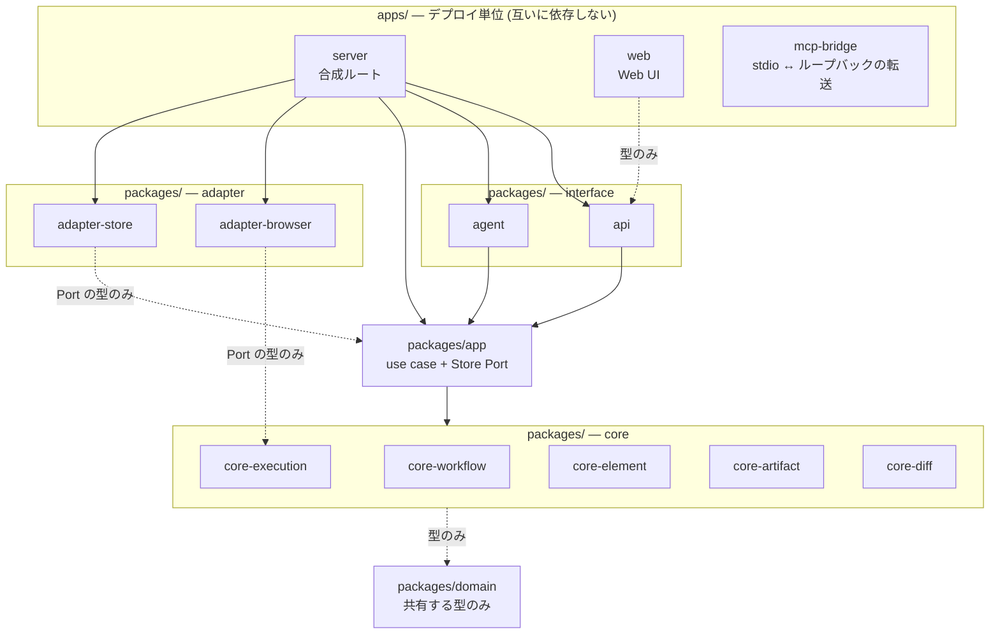

# Codebase Architecture

コードベースの **package / runtime / state boundary と依存方向**。全体像 (system landscape, モジュール責務) は [design/DesignDoc.md](../design/DesignDoc.md) を正本とし、本書は境界規約を扱う。プロジェクト固有の構成は [context/project.yml](project.yml) を参照する。

実装技術は [adr/0001-tech-stack.md](../adr/0001-tech-stack.md) で確定済みで、パッケージの実体は `apps/` / `packages/` / `e2e/` にある。本書の規約自体は実装技術に依存しない。

## Package Boundary

モジュールは interface / app / core / adapter の 4 区分に分ける (責務は [design/DesignDoc.md](../design/DesignDoc.md) のモジュール責務が正本)。加えて、4 区分のどれでもない **合成ルート**を置く。

### apps と packages の分け方

配置の基準は「再利用できるか」ではなく **デプロイされるか**とする。Turborepo は Application Package を「will be deployed from your workspace」、Library Package を「aren't independently deployable」と定義し、Application Package が他から依存されないことを求めている。

| 置き場      | 入るもの                                                   | 制約                                                |
| ----------- | ---------------------------------------------------------- | --------------------------------------------------- |
| `apps/`     | デプロイ単位 (合成ルート、Web UI、MCP ブリッジ)            | **他のパッケージからも他の app からも依存されない** |
| `packages/` | それ以外のすべて (core / app / adapter / api / agent / 型) | デプロイ単位にならない                              |
| `e2e/`      | Playwright                                                 | `apps/` を**プロセスとして起動する**。import しない |

`apps/` の package.json は `exports` を持たない。パッケージ名では解決できないため、**依存グラフの終端であることが構造として保証される**。`e2e` も server を import せず、ビルド済みの bin をプロセスとして起動する。ビルド順だけ turborepo の `@screen-contract/server#build` で担保する。

`api` と `agent` を `packages/` に置くのは、listen せず Hono のアプリケーションとハンドラを組み立てるだけで、プロセスにするのが `apps/server` だからである ([adr/0024](../adr/0024-http-framework.md))。

### 依存方向

- interface (web / api / agent) → app のみに依存する。core / adapter / domain へ直接依存しない。
- app → core に依存する。**adapter と interface へは依存しない**。Port の実装は合成ルートから注入される ([adr/0023](../adr/0023-composition-root.md))。
- core → 他の core と domain へは型の参照のみ許可する。app / adapter / interface へ依存しない。
- domain → **何にも依存しない。** 依存グラフの起点であり、実行時の値も持たない。
- adapter → 自身が実装する Port を定義するモジュール (core または app) と domain の型を通じてのみ依存する。interface と他の adapter へは依存しない。
- 合成ルート (`apps/server`) → 全層に依存してよい。**adapter の具象を選ぶ唯一の場所**とする。
- `apps/mcp-bridge` → **何にも依存しない。** JSON-RPC のフレームを転送するだけで、tool 語彙を解釈しない ([adr/0021](../adr/0021-agent-interface-authz.md))。

実線は値を含む依存、破線は**型だけ**の依存を表す。

`apps/server` だけが adapter へ実線で届く。ここが Port の実装を選ぶ唯一の場所である。`mcp-bridge` はどこへも辺を持たない。

### 禁止経路

- interface から core / adapter / domain への直接依存 (use case を経由せず境界が崩れるため)
- core から adapter への依存 (Port の逆流。差し替え可能性が失われるため)
- core 同士のロジック共有 (共有したくなったら domain へ型として切り出すか、app 層の use case に置く)
- **domain への値の設置** (core → domain は型のみのため、値を置くと core から呼べない API になる)
- **app から adapter への依存** (Store Port が app にあるため循環し、fake の差し替えが実行時分岐になるため。[adr/0023](../adr/0023-composition-root.md))
- **app から interface への依存** (依存は interface → app の一方向であるため)
- **adapter から interface / 他の adapter への依存** (adapter は Port を実装するだけであるため)
- **`packages/` から `apps/` への依存** (`apps/` は依存グラフの終端であるため)
- **`apps/` 同士の依存** (デプロイ単位は独立したプロセスであり、繋ぐと片方の変更が他方の配布物へ波及するため)

### Port の定義場所と参照元

| Port         | 定義するモジュール | 実装するモジュール | 実装側が参照するもの |
| ------------ | ------------------ | ------------------ | -------------------- |
| Browser Port | core/execution     | adapter/browser    | core/execution の型  |
| AI Port      | core/element       | (MVP 実装なし)     | core/element の型    |
| DSL Fix Port | core/workflow      | (MVP 実装なし)     | core/workflow の型   |
| Store Port   | app                | adapter/store      | app の型             |

Store Port を app に置くのは保存が機能横断のためであり、**例外はこの 1 つに限る**。adapter/ai を MVP で実装しない判断は [adr/0019](../adr/0019-agent-led-ai-suggestions.md)。

### 対象ページへ届ける入力の語彙

Stream Proxy が中継する入力は **Browser Port の語彙 (`PageInput`) で表す**。実行基盤の生の形 (CDP の `input_mouse` / `mousePressed` / 修飾キーのビットフラグ) を interface 層 (api / web) へ持ち込まない。持ち込むと、基盤を差し替えたときに adapter だけでなく api と web を直すことになり、[adr/0013](../adr/0013-browser-port.md) の差し替え可能性が失われる。

| 層              | 担うこと                                                      |
| --------------- | ------------------------------------------------------------- |
| core/execution  | 語彙の定義と、外部入力からの `parsePageInput`                 |
| api             | 中継条件の判定 (ADR-0008)。**組み直したものだけを上流へ渡す** |
| adapter/browser | 実行基盤の語彙への写像。**この写像は adapter の外に出さない** |
| web             | 中立の語彙で組み立てる                                        |

`parsePageInput` は列挙に無い形を落とす。素通しにすると、認証を通した client が実行基盤の配信ソケットへ任意の命令を送れる — 中継の口は「操作モードのマウスとキー入力」のためにある。

### 合成ルートの責務

`apps/server` は次だけを担い、ドメインロジックと use case を持たない。

- adapter の具象を選ぶ (実装か fake か)
- `app` の factory へ Port の実装を注入する
- `api` と `agent` を 1 つのプロセスへ載せる
- 自プロセスの起動と終了を管理する (agent-browser のセッション回収を含む。daemon の終了は含まない)

Nx が「an application project contains the deployable shell: entry point, configuration, and composition of features」「the majority of your code in `libs/`, with `apps/` reduced to wiring」と定める形に一致する。

循環依存・未宣言依存・上記の禁止経路は [engineering.md](engineering.md) の quality gate で検査する。検査コマンドは `pnpm boundaries` (dependency-cruiser) で、pre-push で通す。

参考: [Turborepo Package types](https://turborepo.dev/docs/core-concepts/package-types) / [Turborepo best practices](https://github.com/vercel/turborepo/blob/main/skills/turborepo/references/best-practices/RULE.md) / [Nx Folder Structure](https://nx.dev/docs/kb/folder-structure)

## Runtime Boundary

- Web UI と Workflow Server は別プロセスとする。Web UI はブラウザ操作・成果物生成を直接実行しない。
- Workflow Server (api 層) を唯一の backend とする。web 側の server 機能 (TanStack Start の server function 等) に API ロジックを置かない。中間層 (BFF / 別言語 backend) を追加しない判断は [adr/0001-tech-stack.md](../adr/0001-tech-stack.md)。
- agent-browser の CLI は adapter/browser が子プロセスとして呼ぶ。**daemon は CLI が自動起動し、CLI プロセスの終了後も生存する** (既定は 1 時間のアイドルで終了)。本システムは daemon を明示的に終了させず、**回収するのはセッションまで**である ([adr/0027](../adr/0027-agent-browser-bundling.md))。
- AI エージェント (Claude Code / Codex 等) は interface/agent (MCP server / App Server 型 JSON-RPC) からのみ接続する。
- ライブ映像は agent-browser の WebSocket ストリーミングを Workflow Server 経由で配信する ([adr/0008](../adr/0008-stream-proxy.md))。
- 秘密情報 (認証情報・トークン) を client / DSL / 成果物へ露出させない ([infrastructure.md](infrastructure.md))。

## State Boundary

- 正本は DSL と Baseline であり、adapter/store が保存する。画像・Markdown テーブルは生成物で、直接編集しない。
- draft と確定を分離する: エージェント・利用者の編集は draft に置き、人間の承認によってのみ Baseline・構成番号を確定する (用語は [project.yml](project.yml) の glossary)。**draft と正本は別の置き場に保存する**。承認は draft を正本の置き場へ確定させる操作である (判断の正本は [adr/0017](../adr/0017-agent-draft-boundary.md))。
- 実行中の一時状態 (agent-browser の要素参照、実行途中のステップ状態) は永続化しない。永続化するのは実行履歴 (入力、ステップ結果、Snapshot、スクリーンショット、差分結果) のみ。
- client state (Web UI の表示状態) は正本を持たない。リロードで再取得できる情報のみ保持する。
