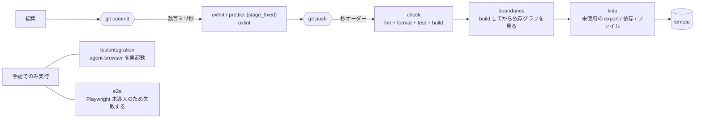

# Engineering Conventions

shared config / root task / repository quality gate の境界規約。toolchain 一覧は [toolchain.md](toolchain.md)、プロジェクト固有コマンドは [context/project.yml](project.yml)。

## Code Comment Boundary

### 何をどこに書くか

情報の置き場を次のとおり分ける。**コードから読み取れることをコメントに書き写さない。**

| 置き場           | 書くこと                                               |
| ---------------- | ------------------------------------------------------ |
| コード           | **How** — どう実現しているか。コード自身が語る         |
| テストコード     | **What** — 何が成り立つべきか                          |
| commit / PR      | **Why** — なぜこの変更をしたか                         |
| コード内コメント | **Why not** — なぜ他の手を採らなかったか               |
| 関数・型の doc   | **What** — 何をするものか (公開 API の doc 規約に従う) |

コード内コメントの主役は **Why not**。「どう動くか」はコードを読めば分かるが、
「なぜ素直な方法を採らなかったか」は読んでも分からない。書かないと後から
不用意に「単純化」されて壊れる。

書かないもの: コードを言い換えただけの行、型を繰り返すだけの doc、
変更の経緯や issue 番号 (commit と ADR が持つ)。

### 言語

- コード内コメント / ドキュメント / commit / PR は**日本語**で書く。
- **利用者に見える文字列リテラル (CLI 出力 / エラーメッセージ / API の値) は変えない。**
  観測可能な契約であり、テストが固定している。
- 識別子・型名・API 名は原語のまま使う。

### 参照の張り方

- **コメントから spec / issue を引用しない。** spec は issue close 時に削除される
  作業文書であり、コードから参照すると宙に浮いたリンクが残る。
- 理由を残すときのリンク先は ADR と長く残る決まりのドキュメント (`adr/*.md` /
  `context/*.md` / feature doc) に限る。

## Shared Config Boundary

共有設定は `packages/config` が `exports` で配り、各パッケージは `extends` か参照だけを持つ。

| 置き場            | 対象                                                                             |
| ----------------- | -------------------------------------------------------------------------------- |
| `packages/config` | tsconfig の base / node / browser、vitest の base / integration                  |
| リポジトリルート  | `turbo.json`、`pnpm-workspace.yaml`、oxlint、整形、依存境界と未使用検出の config |
| 各パッケージ      | 上記を `extends` / 参照する数行のみ                                              |

oxlint は `packages/config` に置かない。層別のルールを `overrides` で 1 本に書くほうが、層とルールの対応を 1 箇所で読めるためである。

`packages/config` も他のパッケージと同じく build する。`exports` を `dist` に向けることで、共有設定が型検査の対象から外れる経路を作らない。

パッケージ固有の上書きは、そのパッケージでしか意味を持たない設定に限る。**同じ上書きが 2 パッケージで重複したら共有設定へ引き上げる**。

pnpm の設定は `pnpm-workspace.yaml` に書く。`.npmrc` は認証と registry のみを扱う (pnpm の現行仕様)。

## Root Task Boundary

root から束ねるのは [project.yml](project.yml) の `commands` と 1 対 1 のタスクである。**パッケージ単位に分かれる仕事だけを turborepo に載せる。**

```jsonc
{
  "tasks": {
    "build": { "dependsOn": ["^build"], "outputs": ["dist/**"] },
    "test": { "dependsOn": ["^build"] },
    "test:integration": { "dependsOn": ["^build"], "cache": false },
    "e2e": { "dependsOn": ["^build"], "cache": false },
  },
}
```

`test` 系が `^build` に依存するのは、依存パッケージの `.d.ts` と `dist` を必要とするためである。成果物を生まないタスク同士を繋がない。

リポジトリ全体を 1 度で見るものは turborepo に載せない。載せると、実装するパッケージが 1 つも無いタスクが**黙って成功する**ためである。

| コマンド              | 実行のしかた           | 理由                                          |
| --------------------- | ---------------------- | --------------------------------------------- |
| `typecheck` / `dev`   | root の `tsc --build`  | solution tsconfig が全パッケージを 1 度に見る |
| `lint` / `format`     | root で oxlint / oxfmt | 設定がルート 1 本                             |
| `boundaries` / `knip` | root で 1 プロセス     | リポジトリ全体のグラフを見る検査              |

root の `test` から外すもの:

- **統合テスト** (`test:integration`) — agent-browser を実起動するため。**手動でのみ実行する**
- **E2E** (`e2e`) — Playwright と Workflow Server の起動を伴うため

`e2e` は Playwright 未導入のため、実行すると理由を出して失敗する。**黙って成功させない。** 実行対象を持たないタスクが緑になると、導入し忘れに気付けないためである。

自動検査の実行点は次のように分ける。実行時間で分けている。

| 実行点     | 通すもの                                                         | 理由                              |
| ---------- | ---------------------------------------------------------------- | --------------------------------- |
| pre-commit | oxfmt、prettier、oxlint (型情報を使わないルール)                 | 数百ミリ秒で終わる                |
| pre-push   | `check` (lint + format + test + build)、dependency-cruiser、knip | 秒オーダー。commit のたびには重い |



**pre-commit に型検査を置かない。** TypeScript 7 は `tsc` にファイルパスを渡せないため、変更ファイルだけを型検査する構成が組めない ([toolchain.md](toolchain.md))。型検査は `lint` に含めて pre-push で通す。

`typecheck` の実体は solution tsconfig に対する `tsc --build` である。composite なプロジェクトでは型検査と `.d.ts` の生成が同じ処理であり、別に `--noEmit` を走らせても同じ仕事を 2 度行うだけになる。

pre-commit で整形した結果は lefthook の `stage_fixed` で staging へ戻す。`git add` を明示的に書くと、部分 stage したファイルの**未 stage の変更まで commit に巻き込む**。

このため、sdd-template が配布する `hooks/format/run_prettier.sh` は**使わない**。整形後に `git add <ファイル全体>` を行うためである。配布物はテンプレ側でしか編集できないので、`lefthook.yml` (消費 repo 所有) で prettier を直接呼ぶ形に置き換えている。

なお **prettier は明示的にパスを渡しても `.prettierignore` を尊重する。** 実際に規則から外れた `.ts` を渡して書き換えられないことを確認した。したがって prettier と oxfmt が TypeScript を二重に整形する事故は起きない。

## Repository Quality Gate

3 つのツールで担当を分ける。役割は重複しない。

| ツール                 | 正本 config               | 担当                                          | 担当しないこと                 |
| ---------------------- | ------------------------- | --------------------------------------------- | ------------------------------ |
| **oxlint**             | `.oxlintrc.json` (ルート) | 通常の lint。native ルールと type-aware       | 層やディレクトリ単位の依存方向 |
| **dependency-cruiser** | `.dependency-cruiser.cjs` | 層の依存方向、循環依存、依存の宣言漏れ        | export 粒度の未使用検出        |
| **knip**               | `knip.json`               | 未使用の export / 型 export / 依存 / ファイル | 依存の方向                     |

tsconfig と vitest の共有設定は `packages/config` が持つ。oxlint の設定はパッケージごとに分けず、ルート 1 本と `overrides` で層別のルールを表現する。

### eslint を採らない

型情報を使う lint は oxlint だけを使う。理由は 2 つ。

- typescript-eslint は TypeScript 7 を型情報源として未対応である
- oxlint の type-aware は TypeScript 7 以上を要求し、typescript-eslint の type-aware 61 ルールのうち 59 を実装している

eslint を残す理由になりうるのは層の依存境界ルールだが、それは dependency-cruiser が担う。プロセスと設定を 2 系統維持する利得がない。

type-aware は `pnpm lint` で有効にする (`oxlint --type-aware`)。別パッケージの `oxlint-tsgolint` を要求し、**入れ忘れると警告 1 行を出して終了コード 0 で抜ける**ため、devDependencies に宣言して外れないようにする。

pre-commit の oxlint には `--type-aware` を付けない。プログラム全体の型情報を要求するため、変更ファイルだけを見る用途に合わないためである。実際に `no-floating-promises` を仕込んで、type-aware 無しでは検出されず有りで検出されることを確かめた。

### 依存境界の検査

依存方向を dependency-cruiser に置くのは、**type-only と value の import を区別できる**ためである (`dependencyTypesNot: ["type-only"]`)。[architecture.md](architecture.md) が「core → 他の core へは型の参照のみ」「adapter → Port の型を通じてのみ」と定めており、この区別ができないと規約を検査できない。パッケージ分割だけでは両者を区別しないため、粒度を細かくしても代替にならない。

ルールは [architecture.md](architecture.md) の禁止経路と 1 対 1 で対応させる。

| ルール名                        | from                           | to                                                                       |
| ------------------------------- | ------------------------------ | ------------------------------------------------------------------------ |
| `no-circular`                   | 全体                           | `circular: true`                                                         |
| `packages-not-to-apps`          | `^packages/`                   | `^apps/`                                                                 |
| `apps-not-to-apps`              | `^apps/([a-z-]+)/`             | 自身を除く `^apps/`                                                      |
| `interface-not-to-core-adapter` | `^packages/(api\|agent)/`      | `^packages/(core-\|adapter-\|domain)`                                    |
| `web-not-to-inner`              | `^apps/web/`                   | `^packages/(core-\|app/\|adapter-\|agent/\|domain)`                      |
| `web-to-api-type-only`          | `^apps/web/`                   | `^packages/api/` + `dependencyTypesNot: ["type-only"]`                   |
| `app-not-to-adapter`            | `^packages/app/`               | `^packages/adapter-`                                                     |
| `core-not-outward`              | `^packages/core-`              | `^packages/(adapter-\|app/\|api/\|agent/)`                               |
| `core-cross-module-type-only`   | `^packages/core-([a-z-]+)/`    | `^packages/(core-\|domain/)` + `dependencyTypesNot: ["type-only"]`       |
| `domain-not-outward`            | `^packages/domain/`            | 自身を除く `^(packages\|apps)/`                                          |
| `adapter-only-port-types`       | `^packages/adapter-`           | `^packages/(core-\|app/\|domain/)` + `dependencyTypesNot: ["type-only"]` |
| `not-unresolvable`              | 全体                           | `couldNotResolve: true`                                                  |
| `no-non-package-json`           | 全体                           | 未宣言の外部依存                                                         |
| `app-not-to-interface`          | `^packages/app/`               | `^packages/(api/\|agent/)`                                               |
| `adapter-not-outward`           | `^packages/adapter-([a-z-]+)/` | 自身を除く `^packages/(api/\|agent/\|fixture-app/\|adapter-)`            |
| `not-to-dev-dep`                | ランタイムコード               | devDependencies                                                          |

`no-restricted-imports` による層別の禁止を oxlint 側にも書く。エディタ上で即座に赤くなる一次防御であり、**正本は dependency-cruiser 側**とする。したがって **oxlint にしか無いルールを作らない**。`no-restricted-imports` はパッケージ名しか見ないため、相対パスで隣のパッケージへ潜る経路を止められない。

### 除外方針

- 除外は各ツールの config に集約する。**ソースへ無効化コメントを書かない**。書くと検査が意味を失う
- 例外が要るときはルールそのものを見直し、理由を ADR か本書に残す
- 実装 0 行から始めるため、dependency-cruiser の `--ignore-known` による baseline は作らない。**最初から違反ゼロで始める**

### scaffold で確認した結果

各ルールに意図的な違反を入れて、検査が落ちることまで確かめた。結果は次のとおり。

| 確認したこと                                     | 結果                                                       |
| ------------------------------------------------ | ---------------------------------------------------------- |
| `pathNot` の後方参照 (`^packages/core-$1/`)      | 機能する。同一 core 内の値 import は誤検知しない           |
| `dependencyTypesNot: ["type-only"]` の判定       | 機能する。`import type` と値 import を区別する             |
| dependency-cruiser の pnpm workspace 対応        | 機能する。`node_modules` の symlink を辿って実体へ解決する |
| oxlint の `overrides` と `no-restricted-imports` | 併用できる。層別のパターン指定がそのまま効く               |

意図的な違反で落ちることを確認したルールは次の 11 個。後方参照が機能したため、core モジュールごとにルールを展開する必要はなくなった。

`app-not-to-adapter` / `app-not-to-interface` / `adapter-only-port-types` / `adapter-not-outward` / `apps-not-to-apps` / `core-cross-module-type-only` / `domain-not-outward` / `not-to-dev-dep` / `not-unresolvable` / `web-not-to-inner` / `web-to-api-type-only`

確認の過程で分かったことを 2 つ残す。

- **`not-to-dev-dep` は workspace 依存には発火しない。** pnpm の workspace link は `dependencyTypes` が `["undetermined", "type-only", "import"]` になり、`npm-dev` が付かない。発火するのは実際の npm パッケージを devDependencies から参照したときだけである。したがって `apps/web` が型でしか使わない `@screen-contract/api` を devDependencies に置いていても本ルールには掛からない。**型限定の強制は `web-to-api-type-only` が担う。**
- **`apps-not-to-apps` はパッケージ名の import では発火しない。** `apps/` の package.json は `exports` を持たないため、そもそもパッケージ名で解決できず `not-unresolvable` が先に落ちる。本ルールが効くのは相対パスで隣の app へ潜ったときである。`exports` を持たないこと自体が、デプロイ単位を依存グラフの終端に保つ構造上の保証になっている。

### 検査を成立させるための前提

**依存境界の検査は、設定を 1 つ間違えると違反ゼロで成功する。** 落ちないことは、正しいことを意味しない。scaffold で実際に空回りさせた設定を挙げる。

| 外すと起きること                                   | 満たすべき設定                                                      |
| -------------------------------------------------- | ------------------------------------------------------------------- |
| dependency-cruiser が起動しない                    | Node を 24 (LTS) に固定する (`mise.toml`)。奇数系は起動を拒否される |
| config 検証で弾かれる                              | `exports` / `conditionNames` は `enhancedResolveOptions` の下に置く |
| パッケージ間の辺が全部消える                       | `dist/` を `exclude` しない                                         |
| 同じく辺が消える (clone 直後 / `dist` 削除後)      | `boundaries` は build してから走らせる                              |
| `not-unresolvable` と `no-non-package-json` が死ぬ | `includeOnly` で外部依存を絞らない                                  |
| 型の消えた成果物を二重に辿る                       | 走査の起点は `src` と `packages/config/vitest` に絞る               |
| **git hook から実行すると常に失敗する**            | hook のコマンドは `scripts/run-with-node.sh` 経由で呼ぶ             |

補足を 2 点。

- パッケージ間の import は `exports` 経由で `packages/<名前>/dist/index.d.ts` に解決される。ルールの `path` はパッケージ名までの前置き一致なので、src と dist のどちらに解決されても判定は変わらない。
- 解決に失敗した依存の `resolved` はモジュール指定子のまま (例 `"lodash"`) になる。`includeOnly: "^(apps|packages|e2e)/"` を置くと、この辺がルール評価の前に捨てられ、未宣言依存を検出するルールが 1 件も発火しなくなる。

**git hook は対話シェルではない。** mise が activate されていないため PATH にはシステムの Node が乗り、`pnpm boundaries` を素で叩くと Node のバージョン違いで必ず失敗する。手元では通るのに push だけ通らない、という形で出る。hook からのコマンドは `scripts/run-with-node.sh` を経由させ、mise がある環境ではそれ経由で解決する。**mise が無い環境でも hook を壊さない**よう、無ければそのまま実行する。

`not-unresolvable` を最後の砦とする。pnpm は宣言していない依存を解決させないため、**宣言漏れは必ず「解決できない依存」として現れる**。

### 整形ツールの担当分け

oxfmt は `--ignore-path` を渡さないと `.gitignore` と `.prettierignore` を読む。`.prettierignore` は TypeScript を除外しているため、既定のままでは **oxfmt が担当すべき `.ts` を飛ばして JSON だけを整形する**。担当を分けるため oxfmt には `.oxfmtignore` を渡す。

| ツール   | ignore ファイル   | 担当                      |
| -------- | ----------------- | ------------------------- |
| oxfmt    | `.oxfmtignore`    | `.ts` / `.tsx` / `.js` 系 |
| prettier | `.prettierignore` | `.md` / `.yml` / `.json`  |

### 未使用 export の検出範囲

knip の `includeEntryExports` は既定 (`false`) のままにする。各パッケージの `src/index.ts` は `exports` で公開する契約そのものであり、実装前の scaffold では全ての Port 型が未使用として挙がって検査が常に落ちるためである。**エントリ以外のファイルの未使用 export は既定でも検出される**ので、実装中の dead code は捕まえられる。

実装が各パッケージに入った時点で `includeEntryExports: true` へ切り替える。内部パッケージは全て `private: true` であり、本来は公開 API を持たないためである。
