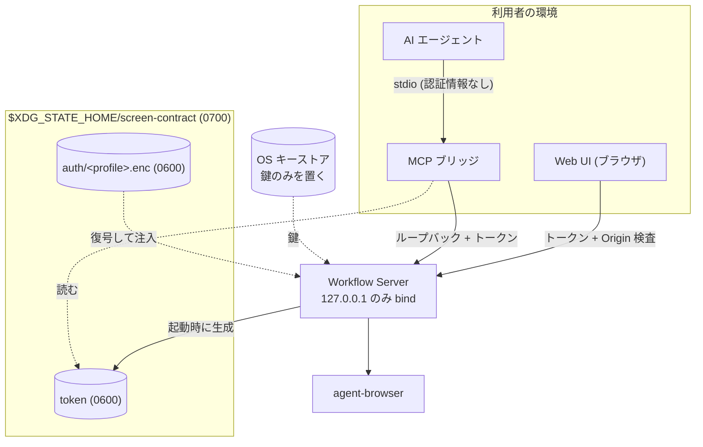

# Infrastructure & Operations

実行基盤・環境戦略・運用・セキュリティの契約。本書は **app 側が依存する contract** を定義する。

MVP はローカル実行とする。利用者の開発マシン上で Workflow Server と agent-browser を起動し、クラウドへは公開しない。リモート公開は対象外である ([adr/0021](../adr/0021-agent-interface-authz.md))。

## Infrastructure / Deployment

配布物は 1 つの Node パッケージである。infra repo は持たない。

| 動くもの        | 実体              | 起動のしかた                                        |
| --------------- | ----------------- | --------------------------------------------------- |
| Workflow Server | `apps/server`     | 利用者が起動する常駐プロセス。127.0.0.1 にのみ bind |
| Web UI          | `apps/web`        | Workflow Server が配信する静的ファイル              |
| MCP ブリッジ    | `apps/mcp-bridge` | AI エージェントが stdio で起動する                  |
| agent-browser   | 外部 CLI          | Workflow Server が子プロセスとして起動する          |

## Security / Privacy

### 保存先はリポジトリの外に置く

secret を含むローカル状態は、**リポジトリ配下に一切置かない**。誤って commit する経路を作らないためである。置き場は XDG Base Directory に従う。

```
$XDG_STATE_HOME/screen-contract/        既定は ~/.local/state/screen-contract/  (0700)
├── token                               Workflow Server のローカルトークン       (0600)
└── auth/
    └── <authProfile>.enc               暗号化した Storage State                (0600)
```

macOS でも同じ配置とする。プラットフォームごとに置き場を変えると、調査と手当ての手順が分岐するためである。

### 経路ごとの認証と保管



### ローカルトークン

- Workflow Server の起動ごとに生成し、`token` へ書き出す。プロセス終了時に削除する。
- ファイルは 0600、置き場のディレクトリは 0700 で作る。作成時に権限を検査し、緩ければ起動を中止する。
- HTTP / App Server 型 JSON-RPC / Stream Proxy が要求する。MCP は stdio のため要求しない。ブリッジがループバック側で付与する ([adr/0021](../adr/0021-agent-interface-authz.md))。
- **ログ・エラーメッセージ・成果物へ出さない。**

### Origin 検査

ブラウザ由来の呼び出しと DNS rebinding を防ぐため、`Origin` ヘッダを検査する。

| `Origin` の値                                         | 扱い                   |
| ----------------------------------------------------- | ---------------------- |
| `http://127.0.0.1:<port>` / `http://localhost:<port>` | 許可する               |
| 上記以外                                              | 403 で拒否する         |
| ヘッダが無い (ブラウザ以外からの要求)                 | トークンだけで判定する |

### 認証状態 (Storage State)

- 実体は cookie / localStorage の JSON である。**鍵は OS のキーストア** (macOS Keychain / libsecret / DPAPI) に置き、JSON 本体は鍵で暗号化して `auth/<authProfile>.enc` に保存する ([adr/0022](../adr/0022-auth-state-storage.md))。
- キーストアの識別子は service を `screen-contract`、account を `storage-state-key` とする。
- 取り込みは、人間がブラウザで手動ログインし、その時点の Storage State を取り込む導線で行う。MFA / SSO がある場合も初回だけ人間が通る。
- 失効時は `auth/expired` の機械可読コードを持つ構造化エラーを返し、取り込み直しを促す。
- **DSL・ログ・Snapshot・生成成果物へ平文で保存しない。** これは DesignDoc の設計上の前提である。

### client への露出

Web UI へ渡してよいのはローカルトークンだけである。Storage State と暗号鍵は Workflow Server の内側に留める。Web UI は backend ロジックを持たない ([context/architecture.md](architecture.md) の Runtime Boundary)。

## Environment Strategy

MVP はローカルの 1 環境だけを持つ。preview / production は作らない。

| 環境  | 用途                             | 昇格トリガ                  |
| ----- | -------------------------------- | --------------------------- |
| local | 利用者の開発マシン上での実行のみ | 無し (公開先を持たないため) |

リモート公開を行う場合は、OAuth / OIDC の追加 ([adr/0021](../adr/0021-agent-interface-authz.md)) と本節の作り直しが同時に必要になる。

## Operations / Observability

- 常駐プロセスは Workflow Server 1 つである。障害の一次観測点はその標準出力とする。
- 継続的インテグレーション (CI) 上での実行は MVP の対象外とする (DesignDoc の Future Work)。
