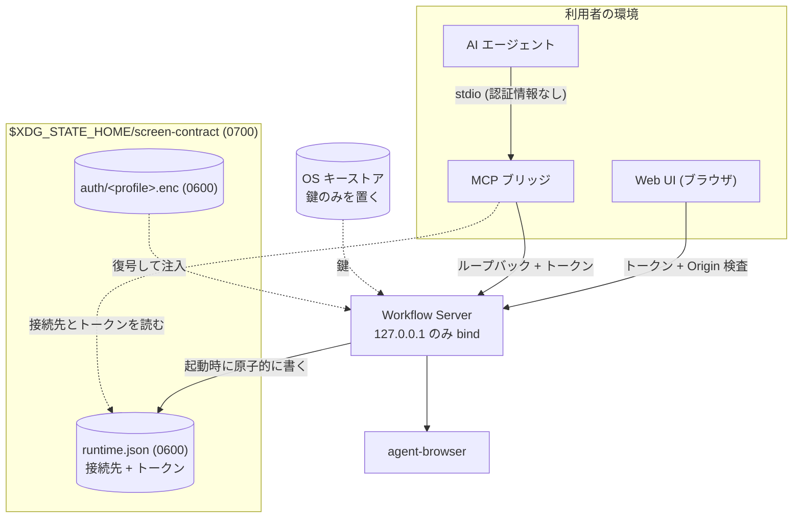

# Infrastructure & Operations

実行基盤・環境戦略・運用・セキュリティの契約。本書は **app 側が依存する contract** を定義する。

MVP はローカル実行とする。利用者の開発マシン上で Workflow Server と agent-browser を起動し、クラウドへは公開しない。リモート公開は対象外である ([adr/0021](../adr/0021-agent-interface-authz.md))。

## Infrastructure / Deployment

配布物は 1 つの Node パッケージである。infra repo は持たない。

| 動くもの        | 実体              | 起動のしかた                                        |
| --------------- | ----------------- | --------------------------------------------------- |
| Workflow Server | `apps/server`     | 利用者が起動する常駐プロセス。127.0.0.1 にのみ bind |
| Web UI          | `apps/web`        | Workflow Server が配信する静的ファイル              |
| MCP ブリッジ    | `apps/mcp-bridge` | AI エージェントが stdio で起動する                  |
| agent-browser   | 外部 CLI          | Workflow Server が子プロセスとして起動する          |

## Security / Privacy

### 保存先はリポジトリの外に置く

secret を含むローカル状態は、**リポジトリ配下に一切置かない**。誤って commit する経路を作らないためである。置き場は XDG Base Directory に従う。

```
$XDG_STATE_HOME/screen-contract/        既定は ~/.local/state/screen-contract/  (0700)
├── runtime.json                        待受アドレス・ポート・トークン・PID      (0600)
├── secrets.enc                         DSL が名前で参照する入力値               (0600)
└── auth/
    └── <authProfile>.enc               暗号化した Storage State                (0600)
```

macOS でも同じ配置とする。プラットフォームごとに置き場を変えると、調査と手当ての手順が分岐するためである。

#### 置き場の検証

**`XDG_STATE_HOME` の値を信用しない。** 環境変数は利用者が設定でき、`XDG_STATE_HOME=$PWD/.state` のような値を置かれると、配置規則を守ったまま secret がリポジトリ配下へ落ちる。起動時に次を検査し、満たさなければ**起動を中止する**。

| 検査                                     | 満たさない場合に起きること                  |
| ---------------------------------------- | ------------------------------------------- |
| 絶対パスであること                       | 実行ディレクトリ次第で置き場が変わる        |
| symlink を解決した後のパスで判定すること | 文字列の検査だけでは symlink で外へ出られる |
| リポジトリと worktree の配下でないこと   | secret が commit の対象に入る               |
| ディレクトリの権限が 0700 であること     | 同じマシンの他利用者が読める                |

「起動しない」を選ぶ。**警告だけ出して続行すると、secret を置いてから気付くことになる。**

### 起動時に検査するもの

置き場の検査に加えて、次を起動時に確かめる。**満たさなければ理由と対処を出して中止する。**

| 検査                                | 満たさない場合の案内                                                                                                                                                             |
| ----------------------------------- | -------------------------------------------------------------------------------------------------------------------------------------------------------------------------------- |
| ブラウザ本体が使えること            | **本リポジトリの導入コマンド**の実行を案内する。ブラウザ本体は版を指定して自前で取得し、実行時は実行ファイルのパスを明示する ([adr/0027](../adr/0027-agent-browser-bundling.md)) |
| 実行してよい origin が 1 つ以上ある | 設定への追記を案内する (既定は空。列挙が無いと実行できない)                                                                                                                      |
| 常駐サーバが二重起動でないこと      | 既存の `runtime.json` が指すプロセスの停止を案内する                                                                                                                             |

**起動してから実行時に失敗させない。** 実行の途中で落ちると、どこまで進んだかの後始末が要る。起動時なら何も始まっていない。

### 常駐サーバの接続先

MCP ブリッジと App Server 型 JSON-RPC のクライアントは**別プロセス**であり、Workflow Server の待受ポートを知る必要がある。トークンだけでは接続先が決まらない。`runtime.json` が待受アドレス・ポート・トークン・プロセス ID を持つ。

- **トークンと接続先を 1 つのファイルにまとめて原子的に置き換える。** 別々に書くと、片方だけ新しい状態を読むクライアントが出る。
- 起動時に書き、終了時に削除する。残っていてもプロセス ID で生存を確認できる。
- **常駐サーバは 1 つに限る。** 起動時に既存の `runtime.json` が生きたプロセスを指していれば、二重起動として中止する。複数動くと、どちらへ繋がったかで見える run が変わる。
- ポートは固定しない。OS に割り当てさせ、結果をこのファイルへ書く。固定すると他のアプリと衝突する。

### 経路ごとの認証と保管



### ローカルトークン

- Workflow Server の起動ごとに生成し、接続先と一緒に `runtime.json` へ書き出す。プロセス終了時に削除する。
- **暗号論的に安全な乱数生成器で 32 バイト以上**を生成する。連番・時刻・プロセス ID から作らない。
- **比較は定数時間で行う。** 通常の文字列比較は先頭からの一致長で処理時間が変わり、1 バイトずつ総当たりできる。
- ファイルは 0600、置き場のディレクトリは 0700 で作る。作成時に権限を検査し、緩ければ起動を中止する。
- HTTP / App Server 型 JSON-RPC / Stream Proxy が要求する。MCP は stdio のため要求しない。ブリッジがループバック側で付与する ([adr/0021](../adr/0021-agent-interface-authz.md))。
- **ログ・エラーメッセージ・成果物へ出さない。**

#### 経路ごとの受け渡し

| 受け取る側               | 受け渡し                                   | 禁止                    |
| ------------------------ | ------------------------------------------ | ----------------------- |
| MCP ブリッジ             | `runtime.json` を読む                      | —                       |
| App Server 型 JSON-RPC   | 同上                                       | —                       |
| Web UI (ブラウザ)        | Workflow Server が配信する HTML へ埋め込む | URL の query に載せない |
| Stream Proxy (WebSocket) | 接続後の**最初のフレーム**で認証する       | URL の query に載せない |

ブラウザは `runtime.json` を読めないため、Web UI だけは別経路が要る。**URL の query に載せない。** URL はブラウザの履歴、`Referer` ヘッダ、サーバのアクセスログに残る。WebSocket は任意のヘッダを付けられないため、接続後の最初のフレームで認証する。

#### MCP ブリッジが転送してよい範囲

ブリッジはトークンを付与する立場にあるため、**転送先を agent tool 語彙に限る**。全経路を素通しさせると、stdio を握った任意のプロセスがトークンなしで Stream Proxy と管理系へ到達でき、ADR-0021 が却下した「無認証ポートの公開」と同じ到達性になる。

### Origin 検査

ブラウザ由来の呼び出しと DNS rebinding を防ぐため、`Origin` ヘッダを検査する。

| `Origin` の値                                          | 扱い                   |
| ------------------------------------------------------ | ---------------------- |
| `http://127.0.0.1:<自分の待受ポート>` / 同 `localhost` | 許可する               |
| 上記以外 (**ポートが違うものを含む**)                  | 403 で拒否する         |
| ヘッダが無い (ブラウザ以外からの要求)                  | トークンだけで判定する |

**任意のポートを許可しない。** 同じマシンで動く別のローカル Web アプリからの cross-origin 要求が通ってしまう。許可するのは自分の待受ポートだけである。

あわせて **`Host` ヘッダも検査する。** DNS rebinding の主防御は Host 検査であり、Origin 検査だけでは足りない。`127.0.0.1:<自分の待受ポート>` 以外を拒否する。

### 認証状態 (Storage State)

- 実体は cookie / localStorage の JSON である。**鍵は OS のキーストア** (macOS Keychain / libsecret / DPAPI) に置き、JSON 本体は鍵で暗号化して `auth/<authProfile>.enc` に保存する ([adr/0022](../adr/0022-auth-state-storage.md))。
- キーストアの識別子は service を `screen-contract`、account を `storage-state-key` とする。
- 取り込みは、人間がブラウザで手動ログインし、その時点の Storage State を取り込む導線で行う。MFA / SSO がある場合も初回だけ人間が通る。
- 失効時は `auth/expired` の機械可読コードを持つ構造化エラーを返し、取り込み直しを促す。
- **DSL・ログ・Snapshot・生成成果物へ平文で保存しない。** これは DesignDoc の設計上の前提である。

#### 暗号化の契約

「暗号化する」だけでは不足である。Storage State は**そのまま使える資格情報**を含むため、機密性に加えて**改ざんの検知**が要る。検知しないと、書き換えられたファイルを復号して注入し、攻撃者の指定した状態でブラウザを動かすことになる。

| 項目           | 契約                                                                        |
| -------------- | --------------------------------------------------------------------------- |
| 暗号方式       | 認証付き暗号 (AEAD) を使う。AES-256-GCM か XChaCha20-Poly1305               |
| 鍵             | 暗号論的に安全な乱数で 32 バイト生成し、OS キーストアにのみ置く             |
| nonce          | 暗号化のたびに乱数で生成する。**同じ鍵で再利用しない**                      |
| ファイル形式   | 形式の版 + 鍵の版 + nonce + 認証タグ + 暗号文                               |
| 追加認証データ | 形式の版・鍵の版・`authProfile` を AAD に含め、ファイルの取り違えを検知する |
| 認証失敗時     | **復号結果を使わずに中止する** (fail closed)。部分的に読めても続行しない    |
| 書き込み       | 一時ファイルへ書いてから置き換える。途中で落ちても壊れた状態を残さない      |
| 鍵の入れ替え   | 鍵の版を上げ、既存ファイルを復号して新しい鍵で暗号化し直す                  |

形式の版と鍵の版を持たせるのは、方式を変えるときに**既存ファイルを読めなくしないため**である。

### DSL が参照する secret

DSL の `fill` は `secret: <名前>` で入力値を外部参照できる ([workflow-dsl feature](../design/features/workflow-dsl/DesignDoc_workflow-dsl.md))。DSL は正本としてリポジトリに commit されるため、値そのものを書かせない。

```
$XDG_STATE_HOME/screen-contract/
└── secrets.enc          名前と値の対応。Storage State と同じ方式で暗号化する (0600)
```

- 鍵は Storage State と同じ OS キーストアに置き、account を `secrets-key` として分ける。
- 解決した値は**実行時のメモリにだけ置く**。StepResult・ExecutionEvent・ログ・成果物のいずれにも書かない。
- 名前が解決できないときは実行前に失敗させる。空文字で続行しない。

### 実行してよい対象の限定

`run.start` は対象 Web アプリケーションを実際に操作するため、draft の安全境界では守れない ([adr/0017](../adr/0017-agent-draft-boundary.md))。実行してよい origin をプロダクト設定で列挙し、**列挙外への `open` を拒否する**。

- 設定はリポジトリ内のプロダクト設定に置く。**secret ではないため、レビューできる場所に置く**ほうがよい。
- 既定は空とする。1 つも列挙していなければ実行できない。**「何でも実行できる」を既定にしない。**
- 拒否した実行は理由付きで記録する。

対象アプリの選択は利用者の責任である。**本番環境を列挙できてしまう点は設定と文書で明示する。** 本システムは対象アプリ側の取り消せない操作を判別できない。

### client への露出

Web UI へ渡してよいのはローカルトークンだけである。Storage State と暗号鍵は Workflow Server の内側に留める。Web UI は backend ロジックを持たない ([context/architecture.md](architecture.md) の Runtime Boundary)。

## Environment Strategy

MVP はローカルの 1 環境だけを持つ。preview / production は作らない。

| 環境  | 用途                             | 昇格トリガ                  |
| ----- | -------------------------------- | --------------------------- |
| local | 利用者の開発マシン上での実行のみ | 無し (公開先を持たないため) |

リモート公開を行う場合は、OAuth / OIDC の追加 ([adr/0021](../adr/0021-agent-interface-authz.md)) と本節の作り直しが同時に必要になる。

## Operations / Observability

- 常駐プロセスは Workflow Server 1 つである。障害の一次観測点はその標準出力とする。
- 継続的インテグレーション (CI) 上での実行は MVP の対象外とする (DesignDoc の Future Work)。
