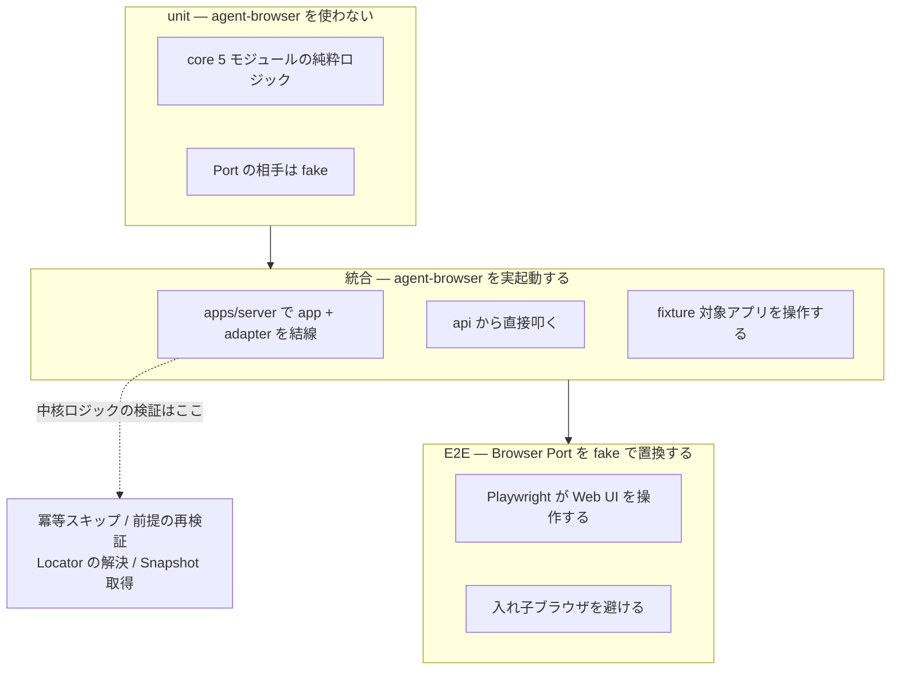

# Testing Conventions

テストの横断規約。feature 固有のテスト観点は各 [design/features/](../design/features/) に置く。プロジェクト固有のテストコマンドは [context/project.yml](project.yml) を正本とする。

## テスト責務の分担

3 層に分ける。層の境界は **agent-browser を実起動するか** で引く。

| 種別 | ツール     | 配置                                                          | 主担当範囲                                                                    | agent-browser |
| ---- | ---------- | ------------------------------------------------------------- | ----------------------------------------------------------------------------- | ------------- |
| unit | vitest     | `packages/*/src/**/*.test.ts` `apps/web/src/**/*.test.ts` | core 5 モジュールの純粋ロジック、web の表示ロジック、agent の共通マッピング層 | 使わない      |
| 統合 | vitest     | `apps/server/src/**/*.integration.test.ts`                    | app + adapter の結線。実行系を api から直接叩く                               | **実起動**    |
| E2E  | Playwright | `e2e/src/`                                                    | Web UI からの通し操作。要素選択、採番、承認、成果物の受け取り                 | fake で置換   |

unit と統合はディレクトリを分けず、**ファイル名の規約で振り分ける**。テスト対象のソースと離れると参照が追いにくくなるためである。振り分けの実体は `packages/config/vitest/` の 2 つの共有設定が持ち、各パッケージの `vitest.config.ts` はそれを参照するだけに留める。

| コマンド                | 参照する共有設定                        | 対象                     |
| ----------------------- | --------------------------------------- | ------------------------ |
| `pnpm test`             | `packages/config/vitest/base.ts`        | `*.test.ts` (統合を除く) |
| `pnpm test:integration` | `packages/config/vitest/integration.ts` | `*.integration.test.ts`  |

### unit test

core 層は外部依存を持たない純粋ロジックとして設計するため、unit test の主対象になる。判定境界と決定性がここで担保される。各 feature doc のテスト観点が対象を列挙する。

Port の相手は fake 実装を使う。Browser Port は fake、AI Port は fake provider とする。

### 統合テスト

**本プロダクトの中核ロジックはここで検証する。** 冪等スキップ、前提の再検証と巻き戻し、Locator の解決、Snapshot の取得を、実際の agent-browser を起動して確かめる。

Web UI を介さず api から直接叩く。ブラウザスタックが 1 段で済み、実行系の挙動を直接観察できる。

置き場は**合成ルートの `apps/server`** とする。app と adapter を結線したものを検証する以上、テスト自身が両方を参照する。`packages/app` に置くと、`app → adapter` を禁じる依存境界の検査に落ちる。adapter の具象を選んでよい唯一の場所は合成ルートである ([adr/0023](../adr/0023-composition-root.md))。

### E2E

Web UI の操作、表示、承認フローを検証する。**Browser Port は fake へ置き換える**。

理由は入れ子ブラウザを避けるためである。素直に組むと Playwright がブラウザで Web UI を操作し、その Web UI が agent-browser を起動し、agent-browser がさらに対象アプリを操作する形になり、ブラウザスタックが 2 段重なる。起動コストと不安定さが乗る割に、実行系の検証は統合テストが既に持つ。

Playwright を採るのは、Web UI が TanStack Start であること、および本プロダクト自身が Playwright の Page Object Model を出力するため ([adr/0006](../adr/0006-playwright-pom-output.md))、出力形式の妥当性確認を兼ねられることによる。

## fixture 対象アプリ

統合テストと、将来の実ブラウザ検証には、操作する相手が要る。

- リポジトリ内に最小の対象アプリを置き、**内容を固定する**。外部サイトを対象にしない
- **静的 HTTP サーバで配信する。** `file://` で開くと URL がマシン固有のフルパスになり、`url` の Expectation に環境依存の値が入る。実行してよい origin の列挙 ([adr/0017](../adr/0017-agent-draft-boundary.md)) も `file://` では意味をなさない
- 対象は、要素の種別 (ボタン、入力欄、リンク、選択、テーブル)、状態遷移 (モーダルの開閉、タブ切り替え)、Locator の解決が難しい形 (アイコンのみのボタン、同名要素の複数出現) を含める
- 差分検知の検証用に、意図的に変更を加えた版を別途持つ

固定するのは再現性・決定性を最優先とするため ([context/project.yml](project.yml) の `decision_priority`)。外部サイトを対象にすると、こちらの変更と相手の変更を区別できない。

## テスト runtime contract

起動時に次を与える。具体値は各実装 issue で確定する。

| 対象             | 与えるもの                                                                            |
| ---------------- | ------------------------------------------------------------------------------------- |
| 統合テスト       | fixture 対象アプリの URL、agent-browser の起動設定、隔離用の namespace とセッション名 |
| E2E              | Workflow Server の URL、ローカルトークン                                              |
| 認証を伴うテスト | 認証プロファイル名 ([adr/0022](../adr/0022-auth-state-storage.md))                    |

Workflow Server は 127.0.0.1 のみに bind し、トークンを要求する ([adr/0021](../adr/0021-agent-interface-authz.md))。テストもこの契約に従う。

**テストは利用者の実際の状態を触らない。** `XDG_STATE_HOME` をテスト専用の一時ディレクトリへ向け、OS キーストアも fake に差し替える。差し替えないと、テストが利用者の認証状態を上書きしたり消したりする。

**`XDG_STATE_HOME` は agent-browser には効かない。** agent-browser は自身のホーム配下に state と socket を置くため、**namespace の指定**で隔離する。ブラウザ本体のキャッシュは共有したままにできるので、テストのたびに数百 MB を取り直さずに済み、版も変わらない。`HOME` の差し替えは隔離できるがブラウザキャッシュを失い、実行基盤が別のブラウザへフォールバックするため使わない。統合テストは namespace とテスト専用のセッション名を与える。

## 認可と secret の負例テスト

**通る経路だけでなく、通ってはいけない経路を検証する。** 正常系だけ書くと、認可が丸ごと外れても全ての検査が緑になる。

| 観点            | 確かめること                                                               | 層   |
| --------------- | -------------------------------------------------------------------------- | ---- |
| トークン        | 無し / 誤り / 期限切れで拒否される。正しいときだけ通る                     | 統合 |
| bind アドレス   | 127.0.0.1 以外からの接続が届かない                                         | 統合 |
| Origin / Host   | 自分の待受ポート以外の Origin と Host が 403 になる                        | 統合 |
| 入力検証        | `../` を含む `authProfile` / `runId` / 保存の鍵が拒否される                | unit |
| 識別子の可搬性  | 末尾がドットの名前と Windows の予約デバイス名 (`con` 等) が拒否される      | unit |
| ファイル権限    | `token` が 0600、置き場が 0700。緩ければ起動を中止する                     | 統合 |
| 終了時の後始末  | プロセス終了で `token` が消える                                            | 統合 |
| 暗号化          | 改ざんしたファイルの復号が失敗し、**復号結果を使わずに中止する**           | unit |
| secret の非露出 | secret 指定した値が StepResult・イベント・ログ・成果物のいずれにも現れない | 統合 |
| 例外メッセージ  | 検証エラーのメッセージに入力値そのものが含まれない                         | unit |

### scaffold 時点で未着手のもの

- **fixture 対象アプリの中身**。`packages/fixture-app` は枠だけで、対象アプリの実体を持たない
- **E2E の実行系**。`e2e/` の枠はあるが Playwright を依存に入れていない。`pnpm e2e` は理由を出して**失敗する**。黙って成功させると、導入し忘れたまま検査が緑になるためである。Web UI の実装が動いてから入れる
- **テストコードそのもの**。`*.test.ts` は 1 件も無い。各パッケージの `test` は `--passWithNoTests` で通っている

いずれも実装 issue で埋める。新しい fixture 対象を追加する手順は、対象アプリの実体が入った時点で本節に書く。

## 横断テスト方針

- **決定性を検証対象にする。** 同じ入力から同じ出力になることを、成果物生成・採番・差分分類の各層で確かめる。これは本プロダクトの中核価値であり、テストで担保する
- Port の実装を差し替えても core の振る舞いが変わらないことを、fake と実装の両方で同じ観点を通して確かめる
- 継続的インテグレーション (CI) 上での実行は実用最小限の製品 (MVP) の対象外とする (DesignDoc の Future Work)

## 今後の拡張: ユースケース手順書に沿った検証

E2E で Browser Port を fake に置き換えるため、**通しの実挙動は MVP のテストで検証されない**。実装を進めて必要と判断した時点で、次を足す。

- ユースケースごとに手順書を用意し、それを正本として検証する。手順書は「対象アプリを開く、要素を選択する、名前を付ける、成果物を生成する」のように、利用者の操作単位で書く
- 手順書に沿って実際のブラウザ操作を行う検証を足す。人間が使う Web UI の操作は、AI エージェントも同じ use case を通るため ([adr/0017](../adr/0017-agent-draft-boundary.md))、実操作での確認に意味がある
- 手順書は E2E のテストケースと、利用者向けドキュメントの両方の入力になる

導入時期と手順書の置き場は、Web UI の実装が動いてから決める。
