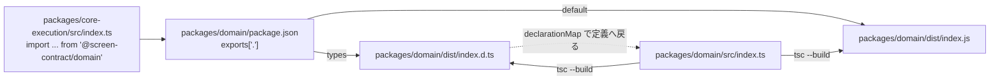

# Toolchain

採用する標準 toolchain。採否の根拠は [adr/](../adr/) を参照する。プロジェクト固有のコマンドは [context/project.yml](project.yml) の `commands` を正本とする。

選定根拠は [adr/0001-tech-stack.md](../adr/0001-tech-stack.md)。

## 標準スタック

| 区分             | ツール                  | 備考                                                                                                                                                                                        |
| ---------------- | ----------------------- | ------------------------------------------------------------------------------------------------------------------------------------------------------------------------------------------- |
| Package manager  | pnpm (workspace)        | `apps/` と `packages/` の分け方は [architecture.md](architecture.md)                                                                                                                        |
| Task runner      | turborepo               | 依存グラフで層の依存規約を反映する                                                                                                                                                          |
| Language         | TypeScript 7 (Node LTS) | 言語サービス用に TypeScript 6 を併置する (後述)                                                                                                                                             |
| Linter           | oxlint                  |                                                                                                                                                                                             |
| Formatter        | oxfmt                   | md / yml / json は prettier。担当分けは [engineering.md](engineering.md)                                                                                                                    |
| Unit test        | vitest                  | 統合テストも vitest で書く                                                                                                                                                                  |
| E2E              | Playwright              | 責務分担は [testing.md](testing.md)                                                                                                                                                         |
| HTTP / WebSocket | Hono                    | listen は合成ルートが行う ([adr/0024](../adr/0024-http-framework.md))                                                                                                                       |
| 画像差分         | pixelmatch / ssim.js    | Pixel Diff と知覚差分 ([adr/0025](../adr/0025-image-diff-library.md))                                                                                                                       |
| Runtime 管理     | mise                    | Node を LTS に固定する (後述)                                                                                                                                                               |
| ブラウザ実行基盤 | agent-browser           | npm 依存として同梱し版を固定する ([adr/0027](../adr/0027-agent-browser-bundling.md))                                                                                                        |
| ブラウザ本体     | Chrome for Testing      | 版を指定して自前で取得し、実行時は実行ファイルのパスを明示する。版番号は `packages/adapter-browser` 配下の専用 JSON に置く (判断の正本は [adr/0027](../adr/0027-agent-browser-bundling.md)) |

### Node のバージョンを LTS に固定する

Node のバージョンは `mise.toml` で **24 (LTS)** に固定する。宣言の正本を 1 つにするため `.nvmrc` は置かない。

固定する理由は再現性だけではない。dependency-cruiser は node.js のリリースサイクルに追随しており、**奇数系 (25 等) では起動を拒否する**。LTS に揃えると依存境界の検査がそのまま通る。

### TypeScript 7 の併置構成

TypeScript 7 は言語サービスの programmatic API が未安定である。**この API を要求するツールのために TypeScript 6 を併置する。**

併置するパッケージが配るのは `tsc6` の実行ファイルと `tsserverlibrary` (programmatic API) であり、**`tsserver` の実行ファイルは含まない**。エディタが tsserver を必要とする場合は、エディタ側が持つ TypeScript を使うか、別途用意する。

```json
"typescript": "npm:@typescript/typescript6@^6.0.2",  // 言語サービス。bin は tsc6
"@typescript/native": "npm:typescript@^7.0.2"        // CLI。bin は tsc
```

TanStack Router / Start が全 example で採る構成と同じものである。TanStack は TypeScript 7 への移行を完了しており、ライブラリのソース修正なしで通し、PR ごとの CI で TypeScript 7 の型検査を回している。

新規プロジェクトが実際に踏む破壊的変更は次の 3 つ。

- `types` の既定が自動探索から `[]` へ変わった。`@types/node` を入れても `"types": ["node"]` の明示が要る
- `baseUrl` が廃止された。`paths` はプロジェクトルート相対で書く
- **`tsc` にファイルパスを渡せない**。変更ファイルだけを型検査する運用は組めない ([engineering.md](engineering.md) の Root Task Boundary)

なお oxlint の type-aware は TypeScript 7 以上を要求する。typescript-eslint は TypeScript 7 を型情報源として未対応であるため、型情報を使う lint は oxlint に寄る。

## ビルド戦略

`packages/` の内部モジュールは **ビルドする** (Turborepo でいう Compiled Package)。`exports` は `dist` を指し、ビルド手段は bundler ではなく `tsc` とする。

```json
// packages/*/package.json
"exports": { ".": { "types": "./dist/index.d.ts", "default": "./dist/index.js" } },
"scripts": { "build": "tsc --build" }
```

```
// packages/*/tsconfig.json
composite: true        project references の必須条件
declaration: true      composite が要求する
declarationMap: true   境界を越えた定義ジャンプと rename
outDir: dist
```

import から実体までの解決経路を示す。依存側が見るのは常に `dist` であり、`src` を直接見ない。



依存境界の検査も同じ経路を辿るため、`dist` が無いとパッケージ間の辺が消える ([engineering.md](engineering.md))。

ビルドしない構成 (Just-in-Time Package) を採らない理由は 3 つ。

- **consumer が 2 系統ある。** `apps/server` は Node、`apps/web` は Vite で動く。ビルドしないと Node 側がトランスパイル層を必要とし、解決経路が 2 本になる。再現性・決定性を最優先とする方針 ([project.yml](project.yml) の `decision_priority`) と合わない
- **パッケージが 13 個ある。** ビルドしない構成では依存側の型エラーが consumer へ伝播し、発生元の特定に手間がかかる
- **turborepo のキャッシュが効かない。** ビルド step がないためである

現時点で `pnpm dev` が起動するのは `tsc --build --watch` だけである。`apps/server` と `apps/web` の開発サーバは実装時に足す。

代償は watch が 3 つ走ること (`tsc -b --watch` / `apps/server` / `apps/web`)。TypeScript 7 の `tsc --build` は `--builders` で参照プロジェクトを並列ビルドでき、公式が「monorepo で特に有効」としているため、全体の再ビルドにはならない。定義へのジャンプは `declarationMap` で元ソースへ飛ぶ。

ビルドする / しないは排他的な戦略である。`dist` を生成しながら `exports` が `src` を指す折衷は、誰も読まない成果物を作り続けることになるため採らない。

参考: [Turborepo Internal Packages](https://turborepo.dev/docs/core-concepts/internal-packages) / [TypeScript Project References](https://www.typescriptlang.org/docs/handbook/project-references.html)

## エージェント補助 (任意)

- bash 出力の token 削減に [RTK](https://github.com/rtk-ai/rtk) を推奨する。導入と注意は `dev-commands` skill の `references/rtk.md` (開発者ごとの global 設定。repo の hook には登録しない)。

## 採用方針

- 採用候補を先行固定する場合は、その根拠と確定タイミング (どの issue / ADR で確定するか) を記す。
- **現時点で未確定のものは無い。** 標準スタック表の全項目が ADR で確定している。
- **agent-browser が宣言する pnpm の `engines` を外れて運用する。** 本システムは agent-browser を CLI として子プロセスで呼ぶだけで pnpm の API に依存せず、install も警告なく通る。engines の宣言は agent-browser 自身の開発環境の要件である。pnpm の更新は本表とは独立に判断する。

## Scaffold Policy

- 新規パッケージは `packages/config` の共有設定を `extends` / 参照し、パッケージ固有の設定はそのパッケージでしか意味を持たないものに限る。同じ上書きが 2 パッケージで重複したら共有設定へ引き上げる。
- パッケージ間の import は実パッケージ名 (`@screen-contract/<module>`) を使う。相対パスで他パッケージへ潜らない。`paths` による alias を作らない (tsconfig / vite / vitest / 依存検査の 4 箇所で定義が食い違う事故を防ぐため)。
- 公開面は `exports` で固定する。内部ファイルへの deep import を成立させない。
- 全パッケージを `"private": true` とする。publish しないため version 管理ツールを導入しない。
- 新規モジュールの初期 scaffold は公式の create command を優先し、生成後に上記の contract (命名 / root scripts / 共有 config) へ寄せる。
