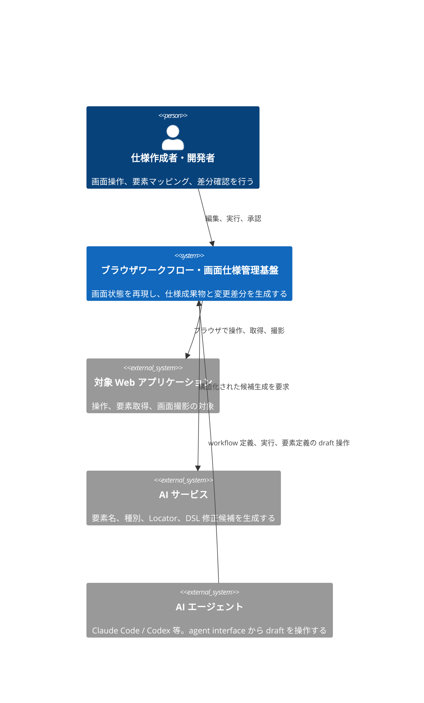
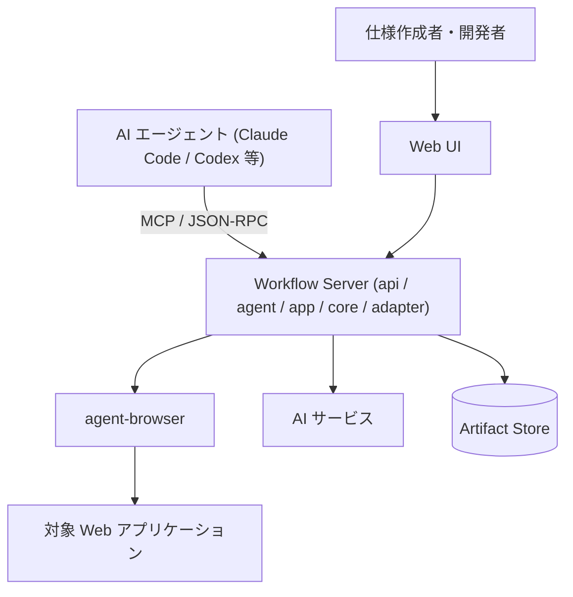
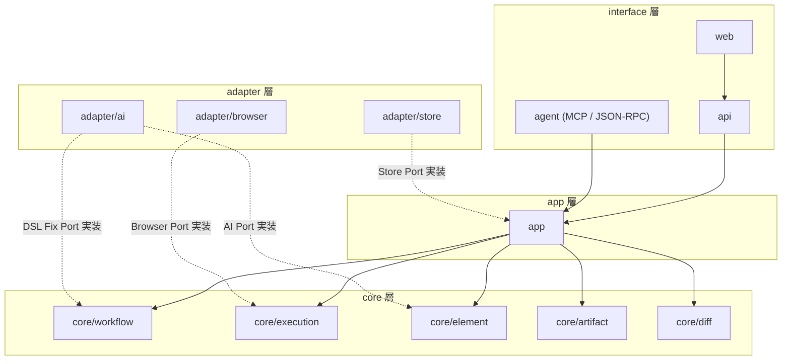

# Screen Contract Design Doc

**Document Status:** Draft
**Development Status:** TBD

本 Design Doc は、ブラウザ操作の再現、画面要素と仕様書構成番号の対応管理、注釈付き画面画像と Markdown テーブルの生成、画面変更差分の検知を行うシステムの全体像を扱う。

Why/What、Goal、アーキテクチャ概観、モジュール責務の順に示す。
Feature 単位の詳細は [design/features/](features/)、技術規約は [context/](../context/)、個別判断は [adr/](../adr/) へ委譲する。

## 概要 (Summary)

本システムは、ブラウザ上の画面状態と操作を YAML の DSL (ドメイン固有言語) で宣言し、agent-browser を使用して再現可能な形で実行する。

利用者は Web UI 上で対象画面を操作し、画面要素を選択して、永続的な要素 ID、構成番号、名称、種別、Locator を割り当てる。
確定した DSL を正本として、構成番号付きの画面画像、Markdown 形式の構成要素テーブル、および Playwright の Page Object コードを生成する。

同じ DSL と同じ画面状態からは同じ成果物を生成し、前回の Baseline との間に構造、表示内容、配置、画像の差分がある場合は、その差分を分類して提示する。

Web UI は、DSL の実行をライブ映像とともに自動再生し、各ステップで対象要素の注釈を重ねて表示する。
利用者は再生を途中で停止し、要素定義や構成番号を編集してから再開できる。

本システムは AI ネイティブに設計する。
AI エージェント (Claude Code / Codex 等) は、人間用の Web UI と同じ use case を agent interface (MCP server / App Server 型 JSON-RPC) 経由で操作し、workflow 定義、実行、要素定義を draft として自由に作成・編集できる。
Baseline と構成番号の確定のみ、人間の承認を必要とする。

## Why / What

### 背景・課題 (Why)

ブラウザ操作をコマンドや一時的なスクリプトとして記録するだけでは、操作対象、期待状態、操作結果の関係が残らない。
画面構造や表示文言が変わった場合も、どの仕様項目に影響したかを追跡できない。

画面仕様書を手動で管理する場合、次の問題が発生する。

- 画面画像と構成要素テーブルの番号が一致しなくなる。
- 画面変更後も古い画像や要素定義が残る。
- 同じ要素へ異なる構成番号や名称が割り当てられる。
- Selector が解決できなくなっても、仕様書の更新まで検知されない。
- 画面状態を再現する操作が担当者の手順に依存する。
- 画像、Markdown、操作スクリプトがそれぞれ別の正本になる。

これらを防ぐには、画面への到達手順、期待状態、画面要素、構成番号、生成物の関係を一つの機械可読なモデルとして管理する必要がある。

### 提供価値 / 成功条件 (What)

本システムは、YAML DSL を画面操作と画面仕様の正本として扱う。

実用最小限の製品 (MVP) の成功条件を次に示す。

- 同じ初期状態と入力で同じ DSL を実行した場合、同じ期待状態へ到達する。
- 既に期待状態を満たしている操作は再実行せず、変更なしとして記録する。
- 画面要素には、表示用の構成番号とは別に永続的な要素 ID を付与できる。
- Web UI 上で画面要素を選択し、名称、種別、構成番号、Locator を編集できる。
- DSL から構成番号付き PNG 画像と Markdown テーブルを生成できる。
- Workflow IR (DSL を実行しやすい形へ正規化した中間表現) から Playwright の Page Object コードを決定的に生成できる。
- 生成内容に意味上の変更がない場合、既存成果物を書き換えない。
- Locator の未解決、複数一致、Role 変更、文言変更、位置変更、画像変更を区別して検知できる。
- DSL の実行をステップ単位で自動再生し、各ステップの対象要素と検証結果をライブ映像上に注釈表示できる。
- 再生を任意のステップで一時停止し、要素定義を編集した後、そのステップから再開または再実行できる。
- AI エージェントが agent interface を通じて、workflow DSL の作成、編集、実行、要素定義の draft を人間の操作なしに行える。
- AI による変更 (要素名、種別、Locator、DSL 修正) は draft として扱い、Baseline と構成番号の確定は人間の承認後にのみ行う。
- 各実行について、入力、ステップ結果、Snapshot、スクリーンショット、差分結果を追跡できる。

### スコープ

MVP では次を対象とする。
グルーピングは後述の core モジュール分割と一対一に対応させる。

ワークフロー定義 (core/workflow):

- YAML DSL の構文定義と Schema 検証
- DSL から Workflow IR への変換

冪等実行 (core/execution):

- agent-browser によるブラウザ操作
- 宣言的な状態確認と変更 (期待状態を満たす操作の冪等スキップを含む)
- ワークフローの自動再生、ステップ単位の一時停止、再生中の要素定義編集

要素同一性 (core/element):

- 画面状態ごとの要素定義
- 永続的な要素 ID と表示用構成番号の管理
- Accessibility Snapshot と DOM 情報を使った要素候補抽出
- AI による要素名、種別、Locator 候補の提案

成果物生成 (core/artifact):

- 構成番号付き画像の生成
- Markdown 構成要素テーブルの生成
- Playwright の Page Object コードの生成 (編集禁止の生成物。adr/0006)

差分検知 (core/diff):

- 構造差分、要素差分、画像差分の検知

AI エージェント操作 (agent):

- MCP server による use case の tool 公開
- App Server 型 JSON-RPC による操作と実行イベントのストリーム配信

interface・保存:

- Web UI によるライブ画面表示と操作転送
- Web UI による要素選択、採番、編集
- 実行履歴と生成成果物の保存

## Goal

本 Design Doc は、MVP 実装に必要なシステム境界と主要モジュールの責務を定義する。

MVP では、次の一連の操作を完了できる状態を Goal とする。

1. 利用者が対象 URL と画面状態への到達手順を DSL へ定義する。
2. システムが DSL を検証し、agent-browser で各ステップを順に実行する。Web UI はライブ映像と実行中ステップを同期表示する。
3. 利用者は再生を一時停止し、Web UI 上で画面要素を選択する。
4. システムまたは AI が、要素 ID、名称、種別、Locator の候補を提示する。
5. 利用者が候補を承認して構成番号を確定し、再生を再開する。
6. システムが注釈付き画像、Markdown テーブル、Playwright の Page Object コードを生成する。
7. 再実行時に前回の Baseline と比較し、変更内容を分類して提示する。
8. 変更がない成果物は書き換えず、変更がある成果物だけを更新候補とする。

## Lower-Priority Goals

次の項目は提供価値があるが、MVP では優先しない。

- 操作履歴から再利用可能な Page Object や Component Object を推論する。
- 複数の実行環境による分散実行を行う。
- 複数利用者が同じ画面仕様を同時編集する。
- ドラッグ操作によるノードベースのワークフロー編集を提供する。
- CI (継続的インテグレーション) 上で複数ブラウザを並列実行する。
- 仕様書の承認ワークフローを外部サービスと連携する。

## Non Goals

MVP では次を意図的にスコープ外とする。

- CAPTCHA や Bot 対策を回避する。
- 購入、決済、送信などの外部副作用について、対象システムの協力なしに完全な冪等性を保証する。
- 任意の JavaScript やシェルコマンドを無制限に DSL から実行する。
- AI が利用者の承認なしに Baseline や構成番号を確定する。
- 異なる OS、ブラウザ、フォント環境間でピクセル単位に同一の画像を保証する。
- 既存の文書管理システム全体を置き換える。
- 対象 Web アプリケーションの API 仕様や業務仕様を自動生成する。

## Background

### 背景

agent-browser は、Accessibility Snapshot、要素参照、ブラウザ操作、スクリーンショット、WebSocket によるライブ表示を提供する。

一方、agent-browser のコマンド列だけでは、操作の目的、期待状態、画面仕様上の要素 ID、構成番号、変更差分の意味を表現できない。
そのため、agent-browser を実行 Adapter として扱い、上位に Semantic DSL と Workflow IR を置く。

画面仕様の成果物は DSL から生成する。
画像、Markdown テーブル、実行スクリプトを個別に編集可能な正本にはしない。

agent-browser には組み込みの dashboard (Next.js 製) があり、WebSocket による JPEG フレーム配信と入力転送を行う live viewport、コマンド実行履歴の activity feed を提供する。
本システムの Web UI はこの dashboard を fork せず、live viewport の配信・入力転送パターンを参考にした自前実装とする。
要素選択、採番、差分承認という固有機能が UI の大半を占め、fork による upstream 追従コストが参照の利益を上回るためである。

### 設計上の前提

- MVP の実行ブラウザは agent-browser が対応する Chromium 系ブラウザとする。
- 利用者は agent-browser を直接導入・操作しない。本システムが同梱し adapter/browser が管理する内部実装であり、利用者の接点は DSL、Web UI、agent interface に限る。利用者の資産 (DSL・仕様書・POM。POM は Page Object Model) は実行基盤に依存しない語彙で書かれ、Browser Port の別実装で実行基盤を差し替えても引き継がれる。
- 対象画面は、検証可能な開発環境またはテスト環境で起動できる。
- 動的データは Fixture、Mock、固定入力のいずれかによって再現可能にする。
- DSL は YAML で記述し、Schema で検証する。
- 実行系は YAML を直接扱わず、core/workflow が正規化した Workflow IR を使用する。
- 要素の同一性には永続的な要素 ID を使用し、構成番号を識別子として使用しない。
- agent-browser の一時的な要素参照は DSL へ保存しない。
- ライブ映像の配信は agent-browser の WebSocket ストリーミング (JPEG フレーム + 入力転送) を使用する。
- Locator は Role、Accessible Name、Label、Test ID などの Semantic Locator を優先する。
- AI の出力とエージェントの操作は構造化された draft として扱い、Baseline と構成番号の確定は人間の承認を経る。
- 認証情報は DSL、ログ、Snapshot、生成成果物へ平文で保存しない。

## アーキテクチャ概観 (Overview)

システムの全体像を C4 モデルで 2 段示す。
詳細コンポーネントは Feature Design Doc、内部シーケンスは Spec へ委譲する。

### System Context (C4 L1) — 誰が・何のために使うか

利用者は本システム上で画面状態と要素定義を管理する。
AI エージェントは人間と同じ use case を agent interface から操作するが、Baseline と構成番号の確定 (承認) は利用者のみが行う。
対象 Web アプリケーションと AI サービスは正本を保持せず、実行対象または候補生成手段として利用する。

### Container (C4 L2) — 主要な実行単位とデータの流れ

Web UI は編集と確認を担い、ブラウザ操作や成果物生成を直接実行しない。
Workflow Server が正本 (DSL / Workflow IR / Baseline) を管理し、実行、候補生成、成果物生成、差分検知を調停する。
Server 内部のモジュール分割は次節に示す。

## モジュール責務

各モジュールの責務と公開境界を示す。
実装レベルの規約は [context/architecture.md](../context/architecture.md) を正本とする。

### 設計方針

モジュールは interface / app / core / adapter の 4 区分に分ける。

- interface 層 (web / api / agent) は利用者・エージェントとの接点だけを持ち、ドメインロジックを持たない。人間用とエージェント用の interface は同じ app 層の use case を呼び、操作範囲の差は承認ゲートだけに置く。
- app 層は複数の core と adapter を結線して use case を編成する。ドメインロジックを持たない。
- core 層は機能単位に分割し、機能ごとのドメインモデル、ドメインロジック、Port 定義を持つ。core 同士は型の参照以外で依存しない。
- adapter 層は core が定義する Port を実装し、外部技術の固有処理を閉じ込める。

Port は原則、それを使う core が定義する。
保存だけは機能横断のため、Store Port を app 層で定義する。

この分割により、次の拡張をモジュールの追加または差し替えで実現する。

- ブラウザ実行基盤の差し替え (Browser Port の別実装)
- AI サービスの差し替え (AI Port の別実装)
- 保存方式の差し替え (Store Port の別実装)
- CLI・CI 実行の追加 (app 層が interface 非依存のため、interface の追加で対応)

### core 層 (機能単位)

| モジュール     | 責務                                                                                                                      | 定義する Port |
| -------------- | ------------------------------------------------------------------------------------------------------------------------- | ------------- |
| core/workflow  | DSL の Schema 検証、Workflow IR への正規化、バージョン互換性の定義                                                        | DSL Fix Port  |
| core/execution | ステップ実行のルール、期待状態の検証、冪等スキップ判定、再生制御 (一時停止・再開・ステップ単位の再実行)、実行イベント発行 | Browser Port  |
| core/element   | 永続要素 ID、Locator モデル、構成番号の採番規則、要素候補の正規化 (Snapshot・DOM の生データは入力値として受け取る)        | AI Port       |
| core/artifact  | 注釈画像・Markdown テーブル・Playwright POM コードの決定的生成、意味上の変更がない場合の書き換え抑止                      | なし          |
| core/diff      | Baseline 比較、構造差分・要素差分・画像差分の分類                                                                         | なし          |

### interface / app / adapter 層

| モジュール      | 責務                                                                                                              | 実装・依存                     |
| --------------- | ----------------------------------------------------------------------------------------------------------------- | ------------------------------ |
| web             | DSL 編集、ライブ表示、再生制御 (一時停止・再開)、要素選択、採番、差分承認                                         | api に依存                     |
| api             | HTTP API、WebSocket、認可                                                                                         | app に依存                     |
| agent           | MCP server と App Server 型 JSON-RPC による use case の公開、実行イベントのストリーム配信、エージェント操作の認可 | app に依存                     |
| app             | use case の編成 (実行、要素編集、成果物生成、差分承認)、core と adapter の結線、Store Port の定義                 | 各 core・各 adapter に依存     |
| adapter/browser | agent-browser の起動、操作、Snapshot・スクリーンショット取得、ライブ配信                                          | Browser Port を実装            |
| adapter/ai      | 要素名、種別、Locator、DSL 修正候補の構造化取得                                                                   | AI Port と DSL Fix Port を実装 |
| adapter/store   | DSL、Baseline、Snapshot、画像、ログ、差分結果の保存                                                               | Store Port を実装              |

依存方向は interface → app → core とし、adapter は Port の型を通じてのみ core へ依存する。
agent-browser、AI サービス、保存方式の固有処理は adapter 内に閉じ込める。

## 詳細の所在 (委譲先)

landscape より下の詳細は以下を正本とする。
本 Doc には重複させず、Feature Design Doc または Engineering Context へのリンクのみを置く。

### Feature 設計 (How: feature)

Feature 単位の設計は [design/features/](features/) を正本とする。
Feature は core モジュールと一対一に対応させ、interface・adapter 固有の設計はそれを使う Feature または専用文書に置く。

| Feature                     | 対応モジュール | 文書                                                                                                                                  | 状態   |
| --------------------------- | -------------- | ------------------------------------------------------------------------------------------------------------------------------------- | ------ |
| ワークフロー定義 (DSL / IR) | core/workflow  | [design/features/workflow-dsl/DesignDoc_workflow-dsl.md](features/workflow-dsl/DesignDoc_workflow-dsl.md)                             | 設計中 |
| 冪等実行と再生制御          | core/execution | [design/features/execution/DesignDoc_execution.md](features/execution/DesignDoc_execution.md)                                         | 設計中 |
| 画面要素マッピング          | core/element   | [design/features/element-mapping/DesignDoc_element-mapping.md](features/element-mapping/DesignDoc_element-mapping.md)                 | 設計中 |
| 仕様成果物生成              | core/artifact  | [design/features/artifact-generation/DesignDoc_artifact-generation.md](features/artifact-generation/DesignDoc_artifact-generation.md) | 設計中 |
| 変更差分検知                | core/diff      | [design/features/change-detection/DesignDoc_change-detection.md](features/change-detection/DesignDoc_change-detection.md)             | 設計中 |
| Web UI                      | web            | [design/features/web-editor/DesignDoc_web-editor.md](features/web-editor/DesignDoc_web-editor.md)                                     | 設計中 |
| AI エージェント操作         | agent          | [design/features/agent-interface/DesignDoc_agent-interface.md](features/agent-interface/DesignDoc_agent-interface.md)                 | 設計中 |
| AI 候補生成                 | adapter/ai     | [design/features/ai-suggestions/DesignDoc_ai-suggestions.md](features/ai-suggestions/DesignDoc_ai-suggestions.md)                     | 設計中 |

### Engineering Context (How: 横断規約)

技術スタック規約、Codebase Architecture、運用契約は [context/](../context/) を正本とする。
プロジェクト固有値は [context/project.yml](../context/project.yml) に置く。

| トピック                                    | 文書                                                      |
| ------------------------------------------- | --------------------------------------------------------- |
| package / runtime / state boundary          | [context/architecture.md](../context/architecture.md)     |
| toolchain・build・scaffold policy           | [context/toolchain.md](../context/toolchain.md)           |
| root task / shared config / quality gate    | [context/engineering.md](../context/engineering.md)       |
| test 方針                                   | [context/testing.md](../context/testing.md)               |
| infra / deployment / environment / security | [context/infrastructure.md](../context/infrastructure.md) |

### Related ADRs / 代替案 (Why: 判断)

確定した技術判断と却下した代替案は [adr/](../adr/) を正本とする。

| ADR                                                     | 決定                                                                              | 関連ドキュメント    |
| ------------------------------------------------------- | --------------------------------------------------------------------------------- | ------------------- |
| [adr/0001](../adr/0001-tech-stack.md)                   | 技術スタック (TypeScript monorepo / TanStack Start / 中間層なし) の選定           | DesignDoc.md        |
| [adr/0002](../adr/0002-pause-semantics.md)              | 一時停止をステップ境界とし pause 中操作を許可して再開時に再検証する判断           | execution           |
| [adr/0003](../adr/0003-dsl-structure.md)                | DSL を Screen / Workflow の 2 文書に分離し実画面の文書化語彙を持たせる判断        | workflow-dsl        |
| [adr/0004](../adr/0004-state-model.md)                  | 画面状態を default 根の木で表し statechart と直交合成を採らない判断               | workflow-dsl        |
| [adr/0005](../adr/0005-renumbering.md)                  | 構成番号を状態単位で採番し badges リストを正本に読み順の再採番で管理する判断      | element-mapping     |
| [adr/0006](../adr/0006-playwright-pom-output.md)        | 正本は YAML DSL のまま Playwright POM を生成物として MVP で提供する判断           | artifact-generation |
| [adr/0007](../adr/0007-visual-diff.md)                  | 画像差分は生スクショ対象・Pixel Diff → 知覚差分の 2 段階とする判断                | change-detection    |
| [adr/0008](../adr/0008-stream-proxy.md)                 | ライブ映像を Workflow Server 経由の Proxy で配信する判断                          | web-editor          |
| [adr/0009](../adr/0009-ai-adapter-auth.md)              | adapter/ai の認証を API キーと OAuth の両対応とする判断                           | ai-suggestions      |
| [adr/0010](../adr/0010-ai-data-boundary.md)             | AI への送信を既定 Snapshot 断片のみとし設定で明示的に許可したときだけ拡張する判断 | ai-suggestions      |
| [adr/0011](../adr/0011-dsl-as-source-of-truth.md)       | YAML DSL を画面操作と画面仕様の唯一の正本とする判断                               | workflow-dsl        |
| [adr/0012](../adr/0012-element-id-number-separation.md) | 永続要素 ID と表示用構成番号を分離する判断                                        | element-mapping     |
| [adr/0013](../adr/0013-agent-browser-runtime.md)        | MVP のブラウザ実行基盤に agent-browser を使用する判断                             | execution           |
| [adr/0014](../adr/0014-core-split-ports-adapters.md)    | core を機能単位に分割し Ports and Adapters を採用する判断                         | DesignDoc.md        |
| [adr/0015](../adr/0015-web-ui-own-implementation.md)    | Web UI を dashboard の fork ではなく自前実装とする判断                            | web-editor          |
| [adr/0016](../adr/0016-dual-agent-protocol.md)          | agent interface に MCP と App Server 型 JSON-RPC の両方を採用する判断             | agent-interface     |
| [adr/0017](../adr/0017-agent-draft-boundary.md)         | エージェントの操作範囲を draft までとし確定に人間の承認を要する判断               | agent-interface     |

## Open Questions / Future Work

### Open Questions

| 未決事項                                 | 選択肢                                               | 影響                               | 確認方法                                           | 担当               | 期限           |
| ---------------------------------------- | ---------------------------------------------------- | ---------------------------------- | -------------------------------------------------- | ------------------ | -------------- |
| 再生中に編集した要素定義の反映タイミング | 即時 DSL 反映、再生完了後に一括反映                  | 再生の決定性と編集体験             | 編集→再開時の Locator 再解決の挙動を試作で確認する | プロダクト設計担当 | Web UI 実装前  |
| agent interface の認可方式               | ローカル無認証、トークン、OAuth                      | エージェントに許す操作範囲と安全性 | ローカル利用とリモート利用の想定構成を決める       | プロダクト設計担当 | agent 実装前   |
| 認証状態の保存方式                       | ローカル Profile、暗号化 Storage State、外部 Secrets | 再現性と情報漏えいリスク           | 利用環境の認証要件を確認する                       | セキュリティ担当   | 認証画面対応前 |

### Future Work

- 操作履歴から再利用可能な Component Object を推論する。
- 既存 Playwright コードとの統合方式を定義する。
- 複数ブラウザで同じ画面仕様を検証する。
- CI で差分検知を実行し、レビュー対象の成果物を生成する。
- 画面仕様書の変更承認履歴を管理する。
- 複数利用者による共同編集と競合解決を提供する。
