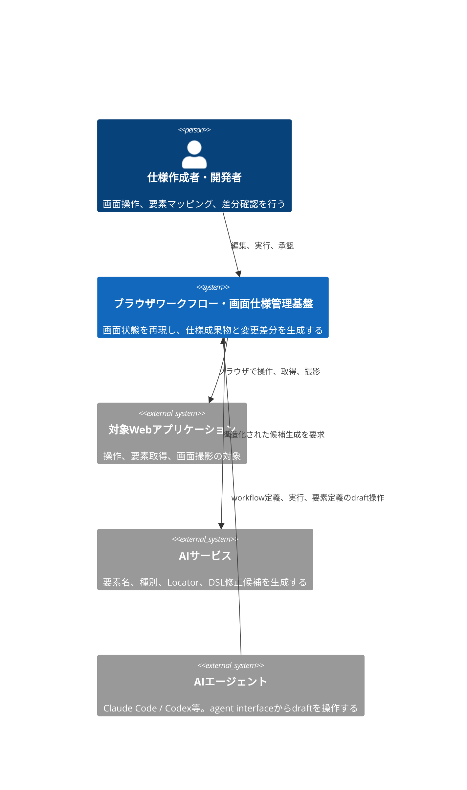
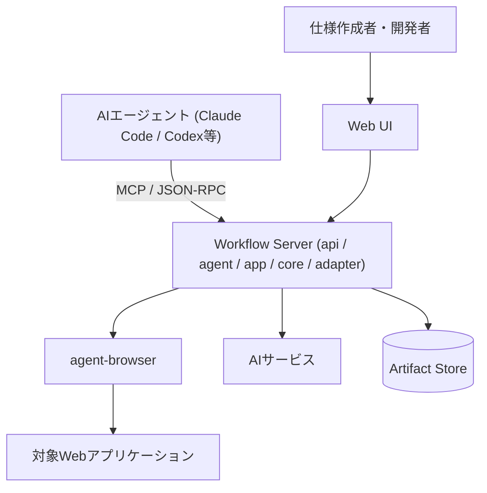
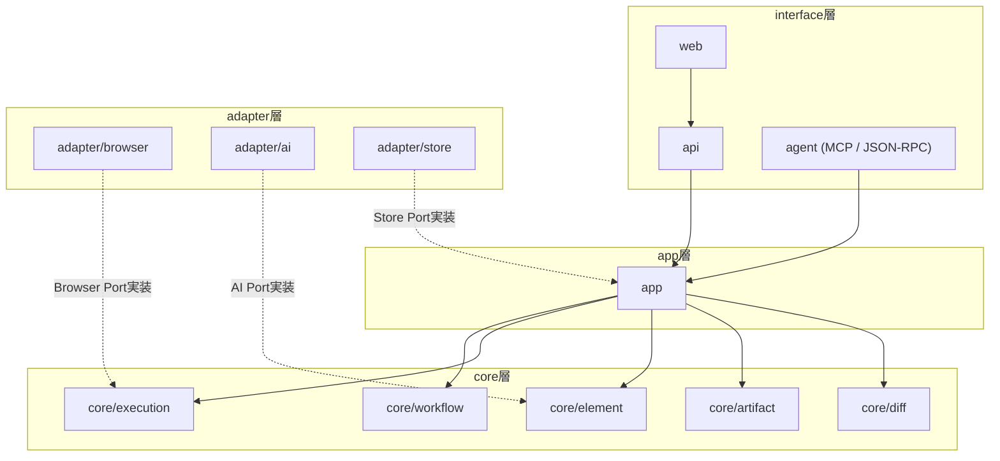

# Screen Contract Design Doc

**Document Status:** Draft
**Development Status:** TBD

本 Design Doc は、ブラウザ操作の再現、画面要素と仕様書構成番号の対応管理、注釈付き画面画像とMarkdownテーブルの生成、画面変更差分の検知を行うシステムの全体像を扱う。

Why/What、Goal、アーキテクチャ概観、モジュール責務の順に示す。
Feature単位の詳細は [design/features/](../features/)、技術規約は [context/](../../context/)、個別判断は [adr/](../../adr/) へ委譲する。

## 概要 (Summary)

本システムは、ブラウザ上の画面状態と操作をYAML DSLで宣言し、agent-browserを使用して再現可能な形で実行する。

利用者はWeb UI上で対象画面を操作し、画面要素を選択して、永続的な要素ID、構成番号、名称、種別、Locatorを割り当てる。
確定したDSLを正本として、構成番号付きの画面画像、Markdown形式の構成要素テーブル、およびPlaywrightのPage Objectコードを生成する。

同じDSLと同じ画面状態からは同じ成果物を生成し、前回のBaselineとの間に構造、表示内容、配置、画像の差分がある場合は、その差分を分類して提示する。

Web UIは、DSLの実行をライブ映像とともに自動再生し、各ステップで対象要素のアノテーションを重ねて表示する。
利用者は再生を途中で停止し、要素定義や構成番号を編集してから再開できる。

本システムはAIネイティブに設計する。
AIエージェント (Claude Code / Codex等) は、人間用のWeb UIと同じuse caseをagent interface (MCP server / App Server型JSON-RPC) 経由で操作し、workflow定義、実行、要素定義をdraftとして自由に作成・編集できる。
Baselineと構成番号の確定のみ、人間の承認を必要とする。

## Why / What

### 背景・課題 (Why)

ブラウザ操作をコマンドや一時的なスクリプトとして記録するだけでは、操作対象、期待状態、操作結果の関係が残らない。
画面構造や表示文言が変わった場合も、どの仕様項目に影響したかを追跡できない。

画面仕様書を手動で管理する場合、次の問題が発生する。

- 画面画像と構成要素テーブルの番号が一致しなくなる。
- 画面変更後も古い画像や要素定義が残る。
- 同じ要素へ異なる構成番号や名称が割り当てられる。
- Selectorが解決できなくなっても、仕様書の更新まで検知されない。
- 画面状態を再現する操作が担当者の手順に依存する。
- 画像、Markdown、操作スクリプトがそれぞれ別の正本になる。

これらを防ぐには、画面への到達手順、期待状態、画面要素、構成番号、生成物の関係を一つの機械可読なモデルとして管理する必要がある。

### 提供価値 / 成功条件 (What)

本システムは、YAML DSLを画面操作と画面仕様の正本として扱う。

MVPの成功条件を次に示す。

- 同じ初期状態と入力で同じDSLを実行した場合、同じ期待状態へ到達する。
- 既に期待状態を満たしている操作は再実行せず、変更なしとして記録する。
- 画面要素には、表示用の構成番号とは別に永続的な要素IDを付与できる。
- Web UI上で画面要素を選択し、名称、種別、構成番号、Locatorを編集できる。
- DSLから構成番号付きPNG画像とMarkdownテーブルを生成できる。
- Workflow IRからPlaywrightのPage Objectコードを決定的に生成できる。
- 生成内容に意味上の変更がない場合、既存成果物を書き換えない。
- Locatorの未解決、複数一致、Role変更、文言変更、位置変更、画像変更を区別して検知できる。
- DSLの実行をステップ単位で自動再生し、各ステップの対象要素と検証結果をライブ映像上にアノテーション表示できる。
- 再生を任意のステップで一時停止し、要素定義を編集した後、そのステップから再開または再実行できる。
- AIエージェントがagent interfaceを通じて、workflow DSLの作成、編集、実行、要素定義のdraftを人間の操作なしに行える。
- AIによる変更 (要素名、種別、Locator、DSL修正) はdraftとして扱い、Baselineと構成番号の確定は人間の承認後にのみ行う。
- 各実行について、入力、ステップ結果、Snapshot、スクリーンショット、差分結果を追跡できる。

### スコープ

MVPでは次を対象とする。
グルーピングは後述のcoreモジュール分割と一対一に対応させる。

ワークフロー定義 (core/workflow):

- YAML DSLの構文定義とSchema検証
- DSLからWorkflow IRへの変換

冪等実行 (core/execution):

- agent-browserによるブラウザ操作
- 宣言的な状態確認と変更 (期待状態を満たす操作の冪等スキップを含む)
- ワークフローの自動再生、ステップ単位の一時停止、再生中の要素定義編集

要素同一性 (core/element):

- 画面状態ごとの要素定義
- 永続的な要素IDと表示用構成番号の管理
- Accessibility SnapshotとDOM情報を使った要素候補抽出
- AIによる要素名、種別、Locator候補の提案

成果物生成 (core/artifact):

- 構成番号付き画像の生成
- Markdown構成要素テーブルの生成
- PlaywrightのPage Objectコードの生成 (編集禁止の生成物。adr/0006)

差分検知 (core/diff):

- 構造差分、要素差分、画像差分の検知

AIエージェント操作 (agent):

- MCP serverによるuse caseのtool公開
- App Server型JSON-RPCによる操作と実行イベントのストリーム配信

interface・保存:

- Web UIによるライブ画面表示と操作転送
- Web UIによる要素選択、採番、編集
- 実行履歴と生成成果物の保存

## Goal

本Design Docは、MVP実装に必要なシステム境界と主要モジュールの責務を定義する。

MVPでは、次の一連の操作を完了できる状態をGoalとする。

1. 利用者が対象URLと画面状態への到達手順をDSLへ定義する。
2. システムがDSLを検証し、agent-browserで各ステップを順に実行する。Web UIはライブ映像と実行中ステップを同期表示する。
3. 利用者は再生を一時停止し、Web UI上で画面要素を選択する。
4. システムまたはAIが、要素ID、名称、種別、Locatorの候補を提示する。
5. 利用者が候補を承認して構成番号を確定し、再生を再開する。
6. システムが注釈付き画像、Markdownテーブル、PlaywrightのPage Objectコードを生成する。
7. 再実行時に前回のBaselineと比較し、変更内容を分類して提示する。
8. 変更がない成果物は書き換えず、変更がある成果物だけを更新候補とする。

## Lower-Priority Goals

次の項目は提供価値があるが、MVPでは優先しない。

- 操作履歴から再利用可能なPage ObjectやComponent Objectを推論する。
- 複数の実行環境による分散実行を行う。
- 複数利用者が同じ画面仕様を同時編集する。
- ドラッグ操作によるノードベースのワークフロー編集を提供する。
- CI上で複数ブラウザを並列実行する。
- 仕様書の承認ワークフローを外部サービスと連携する。

## Non Goals

MVPでは次を意図的にスコープ外とする。

- CAPTCHAやBot対策を回避する。
- 購入、決済、送信などの外部副作用について、対象システムの協力なしに完全な冪等性を保証する。
- 任意のJavaScriptやシェルコマンドを無制限にDSLから実行する。
- AIが利用者の承認なしにBaselineや構成番号を確定する。
- 異なるOS、ブラウザ、フォント環境間でピクセル単位に同一の画像を保証する。
- 既存の文書管理システム全体を置き換える。
- 対象WebアプリケーションのAPI仕様や業務仕様を自動生成する。

## Background

### 背景

agent-browserは、Accessibility Snapshot、要素参照、ブラウザ操作、スクリーンショット、WebSocketによるライブ表示を提供する。

一方、agent-browserのコマンド列だけでは、操作の目的、期待状態、画面仕様上の要素ID、構成番号、変更差分の意味を表現できない。
そのため、agent-browserを実行Adapterとして扱い、上位にSemantic DSLとWorkflow IRを置く。

画面仕様の成果物はDSLから生成する。
画像、Markdownテーブル、実行スクリプトを個別に編集可能な正本にはしない。

agent-browserには組み込みのdashboard (Next.js製) があり、WebSocketによるJPEGフレーム配信と入力転送を行うlive viewport、コマンド実行履歴のactivity feedを提供する。
本システムのWeb UIはこのdashboardをforkせず、live viewportの配信・入力転送パターンを参考にした自前実装とする。
要素選択、採番、差分承認という固有機能がUIの大半を占め、forkによるupstream追従コストが参照の利益を上回るためである。

### 設計上の前提

- MVPの実行ブラウザはagent-browserが対応するChromium系ブラウザとする。
- 対象画面は、検証可能な開発環境またはテスト環境で起動できる。
- 動的データはFixture、Mock、固定入力のいずれかによって再現可能にする。
- DSLはYAMLで記述し、Schemaで検証する。
- 実行系はYAMLを直接扱わず、core/workflowが正規化したWorkflow IRを使用する。
- 要素の同一性には永続的な要素IDを使用し、構成番号を識別子として使用しない。
- agent-browserの一時的な要素参照はDSLへ保存しない。
- ライブ映像の配信はagent-browserのWebSocketストリーミング (JPEGフレーム + 入力転送) を使用する。
- LocatorはRole、Accessible Name、Label、Test IDなどのSemantic Locatorを優先する。
- AIの出力とエージェントの操作は構造化されたdraftとして扱い、Baselineと構成番号の確定は人間の承認を経る。
- 認証情報はDSL、ログ、Snapshot、生成成果物へ平文で保存しない。

## アーキテクチャ概観 (Overview)

システムの全体像をC4で2段示す。
詳細コンポーネントはFeature Design Doc、内部シーケンスはSpecへ委譲する。

### System Context (C4 L1) — 誰が・何のために使うか

利用者は本システム上で画面状態と要素定義を管理する。
AIエージェントは人間と同じuse caseをagent interfaceから操作するが、Baselineと構成番号の確定 (承認) は利用者のみが行う。
対象WebアプリケーションとAIサービスは正本を保持せず、実行対象または候補生成手段として利用する。

### Container (C4 L2) — 主要な実行単位とデータの流れ

Web UIは編集と確認を担い、ブラウザ操作や成果物生成を直接実行しない。
Workflow Serverが正本 (DSL / Workflow IR / Baseline) を管理し、実行、候補生成、成果物生成、差分検知を調停する。
Server内部のモジュール分割は次節に示す。

## モジュール責務

各モジュールの責務と公開境界を示す。
実装レベルの規約は [context/architecture.md](../../context/architecture.md) を正本とする。

### 設計方針

モジュールはinterface / app / core / adapterの4区分に分ける。

- interface層 (web / api / agent) は利用者・エージェントとの接点だけを持ち、ドメインロジックを持たない。人間用とエージェント用のinterfaceは同じapp層のuse caseを呼び、操作範囲の差は承認ゲートだけに置く。
- app層は複数のcoreとadapterを結線してuse caseを編成する。ドメインロジックを持たない。
- core層は機能単位に分割し、機能ごとのドメインモデル、ドメインロジック、Port定義を持つ。core同士は型の参照以外で依存しない。
- adapter層はcoreが定義するPortを実装し、外部技術の固有処理を閉じ込める。

Portは原則、それを使うcoreが定義する。
保存だけは機能横断のため、Store Portをapp層で定義する。

この分割により、次の拡張をモジュールの追加または差し替えで実現する。

- ブラウザ実行基盤の差し替え (Browser Portの別実装)
- AIサービスの差し替え (AI Portの別実装)
- 保存方式の差し替え (Store Portの別実装)
- CLI・CI実行の追加 (app層がinterface非依存のため、interfaceの追加で対応)

### core層 (機能単位)

| モジュール     | 責務                                                                                                                      | 定義するPort |
| -------------- | ------------------------------------------------------------------------------------------------------------------------- | ------------ |
| core/workflow  | DSLのSchema検証、Workflow IRへの正規化、バージョン互換性の定義                                                            | なし         |
| core/execution | ステップ実行のルール、期待状態の検証、冪等スキップ判定、再生制御 (一時停止・再開・ステップ単位の再実行)、実行イベント発行 | Browser Port |
| core/element   | 永続要素ID、Locatorモデル、構成番号の採番規則、要素候補の正規化 (Snapshot・DOMの生データは入力値として受け取る)           | AI Port      |
| core/artifact  | 注釈画像・Markdownテーブルの決定的生成、意味上の変更がない場合の書き換え抑止                                              | なし         |
| core/diff      | Baseline比較、構造差分・要素差分・画像差分の分類                                                                          | なし         |

### interface / app / adapter層

| モジュール      | 責務                                                                                                       | 実装・依存              |
| --------------- | ---------------------------------------------------------------------------------------------------------- | ----------------------- |
| web             | DSL編集、ライブ表示、再生制御 (一時停止・再開)、要素選択、採番、差分承認                                   | apiに依存               |
| api             | HTTP API、WebSocket、認可                                                                                  | appに依存               |
| agent           | MCP serverとApp Server型JSON-RPCによるuse caseの公開、実行イベントのストリーム配信、エージェント操作の認可 | appに依存               |
| app             | use caseの編成 (実行、要素編集、成果物生成、差分承認)、coreとadapterの結線、Store Portの定義               | 各core・各adapterに依存 |
| adapter/browser | agent-browserの起動、操作、Snapshot・スクリーンショット取得、ライブ配信                                    | Browser Portを実装      |
| adapter/ai      | 要素名、種別、Locator、DSL修正候補の構造化取得                                                             | AI Portを実装           |
| adapter/store   | DSL、Baseline、Snapshot、画像、ログ、差分結果の保存                                                        | Store Portを実装        |

依存方向はinterface → app → coreとし、adapterはPortの型を通じてのみcoreへ依存する。
agent-browser、AIサービス、保存方式の固有処理はadapter内に閉じ込める。

## 詳細の所在 (委譲先)

landscapeより下の詳細は以下を正本とする。
本Docには重複させず、Feature Design DocまたはEngineering Contextへのリンクのみを置く。

### Feature 設計 (How: feature)

Feature単位の設計は [design/features/](../features/) を正本とする。
Featureはcoreモジュールと一対一に対応させ、interface・adapter固有の設計はそれを使うFeatureまたは専用文書に置く。

| Feature                     | 対応モジュール | 文書                                                                                                                                  | 状態   |
| --------------------------- | -------------- | ------------------------------------------------------------------------------------------------------------------------------------- | ------ |
| ワークフロー定義 (DSL / IR) | core/workflow  | [design/features/workflow-dsl/DesignDoc_workflow-dsl.md](features/workflow-dsl/DesignDoc_workflow-dsl.md)                             | 設計中 |
| 冪等実行と再生制御          | core/execution | [design/features/execution/DesignDoc_execution.md](features/execution/DesignDoc_execution.md)                                         | 設計中 |
| 画面要素マッピング          | core/element   | [design/features/element-mapping/DesignDoc_element-mapping.md](features/element-mapping/DesignDoc_element-mapping.md)                 | 設計中 |
| 仕様成果物生成              | core/artifact  | [design/features/artifact-generation/DesignDoc_artifact-generation.md](features/artifact-generation/DesignDoc_artifact-generation.md) | 設計中 |
| 変更差分検知                | core/diff      | [design/features/change-detection/DesignDoc_change-detection.md](features/change-detection/DesignDoc_change-detection.md)             | 未作成 |
| Web UI                      | web            | [design/features/web-editor/DesignDoc_web-editor.md](features/web-editor/DesignDoc_web-editor.md)                                     | 未作成 |
| AIエージェント操作          | agent          | [design/features/agent-interface/DesignDoc_agent-interface.md](features/agent-interface/DesignDoc_agent-interface.md)                 | 設計中 |
| AI候補生成                  | adapter/ai     | [design/features/ai-suggestions/DesignDoc_ai-suggestions.md](features/ai-suggestions/DesignDoc_ai-suggestions.md)                     | 未作成 |

### Engineering Context (How: 横断規約)

技術スタック規約、Codebase Architecture、運用契約は [context/](../../context/) を正本とする。
プロジェクト固有値は [context/project.yml](../../context/project.yml) に置く。

| トピック                                    | 文書                                                         |
| ------------------------------------------- | ------------------------------------------------------------ |
| package / runtime / state boundary          | [context/architecture.md](../../context/architecture.md)     |
| toolchain・build・scaffold policy           | [context/toolchain.md](../../context/toolchain.md)           |
| root task / shared config / quality gate    | [context/engineering.md](../../context/engineering.md)       |
| test方針                                    | [context/testing.md](../../context/testing.md)               |
| infra / deployment / environment / security | [context/infrastructure.md](../../context/infrastructure.md) |

### Related ADRs / 代替案 (Why: 判断)

確定した技術判断と却下した代替案は [adr/](../../adr/) を正本とする。

| ADR                                                 | 決定                                                                         | 関連ドキュメント    |
| --------------------------------------------------- | ---------------------------------------------------------------------------- | ------------------- |
| [adr/0001](../../adr/0001-tech-stack.md)            | 技術スタック (TypeScript monorepo / TanStack Start / 中間層なし) の選定      | DesignDoc.md        |
| [adr/0002](../../adr/0002-pause-semantics.md)       | 一時停止をステップ境界とし pause 中操作を許可して再開時に再検証する判断      | execution           |
| [adr/0003](../../adr/0003-dsl-structure.md)         | DSL を Screen / Workflow の 2 文書に分離し実画面の文書化語彙を持たせる判断   | workflow-dsl        |
| [adr/0004](../../adr/0004-state-model.md)           | 画面状態を default 根の木で表し statechart と直交合成を採らない判断          | workflow-dsl        |
| [adr/0005](../../adr/0005-renumbering.md)           | 構成番号を状態単位で採番し badges リストを正本に読み順の再採番で管理する判断 | element-mapping     |
| [adr/0006](../../adr/0006-playwright-pom-output.md) | 正本は YAML DSL のまま Playwright POM を生成物として MVP で提供する判断      | artifact-generation |
| 未作成                                              | DSLを画面操作と画面仕様の正本にする判断                                      | workflow-dsl.md     |
| 未作成                                              | 要素IDと表示用構成番号を分離する判断                                         | element-mapping.md  |
| 未作成                                              | MVPのブラウザ実行基盤にagent-browserを使用する判断                           | execution.md        |
| 未作成                                              | coreを機能単位に分割しPorts and Adaptersを採用する判断                       | DesignDoc.md        |
| 未作成                                              | Web UIをdashboardのforkではなく参考実装として自前構築する判断                | web-editor.md       |
| 未作成                                              | agent interfaceにMCPとApp Server型JSON-RPCの両方を採用する判断               | agent-interface.md  |
| 未作成                                              | エージェントの操作範囲をdraftまでとし確定に人間の承認を要する判断            | agent-interface.md  |
| 未作成                                              | 構造差分と画像差分を分離する判断                                             | change-detection.md |

## Open Questions / Future Work

### Open Questions

| 未決事項                                 | 選択肢                                            | 影響                               | 確認方法                                         | 担当               | 期限               |
| ---------------------------------------- | ------------------------------------------------- | ---------------------------------- | ------------------------------------------------ | ------------------ | ------------------ |
| 再生中に編集した要素定義の反映タイミング | 即時DSL反映、再生完了後に一括反映                 | 再生の決定性と編集体験             | 編集→再開時のLocator再解決の挙動を試作で確認する | プロダクト設計担当 | Web UI実装前       |
| adapter/aiの認証方式                     | APIキー、サブスクリプションのOAuth連携、両対応    | 導入の容易さと利用規約・コスト     | 主要AIサービスのOAuth仕様と利用規約を確認する    | プロダクト設計担当 | adapter/ai実装前   |
| agent interfaceの認可方式                | ローカル無認証、トークン、OAuth                   | エージェントに許す操作範囲と安全性 | ローカル利用とリモート利用の想定構成を決める     | プロダクト設計担当 | agent実装前        |
| Visual Diffの実装方式                    | Pixel Diff、知覚差分、両方                        | 誤検知率と実行コスト               | 固定画面と動的画面のサンプルで比較する           | 差分検知担当       | core/diff実装前    |
| Visual Diffの既定閾値                    | 固定値、画面ごとの設定                            | 誤検知と見逃し                     | 代表画面で差分率を測定する                       | 差分検知担当       | Baseline運用開始前 |
| Browser Streamの公開方式                 | API Proxy、同一ホスト接続                         | 認証、ネットワーク構成、操作遅延   | 配置先と利用形態を決定する                       | インフラ担当       | Web UI実装前       |
| 認証状態の保存方式                       | ローカルProfile、暗号化Storage State、外部Secrets | 再現性と情報漏えいリスク           | 利用環境の認証要件を確認する                     | セキュリティ担当   | 認証画面対応前     |
| AIサービスへ送信できる情報               | Snapshotのみ、画像を含む、DOM情報を含む           | 候補精度と情報管理                 | 対象データ分類と利用規約を確認する               | セキュリティ担当   | AI Adapter実装前   |

### Future Work

- 操作履歴から再利用可能なComponent Objectを推論する。
- 既存Playwrightコードとの統合方式を定義する。
- 複数ブラウザで同じ画面仕様を検証する。
- CIで差分検知を実行し、レビュー対象の成果物を生成する。
- 画面仕様書の変更承認履歴を管理する。
- 複数利用者による共同編集と競合解決を提供する。
