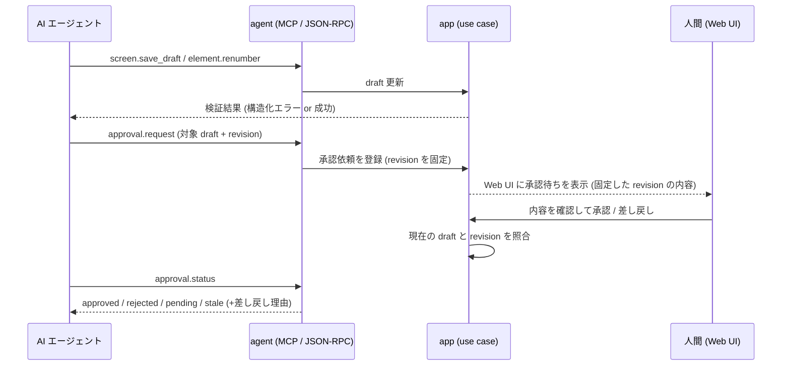
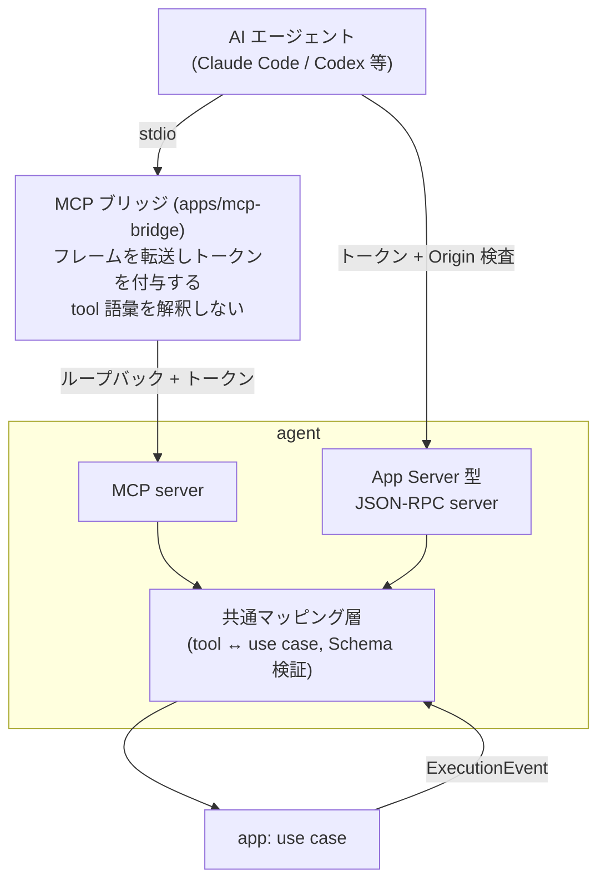

# Feature 設計: AI エージェント操作 (agent)

Feature 単位の設計 doc。仕様 (What) をどう実現するか (How) を、データ構造・フロー単位で記述する。責務・範囲・方針の層に留め、実装レベルの手順は spec へ委譲する。全体像は [design/DesignDoc.md](../../DesignDoc.md)、横断規約は [context/](../../../context/) を参照する。

**現在の設計だけを書く。** 判断の経緯は ADR を参照する (両プロトコル採用は [adr/0016](../../../adr/0016-dual-agent-protocol.md)、draft-確定の線引きは [adr/0017](../../../adr/0017-agent-draft-boundary.md))。

## 概要

agent モジュールは、AI エージェント (Claude Code / Codex 等) が本システムを操作するための interface 層である。本書は次の 4 つを定義する。

1. **公開原則と tool 語彙** — どの use case を、どの粒度の tool として公開するか。
2. **プロトコル対応** — MCP server と App Server 型 JSON-RPC で同じ語彙をどう提供するか。
3. **実行イベントの配信** — 再生の進行をエージェントへどう届けるか。
4. **draft-確定境界の公開方法** — エージェントができること・できないこと (承認の依頼まで) の interface 上の表現。

agent はドメインロジックを持たず、すべての tool は app 層の use case を 1:1 で呼ぶ。人間用の Web UI と同じ use case であり、操作範囲の差は承認ゲートだけに置く (DesignDoc の設計方針)。

## 背景・要件解釈

- 本システムは AI ネイティブに設計し、エージェントが workflow 定義・実行・要素定義を draft として人間の操作なしに行えることが成功条件 (DesignDoc の What)。
- Baseline と構成番号の確定のみ人間の承認を必要とする。エージェントは確定を実行できず、依頼までができる。
- エージェントの自己修正を支えるため、エラーは機械可読コード付きの構造化形式で返す (workflow-dsl の検証エラー形式を踏襲)。

## スコープ

### やること

- tool / RPC の語彙 (名前空間、入出力、粒度の原則)
- MCP server と App Server 型 JSON-RPC のプロトコル対応表と機能差
- 実行イベント (execution feature の ExecutionEvent) の配信方法
- 承認依頼 (approval) の interface
- エラー応答の形式

### やらないこと

- use case の実装 → app 層 (tool は呼ぶだけ)
- 実行イベントの語彙定義 → execution feature ([DesignDoc_execution.md](../execution/DesignDoc_execution.md))
- 認可の実装配置と secret の置き場 → [context/infrastructure.md](../../../context/infrastructure.md) (本書は経路ごとの認証要件だけを示す)
- リモート公開時の OAuth / OIDC → 実用最小限の製品 (MVP) の対象外 ([adr/0021](../../../adr/0021-agent-interface-authz.md))
- 人間向け UI → web-editor feature
- エージェント側の実装 (Claude Code の skill や Codex の設定) → 利用者のドキュメント (Future Work)

## 設計

### 公開原則

- **tool = app use case と 1:1**。エージェントの 1 意図が 1 呼び出しで完結する粒度にし、細かい CRUD の組み立てをエージェントに要求しない。
- **すべての tool は draft 空間で作用する**。正本 (Baseline・確定済み DSL) を変更する tool は存在しない。確定に関わるのは承認依頼 (`approval.request`) のみで、これは人間への通知であって確定そのものではない。
- 入出力はすべて JSON Schema で定義し、両プロトコルで共有する。
- 破壊的でない読み取り系 (`*.list` / `*.get`) と、draft を変更する系を名前で区別できるようにする (動詞で判別)。

### tool 語彙 (MVP)

| namespace  | tool                                                     | 内容                                                                                                          |
| ---------- | -------------------------------------------------------- | ------------------------------------------------------------------------------------------------------------- |
| screen     | `screen.list` / `screen.get`                             | Screen 文書の一覧・取得 (draft と正本の別を含む)                                                              |
| screen     | `screen.save_draft`                                      | Screen 文書の draft 保存。保存時に Schema 検証 + 正規化検査を行い、構造化エラーを返す                         |
| workflow   | `workflow.list` / `workflow.get` / `workflow.save_draft` | Workflow 文書の一覧・取得・draft 保存                                                                         |
| run        | `run.start`                                              | 対象 (screen, state または workflow) を指定して実行を開始する                                                 |
| run        | `run.pause` / `run.resume` / `run.rerun_step`            | 再生制御 (意味論は execution feature)                                                                         |
| run        | `run.get` / `run.events`                                 | 実行状態の取得、イベント列の取得 (後述の配信も参照)                                                           |
| element    | `element.candidates`                                     | 座標または Snapshot 問い合わせから要素候補列を得る                                                            |
| element    | `element.renumber`                                       | 再採番を計算し NumberingPlan を draft に反映する                                                              |
| artifact   | `artifact.preview`                                       | draft の内容で成果物 (注釈画像・テーブル) を試し生成する。Baseline は更新しない                               |
| diff       | `diff.compare`                                           | 現在の draft / 実行結果を Baseline と比較し、分類済み差分を返す                                               |
| approval   | `approval.request` / `approval.status`                   | 指定した draft (DSL 変更・NumberingPlan・Baseline 更新) の承認を人間へ依頼し、状態を確認する                  |
| suggestion | `suggestion.list` / `suggestion.respond`                 | 人間が出した候補生成の依頼を取り出し、推論結果を返す ([adr/0020](../../../adr/0020-suggestion-pull-queue.md)) |

### 認可 ([adr/0021](../../../adr/0021-agent-interface-authz.md))

常駐サーバは **127.0.0.1 にのみ bind する**。接続経路ごとに要件が異なる。

| 接続経路               | 認証                                   | 備考                                                 |
| ---------------------- | -------------------------------------- | ---------------------------------------------------- |
| MCP (stdio)            | エージェント側は**認証情報を持たない** | MCP ブリッジがループバック側でトークンを付与する     |
| App Server 型 JSON-RPC | ローカルトークン + Origin 検査         | クライアントがトークンファイルを読む                 |
| Stream Proxy           | 同上                                   | 経路は [adr/0008](../../../adr/0008-stream-proxy.md) |

**MCP ブリッジ** (`apps/mcp-bridge`) は、エージェントが stdio で起動する薄い転送プロセスである。tool 語彙を解釈せず、JSON-RPC のフレームをループバックへ転送してトークンを付与する。ブリッジ自身は依存グラフの終端であり、app / core を参照しない。

ブリッジが転送してよい method は **agent tool 語彙に限る**。全経路を素通しさせると、stdio を握った任意のプロセスがトークンなしで Stream Proxy と管理系へ到達でき、ADR-0021 が却下した「無認証ポートの公開」と同じ状態になる。

### run 系 tool は draft 空間に閉じない

`screen.save_draft` などが管理対象データの draft へ書くだけなのに対し、**`run.start` / `run.resume` / `run.rerun_step` は対象 Web アプリケーションを実際に操作する**。クリックと入力が外部に副作用を起こすため、draft の安全境界 ([adr/0017](../../../adr/0017-agent-draft-boundary.md)) では守れない。

| 制約       | 内容                                                                 |
| ---------- | -------------------------------------------------------------------- |
| 対象の限定 | 実行してよい origin を設定で列挙し、**列挙外への `open` を拒否する** |
| 記録       | どの run がどの origin へ何を行ったかを実行履歴に残す                |
| 破壊的操作 | 対象アプリ側の取り消せない操作を本システムは判別できない             |

**run 系を承認ゲートの対象にしない。** 実行のたびに人間の承認を求めると、エージェントが自律的に再生して失敗を特定するという中核の動線が成立しない。代わりに対象の限定と記録で守る。

対象アプリの選択は**利用者の責任**である。本番環境を対象に指定できてしまう点は、設定と文書で明示する。

### 提案依頼キュー ([adr/0020](../../../adr/0020-suggestion-pull-queue.md))

人間が Web UI から候補生成を依頼し、エージェントが `suggestion.list` で取り出して `suggestion.respond` で返す **pull 型**とする。サーバからエージェントへ push しない。

| 状態       | 意味                                         |
| ---------- | -------------------------------------------- |
| `pending`  | 依頼が積まれ、まだ誰も応答していない         |
| `answered` | いずれかのエージェントが応答した             |
| `expired`  | 期限を過ぎた。人間が手動で名付ける導線へ戻す |

**排他的な割り当てをしない。** 複数のエージェントが同じ依頼を取り出してよく、先に `suggestion.respond` した応答を採る。割り当てを持つと、応答しないエージェントに依頼が滞留する。

`expired` を用意するのは、**AI が居なくても完結する**という要件を守るためである。応答が無いまま待ち続けさせない。

#### 待ち時間を縮める経路

未処理の依頼リストを 1 つのリソースとして公開し、MCP のリソース購読で更新を通知する ([adr/0020](../../../adr/0020-suggestion-pull-queue.md))。

| 段階                     | やりとり                                                                    |
| ------------------------ | --------------------------------------------------------------------------- |
| サーバの宣言             | `capabilities.resources.subscribe: true`                                    |
| エージェントの購読       | `subscriptions/listen` に依頼リストの URI を `resourceSubscriptions` で渡す |
| 依頼が積まれたときの通知 | サーバが `notifications/resources/updated` を送る                           |
| 取得                     | `resources/read` または `suggestion.list`                                   |

**通知は「見に来る合図」であって割り当てではない。** 取りこぼしても `suggestion.list` のポーリングで追いつけるため、購読は最適化であり前提にしない。

### プロトコル対応

MCP は **stateless 化後の現行仕様**に準拠する (版・変更点は末尾の参考リンク)。旧仕様の initialize ハンドシェイク・プロトコルセッション・任意の server 通知を前提にしない。

| 観点           | MCP server                                                          | App Server 型 JSON-RPC                                                          |
| -------------- | ------------------------------------------------------------------- | ------------------------------------------------------------------------------- |
| 接続           | エージェント設定に 1 行追加 (標準)。stateless (セッションなし)      | 専用クライアント実装が必要 (接続実装は容易)                                     |
| tool 呼び出し  | MCP tools (上表と同名)。run id 等はサーバ発行ハンドルとして引数渡し | JSON-RPC method (同名・同 Schema)                                               |
| 実行イベント   | Tasks 拡張 + `run.events` ポーリング (後述)                         | 双方向ストリームでサーバ push (低遅延)                                          |
| 提案依頼の取得 | 依頼リストをリソースとして購読し、通知を合図に取りに来る (後述)     | ロングポーリングで待てる ([adr/0016](../../../adr/0016-dual-agent-protocol.md)) |
| 想定用途       | 汎用エージェントからの操作                                          | 常駐・低遅延が要る統合 (エディタ拡張等)                                         |

- 両プロトコルは同じ tool 語彙・同じ JSON Schema を共有し、agent モジュール内の共通マッピング層が app use case へ変換する。プロトコル固有の処理 (通知・タスクの形式) だけを各サーバ実装に置く。
- イベントの語彙・順序は execution feature の ExecutionEvent と同一。プロトコルによって内容が変わらない。
- `tools/list` は決定的な順序で返す (仕様の SHOULD。クライアント側キャッシュと LLM プロンプトキャッシュのため)。

### MCP でのイベント配信 (現行仕様の制約への適合)

現行仕様では、サーバからクライアントへの任意の通知が廃止されている (push は `subscriptions/listen` のリスト変更・リソース購読に限定され、request-scoped の `notifications/progress` は元の呼び出しの応答ストリーム上でのみ流せる)。これを踏まえ、MCP では次の組み合わせで実行イベントを届ける。

1. **Tasks 拡張 (`io.modelcontextprotocol/tasks`)**: `run.start` は長時間実行としてタスクハンドルを返す。エージェントは `tasks/get` のポーリングで進行状態 (現在のステップ・RunStatus) を追う。
2. **`run.events` によるイベント列の取得**: カーソル (最後に読んだイベント位置) を渡して差分を取得する。イベント列は append-only なので、ポーリング間隔によらず取りこぼしがない。
3. **`notifications/progress`**: `run.start` の応答ストリームが開いている間は、ステップ進行を progress として流す (接続が切れたら 1〜2 に退避)。

低遅延の push が必要な統合は App Server 型 JSON-RPC を使う、という 2 プロトコルの分担は、この制約の下でより明確になる。

### 承認依頼のフロー

- 差し戻しには人間のコメントを構造化して含め、エージェントが修正 → 再依頼のループを回せるようにする。
- 承認待ちの間もエージェントは他の draft 作業を継続できる (承認はブロッキングでない)。

**`approval.request` は対象 draft の revision を固定する。** 固定しないと、承認はブロッキングでないため、依頼後にエージェントが編集した内容まで、人間が見ていない差分のまま確定してしまう。承認時に現在の draft の revision と照合し、一致しなければ確定せず `stale` を返して再確認を求める。

revision は draft の内容から決まる値とする。編集していなければ同じ値になり、1 文字でも変われば別の値になる。

### エラー応答の形式

- すべての tool は失敗時に `{ code, message, path?, hint? }` の構造化エラーを返す。`code` は機械可読 (例: `schema/unknown-field`, `ref/unresolved`, `run/not-paused`)、`message` は人間可読、`path` は DSL 内の位置、`hint` は修正の方向。
- workflow-dsl の検証エラー形式をそのまま流用し、interface 層で変換しない。

### コンポーネント構成 (C4 L3)

ブリッジを別プロセスにするのは、MCP 利用者にトークンの取り回しを負わせないためである ([adr/0021](../../../adr/0021-agent-interface-authz.md))。ブリッジは `apps/` に置き、依存グラフの終端とする。

## 主要シナリオ / フロー

- エージェントが `screen.save_draft` で新しい Screen 文書の draft を作り、検証エラーの機械可読コードを見て自己修正する。
- エージェントが `run.start` で再生を開始し、タスクのポーリングと `run.events` で届く ExecutionEvent を見ながら失敗ステップを特定して DSL を修正する。
- エージェントが `element.candidates` と `element.renumber` で要素定義と番号案の draft を作り、`approval.request` で人間の承認を依頼する。
- 人間が差し戻し、エージェントが理由を読んで修正し再依頼する。
- 常駐統合 (エディタ拡張) が JSON-RPC の双方向ストリームでライブにイベントを受け取る。

## テスト観点

- 横断規約は [context/testing.md](../../../context/testing.md)。
- 両プロトコルの等価性: 同じ tool 呼び出しが同じ use case 呼び出しに変換されること (共通マッピング層の unit test)。
- Schema 検証: 不正入力の拒否と構造化エラーの形式。
- draft 境界: どの tool の組み合わせでも正本 (Baseline・確定済み DSL) が変更されないこと。
- イベント配信: ExecutionEvent の順序保存、カーソル指定の `run.events` で取りこぼしなく追いつけること、Tasks 拡張のポーリングと progress の整合。
- 承認フロー: request → status の状態遷移、差し戻し理由の伝搬。

## 参考リンク

- MCP 仕様 (現行版): https://modelcontextprotocol.io/specification/2026-07-28
- MCP 変更点 (stateless 化・通知の再設計・Tasks 拡張): https://modelcontextprotocol.io/specification/2026-07-28/changelog
- MCP Extensions (Tasks 拡張を含む): https://modelcontextprotocol.io/docs/extensions/overview
- Codex App Server (App Server 型 JSON-RPC の参考実装): https://github.com/openai/codex/tree/main/codex-rs/app-server
- App Server の設計背景: https://openai.com/index/unlocking-the-codex-harness/
