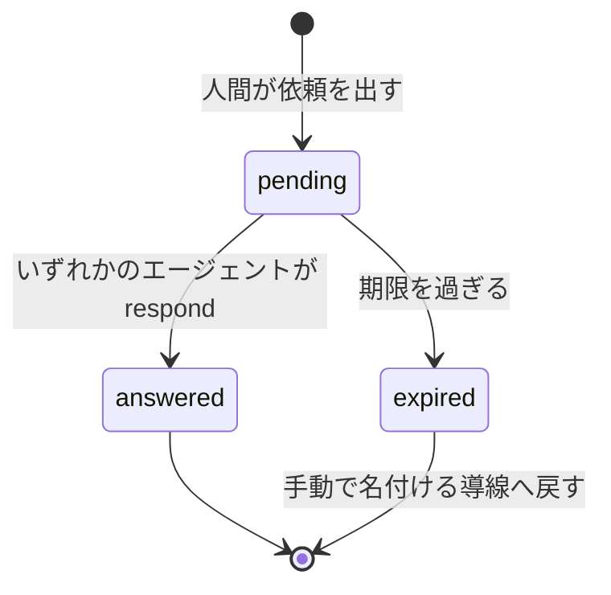
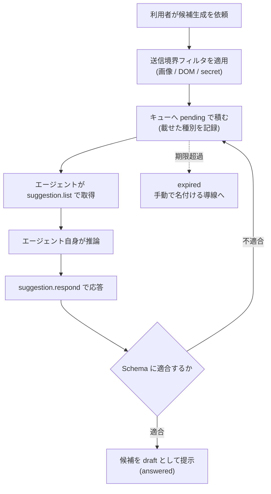

# Feature 設計: AI 候補生成

Feature 単位の設計 doc。仕様 (What) をどう実現するか (How) を、データ構造・フロー単位で記述する。責務・範囲・方針の層に留め、実装レベルの手順は spec へ委譲する。全体像は [design/DesignDoc.md](../../DesignDoc.md)、横断規約は [context/](../../../context/) を参照する。

**現在の設計だけを書く。** 判断の経緯は ADR を参照する (候補生成の方式は [adr/0019](../../../adr/0019-agent-led-ai-suggestions.md)、依頼の受け渡しは [adr/0020](../../../adr/0020-suggestion-pull-queue.md)、送信境界は [adr/0010](../../../adr/0010-ai-data-boundary.md))。

## 概要

要素の名称・種別・Locator の候補、および DSL の修正候補を AI に作らせる機能である。

**推論はエージェント自身が行う。** 本プロダクトは AI サービスへ接続せず、credential も持たない ([adr/0019](../../../adr/0019-agent-led-ai-suggestions.md))。利用者が既に使っている Claude Code や Codex が、agent interface 経由で依頼を取りに来て、推論結果を draft として書き戻す。

本書は次の 3 つを定義する。

1. **依頼の受け渡し** — 人間が出した依頼をエージェントがどう受け取り、どう返すか。
2. **送信情報の境界** — 依頼にどこまでの情報を載せてよいか。
3. **将来経路の位置づけ** — AI Port / DSL Fix Port を型として残す理由と、実装する場合の条件。

**AI が居なくても機能が完結する。** 候補生成は機械的な候補抽出 (core/element) の補強であり、本体機能の前提にしない。

## 背景・要件解釈

- 本設計が満たすべき成功条件 (DesignDoc の What から):
  - AI による要素名、種別、Locator 候補の提案ができる。
  - AI の出力は構造化された draft として扱い、確定は人間の承認を経る。
- プロダクトが AI サービスへ直接接続する形は採れない。サブスクリプションの credential を第三者プロダクトが使う形は主要な提供元の利用規約が許さず、API キーを別に要求すると利用者に二重の課金を強いる ([adr/0019](../../../adr/0019-agent-led-ai-suggestions.md))。

## スコープ

### やること

- 提案依頼キューのデータモデルと状態遷移
- 依頼に載せる情報の境界 (送信境界) と記録
- 応答の検証と draft への反映の原則
- AI Port / DSL Fix Port を将来経路として残す整理

### やらないこと

- tool の Schema と認可 → agent-interface feature ([DesignDoc_agent-interface.md](../agent-interface/DesignDoc_agent-interface.md))
- 依頼を出す UI と `expired` 時の導線 → web-editor feature ([DesignDoc_web-editor.md](../web-editor/DesignDoc_web-editor.md))
- 機械的な候補抽出の規則と AI Port の契約 → element-mapping feature ([DesignDoc_element-mapping.md](../element-mapping/DesignDoc_element-mapping.md))
- DSL Fix Port の契約 → workflow-dsl feature ([DesignDoc_workflow-dsl.md](../workflow-dsl/DesignDoc_workflow-dsl.md))
- **外部 AI サービスへの接続 (provider 抽象・credential 解決)** → 実用最小限の製品 (MVP) では実装しない ([adr/0019](../../../adr/0019-agent-led-ai-suggestions.md))

## 設計

### 提案依頼キュー

人間が依頼を積み、エージェントが取りに来る **pull 型**とする ([adr/0020](../../../adr/0020-suggestion-pull-queue.md))。キューは app 層が持つ。

| 項目       | 内容                                                             |
| ---------- | ---------------------------------------------------------------- |
| 依頼の識別 | 依頼 ID (サーバ発行)                                             |
| 対象       | Screen と state、対象の要素候補 (element-mapping が抽出したもの) |
| 種別       | 要素の命名か、DSL の修正か                                       |
| 入力       | 送信境界を適用した後の情報 (後述)                                |
| 状態       | `pending` / `answered` / `expired`                               |
| 期限       | 依頼ごとに持つ。過ぎたら `expired`                               |
| 応答       | 構造化した候補列。自由文を受け取らない                           |

**排他的な割り当てをしない。** 複数のエージェントが同じ依頼を取り出してよく、応答は複数の draft として並び、人間が選ぶ。割り当てを持つと、応答しないエージェントに依頼が滞留する。

**`expired` を必ず持つ。** 応答が無いまま待ち続けさせないためである。AI が居なくても完結するという要件は、この状態遷移で守る。

### 送信情報の境界

依頼の内容はエージェントを経由してモデル提供者のサーバへ送られる。**プロセスがローカルであることと、データがローカルに留まることは別である** ([adr/0010](../../../adr/0010-ai-data-boundary.md))。

| 送信内容                                                            | 既定   | 変更方法                           |
| ------------------------------------------------------------------- | ------ | ---------------------------------- |
| Snapshot 断片 (対象要素 + 周辺文脈)・画面メタ情報・既存要素定義一覧 | 送信   | 常に送信 (依頼の入力)              |
| スクリーンショット画像                                              | 不送信 | プロダクト単位の設定で明示的に許可 |
| DOM 断片                                                            | 不送信 | プロダクト単位の設定で明示的に許可 |
| secret 系フィールド (パスワード等) の値                             | 除去   | 変更不可 (常に除去)                |

- フィルタは**依頼をキューへ積む直前に一元的に適用する**。依頼を作る側が個別に判断しない。
- 何をどの種別で載せたかを実行記録に残す。後から範囲を説明できるようにするためである。
- 除去の理由は送信先ではなく、**認証情報を Snapshot 経由で拡散させないこと**にある。依頼内容はエージェントのセッション履歴にも残る。

### 応答の扱い

- 応答は **draft への提案に限る**。正本 (確定済み DSL・Baseline・構成番号) を書き換える経路を持たない ([adr/0017](../../../adr/0017-agent-draft-boundary.md))。
- 応答は Schema で検証する。自由文・未知の要素種別・確信度の範囲外は拒否する。**エージェントの出力を信用しない。**
- 検証に落ちた応答は依頼を `pending` のまま残す。壊れた候補で埋めない。

### 将来経路 (AI Port / DSL Fix Port)

| Port         | 定義元        | MVP        | 実装する場合の条件                                    |
| ------------ | ------------- | ---------- | ----------------------------------------------------- |
| AI Port      | core/element  | 実装しない | 利用者が自前の API キーを持ち込む形が要件になったとき |
| DSL Fix Port | core/workflow | 実装しない | 同上                                                  |

型として残すのは、**エージェント経由の経路と将来の直接接続で、core 側の呼び出し形を変えずに済ませる**ためである。実装に着手する場合は、provider の選定・credential の置き場・利用規約の確認を伴うため、その時点で ADR を起こす。

### フロー / シーケンス (依頼 → 応答 → draft)

## 主要シナリオ / フロー

- 利用者が要素を選び、機械的な候補では名称が不十分なとき、依頼を積んで作業を続ける。エージェントが応答すると候補がインスペクタに並ぶ。
- エージェントが応答しないまま期限を過ぎ、`expired` になる。利用者はそのまま手で名付けて作業を終える。
- 複数のエージェントが同じ依頼に応答し、候補が並び、利用者がどちらかを選ぶ。
- エージェントが自由文を返し、Schema 検証で拒否される。依頼は `pending` のまま残る。

## テスト観点

- 横断規約は [context/testing.md](../../../context/testing.md)。キューは app 層の純粋ロジックとして unit test の対象。
- 状態遷移: `pending → answered` / `pending → expired`、`expired` 後に応答が来た場合の扱い。
- 排他割り当てをしないこと: 複数の応答が並び、どちらも失われないこと。
- 送信境界: 許可設定ごとに画像・DOM が依頼から除去されること、secret 系フィールドの値が常に除去されること、載せた種別が記録されること。
- 応答の検証: 自由文・未知種別・確信度範囲外の拒否。拒否時に依頼が `pending` のまま残ること。
- **AI が居なくても要素マッピングが完結すること** (依頼を出さない経路と `expired` 経路の両方)。
