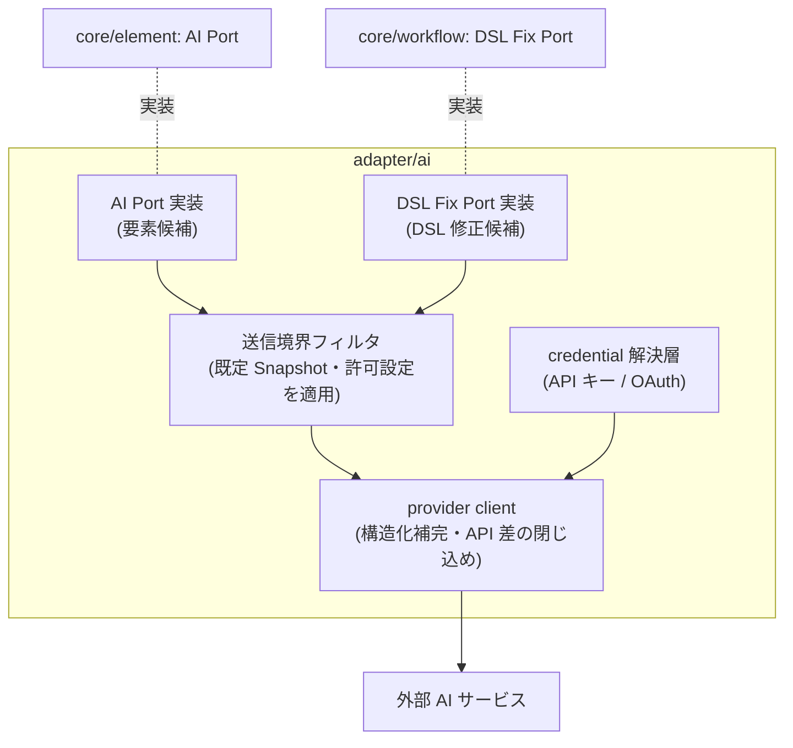

# Feature 設計: AI 候補生成 (adapter/ai)

Feature 単位の設計 doc。仕様 (What) をどう実現するか (How) を、データ構造・フロー単位で記述する。責務・範囲・方針の層に留め、実装レベルの手順は spec へ委譲する。全体像は [design/DesignDoc.md](../../DesignDoc.md)、横断規約は [context/](../../../context/) を参照する。

**現在の設計だけを書く。** 判断の経緯は ADR を参照する (認証は [adr/0009](../../../adr/0009-ai-adapter-auth.md)、送信境界は [adr/0010](../../../adr/0010-ai-data-boundary.md))。

## 概要

adapter/ai は、core が定義する Port を実装し、外部 AI サービスの固有処理 (API 差・認証・送信可否) を閉じ込める adapter である。本書は次の 4 つを定義する。

1. **実装する Port** — AI Port (core/element) と DSL Fix Port (core/workflow) の対応。
2. **provider 抽象と構造化出力** — AI サービス差の閉じ込めと、出力を Schema で強制する仕組み。
3. **認証** — API キーと OAuth (サブスクリプション連携) の両対応 ([adr/0009](../../../adr/0009-ai-adapter-auth.md))。
4. **送信情報の境界** — 既定は Snapshot 断片のみ。設定で明示的に許可したときだけ拡張 ([adr/0010](../../../adr/0010-ai-data-boundary.md))。

adapter/ai の出力はすべて draft への提案であり、DSL・Baseline を直接変更しない (DesignDoc の設計上の前提)。AI サービスへ到達できない場合でも、機械的な候補生成 (core/element の CandidateExtractor) は動作し続ける — AI Port は候補の補強であり、本体機能の前提にしない。

## 背景・要件解釈

- 本設計が満たすべき成功条件 (DesignDoc の What から):
  - AI による要素名、種別、Locator 候補の提案ができる。
  - AI の出力は構造化された draft として扱い、確定は人間の承認を経る。
- adapter/ai の責務 (DesignDoc のモジュール責務): 要素名、種別、Locator、DSL 修正候補の構造化取得。

## スコープ

### やること

- 実装する Port と定義元 core の対応
- provider 抽象 (API 差の閉じ込め) と構造化出力の検証・再要求
- credential の解決 (API キー / OAuth) と保存境界
- 送信情報のフィルタ (送信境界) と送信記録
- エラー分類と再試行方針

### やらないこと

- AI Port の契約 (入力・出力・draft の扱い) の定義 → element-mapping feature ([DesignDoc_element-mapping.md](../element-mapping/DesignDoc_element-mapping.md)。Port は使う core が定義する)
- DSL Fix Port の契約の定義 → workflow-dsl feature (DSL の語彙を知る core/workflow が定義する)
- 候補の draft への反映・承認フロー → app / web / agent-interface
- エージェント (Claude Code / Codex 等) が自身の推論で draft を作る経路 → agent-interface feature (adapter/ai を経由しない)
- secret の保存場所の具体 → [context/infrastructure.md](../../../context/infrastructure.md)

## 設計

### 実装する Port

| Port         | 定義元        | 要求内容                                  | 出力                                             |
| ------------ | ------------- | ----------------------------------------- | ------------------------------------------------ |
| AI Port      | core/element  | 要素の名称・種別・Locator 候補の補強      | 候補列 (確信度つき)。契約は element-mapping 参照 |
| DSL Fix Port | core/workflow | 検証エラー・実行失敗に対する DSL 修正候補 | 修正案の候補列 (対象箇所 + 変更内容 + 理由)      |

- どちらの Port も出力は draft への提案に限る。adapter/ai が正本 (DSL / Baseline) を書き換える経路は存在しない。
- DSL Fix Port の契約詳細 (入力に含める検証エラーの形・修正案の Schema) は workflow-dsl feature に定義を追加する (未反映。本書の Open Questions 参照)。

### provider 抽象と構造化出力

- AI サービスごとの API 差 (メッセージ形式・構造化出力の指定方法・認証) は provider 実装に閉じ込め、Port 実装は provider 非依存の内部 interface (構造化補完: 入力 + 出力 Schema → 検証済みオブジェクト) だけを使う。
- 出力は Port ごとの JSON Schema で検証する。自由文・未知の要素種別・確信度範囲外は拒否する。
- Schema 不一致の応答は 1 回だけ再要求し、再度失敗したらエラーとして返す (無限の再生成はしない)。
- 使用する provider は設定で選ぶ。最初に対応する provider の選定は実装 spec で確定する。

### 認証 ([adr/0009](../../../adr/0009-ai-adapter-auth.md))

- API キー (環境変数または設定ファイル) と OAuth (サブスクリプション連携) の両方に対応する。credential の解決は adapter/ai 内の credential 解決層が行い、Port 契約・core・app には露出しない。
- credential は [context/infrastructure.md](../../../context/infrastructure.md) の secret 規約に従って保存し、DSL・ログ・Snapshot・生成成果物へ平文で残さない。
- OAuth のトークン更新失敗・API キーの認証エラーは「認証エラー」として分類し、再試行しない (エラー分類の節)。

### 送信情報の境界 ([adr/0010](../../../adr/0010-ai-data-boundary.md))

| 送信内容                                                            | 既定   | 変更方法                           |
| ------------------------------------------------------------------- | ------ | ---------------------------------- |
| Snapshot 断片 (対象要素 + 周辺文脈)・画面メタ情報・既存要素定義一覧 | 送信   | 常に送信 (Port 契約の入力)         |
| スクリーンショット画像                                              | 不送信 | プロダクト単位の設定で明示的に許可 |
| DOM 断片                                                            | 不送信 | プロダクト単位の設定で明示的に許可 |
| secret 系フィールド (パスワード等) の値                             | 除去   | 変更不可 (常に除去)                |

- 送信境界のフィルタは provider 呼び出しの直前に一元的に適用する。Port 実装や呼び出し元が個別に判断しない。
- 何をどの種別で送ったかを実行記録に残し、後から監査できるようにする。

### エラー分類と再試行

| 分類       | 例                                   | 扱い                                               |
| ---------- | ------------------------------------ | -------------------------------------------------- |
| 一時エラー | タイムアウト、5xx、rate limit        | 指数バックオフで最大 2 回再試行                    |
| 認証エラー | API キー無効、OAuth トークン更新失敗 | 再試行せず、設定の確認を促すエラーとして返す       |
| 入力エラー | 4xx (コンテキスト超過等)             | 再試行せず、入力を縮小できる場合は呼び出し元へ返す |
| 出力不正   | Schema 不一致                        | 1 回だけ再要求し、失敗したらエラーとして返す       |

- いずれのエラーでも呼び出し元 (core) は候補なしとして継続できる。AI の障害が実行・編集を止めない。

### コンポーネント構成 (C4 L3)

### フロー / シーケンス (候補要求 → draft 提案)

```mermaid
flowchart TD
    A["core が Port 経由で<br/>候補の補強を要求"] --> B["送信境界フィルタを適用<br/>(許可されていない情報を除去)"]
    B --> C["credential を解決し<br/>provider を呼び出す"]
    C --> D{"出力は Schema に<br/>適合するか"}
    D -->|不適合| E["1 回だけ再要求"]
    E --> D
    D -->|適合| F["検証済み候補列を返す<br/>(draft への提案)"]
    D -->|再失敗| G["エラー分類を返す<br/>(呼び出し元は候補なしで継続)"]
```

## 主要シナリオ / フロー

- 利用者が要素を選択し、機械的な候補では名称が不十分なとき、AI Port 経由で命名候補が補強され、インスペクタに確信度つきで並ぶ。
- アイコンのみのボタンが多い画面で、利用者がプロダクト設定で画像送信を許可し、視覚情報に基づく名称候補を得る。
- DSL の Schema 検証エラーに対し、DSL Fix Port が修正案を返し、エージェントまたは利用者が draft として適用する。
- AI サービスが rate limit を返し、再試行後も失敗するが、機械的な候補生成だけで編集作業は継続できる。

## テスト観点

- 横断規約は [context/testing.md](../../../context/testing.md)。provider は fake 実装で検証する。
- 構造化出力: Schema 不一致の拒否と 1 回だけの再要求、自由文・未知種別・確信度範囲外の拒否。
- 送信境界: 許可設定ごとに画像・DOM が送信ペイロードから除去されること、secret 系フィールド値が常に除去されること、送信種別が記録されること。
- 認証: credential がログ・エラーメッセージへ出ないこと、認証エラーが再試行されないこと。
- エラー分類: 分類ごとの再試行回数、エラー時に呼び出し元が候補なしで継続できること。

## Open Questions

| 未決事項                                  | 選択肢                      | 影響                   | 確認方法                               | 担当               | 期限              |
| ----------------------------------------- | --------------------------- | ---------------------- | -------------------------------------- | ------------------ | ----------------- |
| DSL Fix Port の契約の定義先への反映       | workflow-dsl feature へ追記 | Port 契約の正本の所在  | workflow-dsl feature doc の更新で解消  | プロダクト設計担当 | adapter/ai 実装前 |
| 最初に対応する provider と OAuth 規約確認 | 主要 AI サービスから選定    | 実装順序と利用規約適合 | provider の OAuth 仕様と規約を確認する | プロダクト設計担当 | adapter/ai 実装前 |
