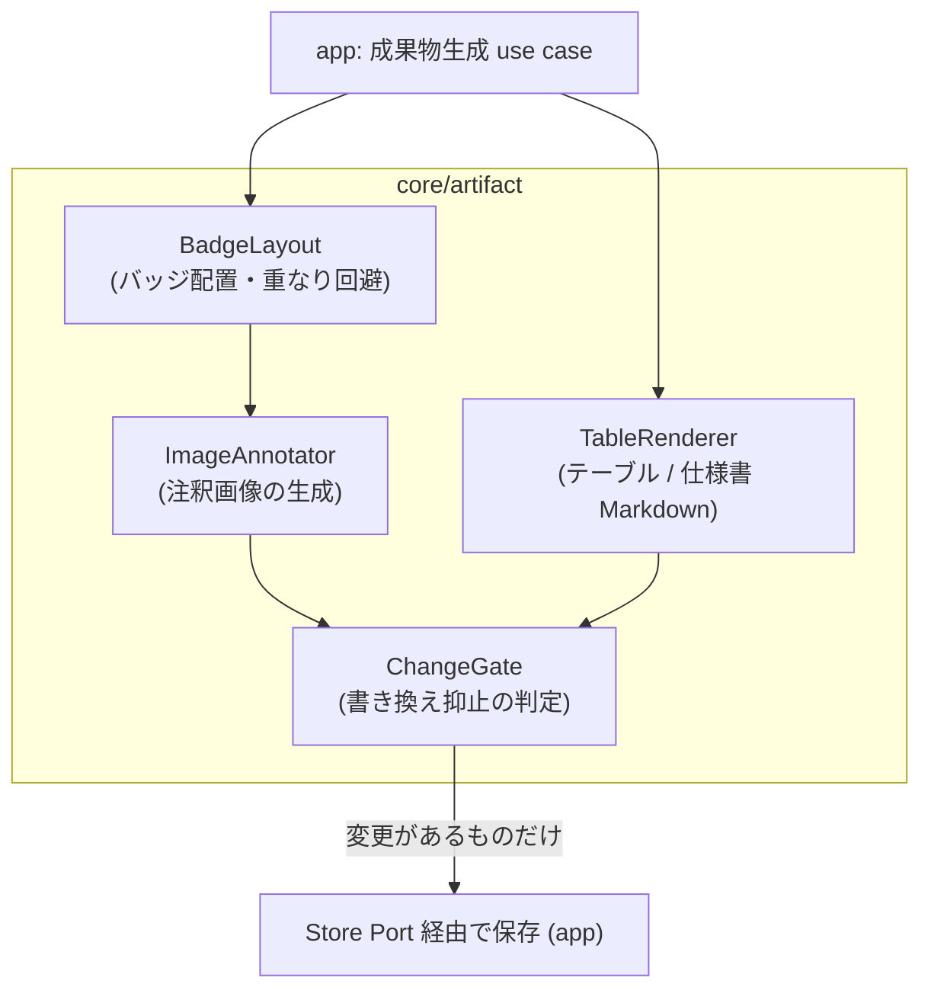
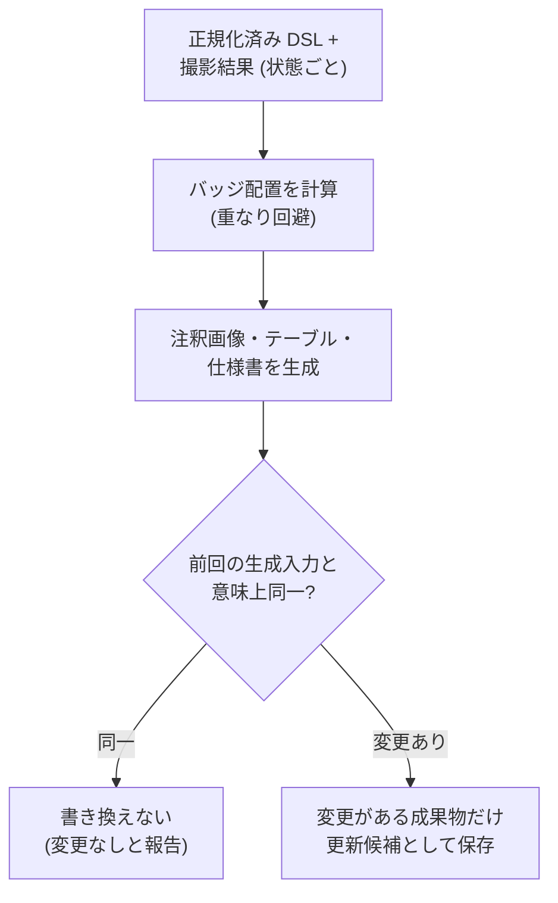

# Feature 設計: 仕様成果物生成 (core/artifact)

Feature 単位の設計 doc。仕様 (What) をどう実現するか (How) を、データ構造・フロー単位で記述する。責務・範囲・方針の層に留め、実装レベルの手順は spec へ委譲する。全体像は [design/DesignDoc.md](../../DesignDoc.md)、横断規約は [context/](../../../context/) を参照する。

**現在の設計だけを書く。**

## 概要

core/artifact は「DSL と撮影結果から、画面仕様書の成果物を決定的に生成する」機能の中核である。本書は次の 4 つを定義する。

1. **成果物の種類と構成** — 何を、どの単位で生成するか。
2. **注釈画像の描画規則** — 番号バッジをどこに・どう描くか。
3. **Markdown テーブルの構成** — 列と行の規則。
4. **書き換え抑止** — 意味上の変更がない場合に既存成果物を書き換えない判定。

生成は「DSL (正本) + 撮影結果 (入力値)」からの決定的な写像であり、成果物側にしか存在しない情報を作らない。成果物は手で編集しない (DesignDoc の前提)。

## 背景・要件解釈

- 画面画像と構成要素テーブルの番号が一致しなくなる・画像と Markdown が別の正本になる問題を、DSL からの一括生成で解消する (DesignDoc の Why)。
- 本設計が満たすべき成功条件 (DesignDoc の What から):
  - DSL から構成番号付き PNG 画像と Markdown テーブルを生成できる。
  - 生成内容に意味上の変更がない場合、既存成果物を書き換えない。
  - 同じ DSL と同じ画面状態からは同じ成果物を生成する。

## スコープ

### やること

- 成果物の種類 (注釈画像 / 構成要素テーブル) と生成単位
- 番号バッジの配置・重なり回避の規則
- テーブルの列構成と行順 (構成番号順)、番号なし要素・削除の扱い
- 「意味上の変更がない」の判定規則と書き換え抑止
- 成果物のファイル配置規則 (保存自体は Store Port 経由で app が行う)

### やらないこと

- 撮影 (スクリーンショット・bounding box の取得) → adapter/browser (入力値として受け取る)
- 構成番号の採番 → element-mapping feature (DSL に書かれた番号を使うだけで、計算しない)
- Baseline との差分検知 → change-detection feature
- 成果物のプレビュー UI → web-editor feature
- PDF / HTML など Markdown 以外の出力形式 (Future Work)

## 設計

### 成果物の種類と生成単位

| 成果物                      | 単位                | 内容                                                                         |
| --------------------------- | ------------------- | ---------------------------------------------------------------------------- |
| 注釈画像 (PNG)              | 画面状態ごとに 1 枚 | その状態のスクリーンショットに、状態に現れる採番要素の番号バッジを重ねたもの |
| 構成要素テーブル (Markdown) | 画面ごとに 1 つ     | 採番要素を構成番号順に並べた表。複数状態の要素を 1 表に統合する              |
| 画面仕様書 (Markdown)       | 画面ごとに 1 つ     | 画面タイトル、状態ごとの注釈画像への参照、構成要素テーブルを結合した文書     |

生成の入力は「正規化済み DSL (要素定義 + 構成番号 + 状態木)」と「撮影結果 (状態ごとのスクリーンショット + 要素の bounding box)」であり、どちらも core/artifact にとっては引数である。

### 注釈画像の描画規則

- バッジは対象要素の bounding box の**左上角の外側**に描く。画像の端にかかる場合は box の内側へ倒す。
- バッジ同士が重なる場合は、読み順で後の要素のバッジを右方向へずらす (ずらし量は固定値)。決定的に解決できない重なりは生成警告として報告する。
- バッジの形状・配色・フォントは固定のスタイル設定 (設定値) とし、要素ごとに変えない。
- 番号なし要素 (`numbered: false`) と、その状態に現れない要素 (継承規則の展開結果に従う) は描かない。

### 構成要素テーブルの構成

| 列       | 内容                                             |
| -------- | ------------------------------------------------ |
| 番号     | 構成番号 (昇順で並べる)                          |
| 名称     | 要素定義の `name`                                |
| 種別     | 要素定義の `type` (固定 enum + custom)           |
| 表示状態 | 要素が現れる状態。全状態に現れる場合は省略 (`-`) |
| 備考     | 要素定義の任意注記 (`note`)。無ければ空          |

- 行は構成番号の昇順。番号なし要素は載せない。
- Locator はテーブルに載せない (実装詳細であり仕様書の読者に不要。必要なら DSL を参照する)。

### 書き換え抑止 — 「意味上の変更がない」の判定

成果物の再生成時、次の規則で既存成果物と比較し、変更がなければファイルを書き換えない (タイムスタンプも更新しない)。

| 成果物                       | 比較方法                                                                                                                                                |
| ---------------------------- | ------------------------------------------------------------------------------------------------------------------------------------------------------- |
| テーブル / 仕様書 (Markdown) | 生成した内容のテキスト比較 (完全一致)                                                                                                                   |
| 注釈画像 (PNG)               | 画像バイト比較ではなく、**生成入力の比較**: スクリーンショットのハッシュ + 採番要素の (番号, bounding box, バッジ位置) の組が前回と同一なら再生成しない |

- 画像をバイト比較しないのは、描画エンジンの環境差でバイトが揺れうるため (ピクセル同一性は Non Goals)。入力が同じなら出力は意味的に同じとみなす。
- 「見た目は同じだが入力が変わった」場合 (例: bounding box が 1px 動いた) は書き換えが起きる。閾値による吸収は change-detection の関心であり、生成側では行わない。

### 成果物のファイル配置

```text
artifacts/
└── screens/<screen-id>/
    ├── spec.md              # 画面仕様書 (テーブル含む)
    ├── <state-id>.png       # 状態ごとの注釈画像
    └── meta.json            # 生成入力の記録 (書き換え抑止の比較用ハッシュ等)
```

- 配置規則は core/artifact が決め、書き込みは app が Store Port 経由で行う。
- `meta.json` は書き換え抑止と差分検知のための機械可読情報であり、人間向け文書ではない。

### コンポーネント構成 (C4 L3)



### フロー / シーケンス (生成と書き換え抑止)



## 主要シナリオ / フロー

- 利用者が承認済みの Screen 文書から仕様書を生成し、状態ごとの注釈画像と構成番号順のテーブルを得る。
- 何も変えずに再生成し、全成果物が「変更なし」としてスキップされる (タイムスタンプも動かない)。
- 文言だけ変わった要素があり、テーブルと該当状態の画像だけが更新候補になる。
- バッジが密集する画面で重なり回避が働き、解決しきれない箇所が生成警告として報告される。
- エージェントが `artifact.preview` で draft の内容から試し生成し、Baseline を汚さずに見た目を確認する。

## テスト観点

- 横断規約は [context/testing.md](../../../context/testing.md)。core/artifact は純粋ロジック (描画計算・テキスト生成) を unit test の主対象とする。
- 決定性: 同じ DSL + 同じ撮影結果から、バッジ配置・テーブル内容が常に同一であること。
- バッジ配置: 端・重なり・ずらしの境界ケース。解決不能な重なりの警告。
- テーブル: 番号順、番号なし要素の除外、表示状態列の省略規則。
- 書き換え抑止: 入力同一で書き換えないこと、1 箇所の変更で該当成果物だけが更新候補になること。
- 継承展開との整合: 状態に現れない要素がその状態の画像に描かれないこと。
