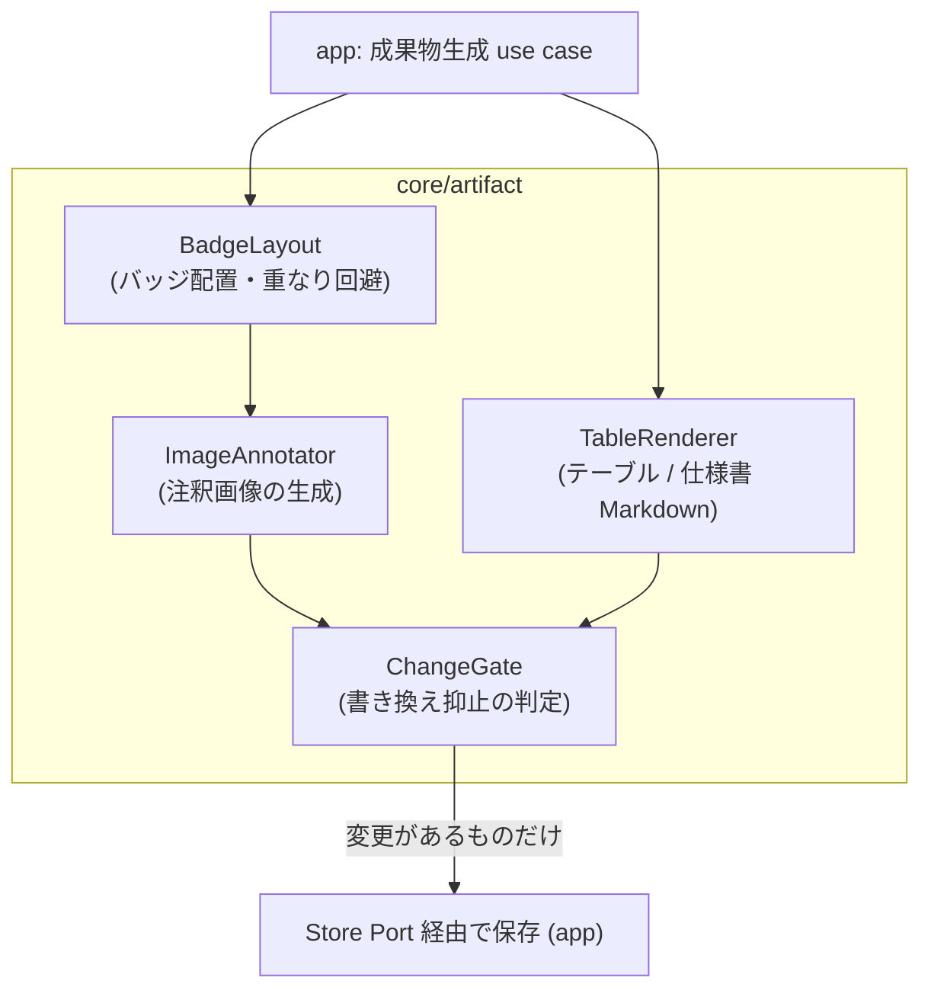
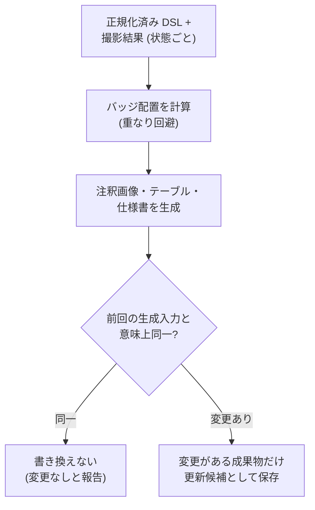

# Feature 設計: 仕様成果物生成 (core/artifact)

Feature 単位の設計 doc。仕様 (What) をどう実現するか (How) を、データ構造・フロー単位で記述する。責務・範囲・方針の層に留め、実装レベルの手順は spec へ委譲する。全体像は [design/DesignDoc.md](../../DesignDoc.md)、横断規約は [context/](../../../context/) を参照する。

**現在の設計だけを書く。**

## 概要

core/artifact は「DSL と撮影結果から、画面仕様書の成果物を決定的に生成する」機能の中核である。本書は次の 4 つを定義する。

1. **成果物の種類と構成** — 何を、どの単位で生成するか。
2. **注釈画像の描画規則** — 番号バッジをどこに・どう描くか。
3. **Markdown テーブルの構成** — 列と行の規則。
4. **書き換え抑止** — 意味上の変更がない場合に既存成果物を書き換えない判定。

生成は「DSL (正本) + 撮影結果 (入力値)」からの決定的な写像であり、成果物側にしか存在しない情報を作らない。成果物は手で編集しない (DesignDoc の前提)。

## 背景・要件解釈

- 画面画像と構成要素テーブルの番号が一致しなくなる・画像と Markdown が別の正本になる問題を、DSL からの一括生成で解消する (DesignDoc の Why)。
- 本設計が満たすべき成功条件 (DesignDoc の What から):
  - DSL から構成番号付き PNG 画像と Markdown テーブルを生成できる。
  - 生成内容に意味上の変更がない場合、既存成果物を書き換えない。
  - 同じ DSL と同じ画面状態からは同じ成果物を生成する。

## スコープ

### やること

- 成果物の種類 (注釈画像 / 構成要素テーブル / Playwright POM コード) と生成単位
- 番号バッジの配置・重なり回避の規則
- テーブルの列構成と行順 (構成番号順)、番号なし要素・削除の扱い
- 「意味上の変更がない」の判定規則と書き換え抑止
- 成果物のファイル配置規則 (保存自体は Store Port 経由で app が行う)

### やらないこと

- 撮影 (スクリーンショット・bounding box の取得) → adapter/browser (入力値として受け取る)
- 構成番号の採番 → element-mapping feature (DSL に書かれた番号を使うだけで、計算しない)
- Baseline との差分検知 → change-detection feature
- 成果物のプレビュー UI → web-editor feature
- PDF / HTML など仕様書の他形式出力 (Future Work)
- 生成した POM を使うテストコード自体の生成 (POM は部品の提供まで)

## 設計

### 成果物の種類と生成単位

| 成果物                      | 単位                    | 内容                                                                                                     |
| --------------------------- | ----------------------- | -------------------------------------------------------------------------------------------------------- |
| 注釈画像 (PNG)              | 画面状態ごとに 1 枚     | その状態のスクリーンショット (clip 指定があれば切り抜き) に、badges の番号バッジを重ねたもの             |
| 構成要素テーブル (Markdown) | **画面状態ごとに 1 つ** | その状態の要素を構成番号順に並べた表。番号は状態内で 1..N ([adr/0005](../../../adr/0005-renumbering.md)) |
| 画面仕様書 (Markdown)       | 画面ごとに 1 つ         | 画面タイトルと、状態ごとの「注釈画像 + テーブル」のセットを状態木の DFS 順に並べた文書                   |

生成の入力は「Screen IR (core/workflow が正規化した画面全体のモデル。要素定義・badges・状態木を含む)」と「撮影結果 (状態ごとのスクリーンショット + 要素の bounding box)」であり、どちらも core/artifact にとっては引数である。IR と Locator の型参照のみで core/workflow / core/element に依存する (規約は context/architecture.md)。

### 注釈画像の描画規則

**撮影と注釈は 2 段に分離する**。撮影 (生スクリーンショット + 各要素の bounding box の取得) は実行時に adapter/browser が行い、注釈 (バッジ配置の計算と合成) は core/artifact の純粋計算である。生スクリーンショットと bounding box は保存し、バッジは何度でも再合成できる — 再採番や badges の並べ替えだけなら再撮影は不要。**差分検知 (Visual Diff) の対象は生スクリーンショットであり、バッジを焼き込んだ注釈済み画像は差分検知の対象にしない** (番号の変更が画面の実変化と混ざるため。詳細は change-detection feature)。

- バッジの位置の基準は、**撮影時に取得した対象要素の bounding box** (viewport ピクセル座標。`clip` 指定時は切り抜き後の画像座標へ変換する)。selector から位置を計算するのではなく、Locator の解決はバッジ描画より前 (撮影時) に済んでいる。
- バッジは bounding box の**左上角の外側**に固定オフセット (設定値) で描く。画像の端にかかる場合は box の内側へ倒す。
- バッジ同士が重なる場合は、読み順で後の要素のバッジを右方向へずらす (ずらし量は固定値)。決定的に解決できない重なりは生成警告として報告する。
- バッジの形状・配色・フォントは固定のスタイル設定 (設定値) とし、要素ごとに変えない。
- バッジを描くのは state の `badges` に載る要素だけ。`optional` / `child_doc` と、その状態に現れない要素 (継承規則の展開結果に従う) は描かない。
- `all` 指定の要素は、Locator に一致する全件へ同じ番号のバッジを描く (件数上限は設定値。超過は生成警告)。

### 構成要素テーブルの構成

テーブルは状態ごとに生成し、行は次の 3 種からなる。

| 行の種類                      | 番号列               | 内容                                                                                            |
| ----------------------------- | -------------------- | ----------------------------------------------------------------------------------------------- |
| バッジ要素                    | 1..N (badges の位置) | 名称・種別を表示。行順は番号順                                                                  |
| 条件付き表示要素 (`optional`) | `-`                  | 名称・種別・`note` (表示条件や特定できない理由) を表示。未実装 (`unimplemented`) はその旨を注記 |
| 子文書要素 (`child_doc`)      | なし                 | 名称を対象 Screen の仕様書へのリンクとして表示                                                  |

- 列は「番号 / 名称 / 種別 / 備考」。種別は要素定義の `type` (固定 enum + custom)。
- Locator はテーブルに載せない (実装詳細であり仕様書の読者に不要。必要なら DSL を参照する)。

### Playwright POM コードの生成規則

Workflow IR からの決定的 codegen とする。生成コードは編集禁止 (生成ヘッダで明示) で、拡張はクラス継承など生成物の外側で行う。

**Playwright への依存は生成物の利用側にのみ生じる**。本システムの実行 (agent-browser)・仕様書生成・差分検知は Playwright に依存せず、POM 生成もテキスト生成であってランタイムを要しない。POM の生成は、**プロダクト設定で明示的に有効にしたときだけ行う** (`outputs: [spec]` / `[spec, pom]`)。Playwright を使わない利用者は仕様書生成だけで完結する。codegen の Locator / action 対応表は出力 target 単位で持ち、将来の他フレームワーク向け出力は target の追加で対応する (Future Work)。

- 入力は Screen IR。Screen IR → 画面ごとの Page Object クラス。要素定義 → 型付き locator プロパティ、状態遷移 steps → 遷移メソッド、Expectation → 対応する assertion helper。
- **Expectation の意味論の正本は execution feature の評価規則**とし、assertion への対応表はそれと同じ意味になるよう定義する。対応できない Expectation (Playwright で表現できない条件) は生成時警告とし、黙って意味を変えない。
- Workflow 文書 → 到達手順の fixture / helper。
- Locator の対応: `role+name` → `getByRole`、`label` → `getByLabel`、`testid` → `getByTestId`、`text` → `getByText`、`css` + `index` → `locator().nth()`。agent-browser と Playwright で意味論が一致しない Locator は生成時警告にする。
- 識別子は要素 ID / 状態 id から決定的に導出する (同じ IR からは常に同じコード): 要素 ID は `el-` 接頭辞を除いた camelCase をプロパティ名に (`el-username` → `username`)、状態遷移メソッドは `to<遷移先状態>` (`toModalOpen`)、状態の期待状態検証は `expect<状態>` (`expectModalError`)、entry は static `goto`。
- 衝突 (導出した識別子の重複・予約語) は生成エラーとし、要素 ID の変更を促す。

生成コードの構造 (workflow-dsl の Screen 例からの生成イメージ。抜粋のため一部要素のプロパティ宣言は省略):

```ts
// Generated by screen-contract from screens/login.yaml — DO NOT EDIT
import { type Locator, type Page, expect } from "@playwright/test";

export class LoginScreen {
  readonly username: Locator; // el-username
  readonly modal: Locator; // el-modal
  readonly toast: Locator; // el-toast

  constructor(readonly page: Page) {
    this.username = page.getByRole("textbox", { name: "ユーザー名" });
    this.modal = page.getByRole("dialog");
    this.toast = page.getByRole("alert");
  }

  /** entry: workflows/goto-login */
  static async goto(page: Page): Promise<LoginScreen> {
    await page.goto("/login");
    await expect(page).toHaveURL(/\/login/);
    return new LoginScreen(page);
  }

  /** default → modal-open */
  async toModalOpen(): Promise<void> {
    await this.openModalButton.click();
    await this.expectModalOpen();
  }

  /** modal-open → modal-error (fragments: submit-empty) */
  async toModalError(): Promise<void> {
    await this.modalSubmit.click();
    await this.expectModalError();
  }

  /** modal-error の期待状態 */
  async expectModalError(): Promise<void> {
    await expect(this.toast).toBeVisible();
  }
}
```

- 状態遷移メソッドは遷移 steps の実行 + 遷移先 Expectation の検証で構成し、`expect<状態>` は単独でも呼べる (冪等実行の「期待状態の検証」に対応する)。
- `optional` / `child_doc` 要素は locator プロパティを生成しない (前者は状態依存で不安定、後者は子画面クラス側で生成される)。`all` 指定は複数件 locator (`nth` なし) として生成する。

### 書き換え抑止 — 「意味上の変更がない」の判定

成果物の再生成時、次の規則で既存成果物と比較し、変更がなければファイルを書き換えない (タイムスタンプも更新しない)。

| 成果物                                  | 比較方法                                                                                                                                                                        |
| --------------------------------------- | ------------------------------------------------------------------------------------------------------------------------------------------------------------------------------- |
| テーブル / 仕様書 (Markdown) / POM (TS) | 生成した内容のテキスト比較 (完全一致)                                                                                                                                           |
| 注釈画像 (PNG)                          | 画像バイト比較ではなく、**生成入力の比較**: スクリーンショット (clip 適用後) のハッシュ + badges の要素列と各 (番号, bounding box, バッジ位置) の組が前回と同一なら再生成しない |

- 画像をバイト比較しないのは、描画エンジンの環境差でバイトが揺れうるため (ピクセル同一性は Non Goals)。入力が同じなら出力は意味的に同じとみなす。
- 「見た目は同じだが入力が変わった」場合 (例: bounding box が 1px 動いた) は書き換えが起きる。閾値による吸収は change-detection の関心であり、生成側では行わない。

### 成果物のファイル配置

出力先は Screen 文書ごとに設定できる (`doc` / `image` のパス指定。既存の仕様書ディレクトリ構成へ出力するため)。未指定時の既定は次のとおり。

```text
artifacts/
└── screens/<screen-id>/
    ├── spec.md              # 画面仕様書 (状態ごとの画像 + テーブル)
    ├── <state-id>.png       # 状態ごとの注釈画像
    ├── <screen-id>.page.ts  # Playwright POM (編集禁止の生成物)
    └── meta.json            # 生成入力の記録 (書き換え抑止の比較用ハッシュ等)
```

- 配置規則と既定値は core/artifact が決め、書き込みは app が Store Port 経由で行う。
- `meta.json` は書き換え抑止と差分検知のための機械可読情報であり、人間向け文書ではない。
- Baseline は `(screen, state, authProfile)` で識別されるため ([adr/0022](../../../adr/0022-auth-state-storage.md))、成果物も認証プロファイルごとに分ける。既定では `screens/<screen-id>/<authProfile>/` を挟む。混ぜると、権限差で見える範囲の違う画像とテーブルが同じファイルを上書きし合う。

#### 出力先の格納範囲

**出力先はプロジェクトルートの配下に限る。** 出力先は Screen 文書で指定でき、Screen 文書はエージェントが `screen.save_draft` で編集できる。制約が無いと、`../../../.git/hooks/pre-commit` や `~/.zshrc` を指定して任意のファイルを書き換えられる。

| 拒否するもの                             | 理由                                 |
| ---------------------------------------- | ------------------------------------ |
| 絶対パス                                 | ルート外へ直接届く                   |
| `..` を含むパス                          | 相対で遡ってルート外へ出る           |
| `~` 始まり                               | ホームディレクトリへ展開される       |
| 解決後にルート外を指すシンボリックリンク | パス文字列の検査だけでは通ってしまう |

検査は Schema での文字列検査と、**パスを解決したあとの格納範囲の検査**の 2 段で行う。文字列検査だけではシンボリックリンクを通してしまう。

### コンポーネント構成 (C4 L3)



### フロー / シーケンス (生成と書き換え抑止)



## 主要シナリオ / フロー

- 利用者が承認済みの Screen 文書から仕様書を生成し、状態ごとの「注釈画像 + 構成要素テーブル」のセットを得る。
- 何も変えずに再生成し、全成果物が「変更なし」としてスキップされる (タイムスタンプも動かない)。
- 文言だけ変わった要素があり、該当状態のテーブルと画像だけが更新候補になる。
- バッジが密集する画面で重なり回避が働き、解決しきれない箇所が生成警告として報告される。
- エージェントが `artifact.preview` で draft の内容から試し生成し、Baseline を汚さずに見た目を確認する。
- 利用者が生成された Page Object クラスを自プロダクトの Playwright テストから import し、画面変更後は DSL 更新 → 再生成で追従する。

## テスト観点

- 横断規約は [context/testing.md](../../../context/testing.md)。core/artifact は純粋ロジック (描画計算・テキスト生成) を unit test の主対象とする。
- 決定性: 同じ DSL + 同じ撮影結果から、バッジ配置・テーブル内容が常に同一であること。
- バッジ配置: 端・重なり・ずらしの境界ケース。解決不能な重なりの警告。
- テーブル: 番号順、optional 行 (`-` + note) と child_doc リンク行の出力、状態ごとの独立性 (他状態の変更が波及しないこと)。
- 書き換え抑止: 入力同一で書き換えないこと、1 箇所の変更で該当成果物だけが更新候補になること。
- 継承展開との整合: 状態に現れない要素がその状態の画像に描かれないこと。
- POM codegen: 同一 IR からの出力一致 (決定性)、Locator 対応表の網羅、対応不能 Locator の生成時警告、生成ヘッダの付与。
