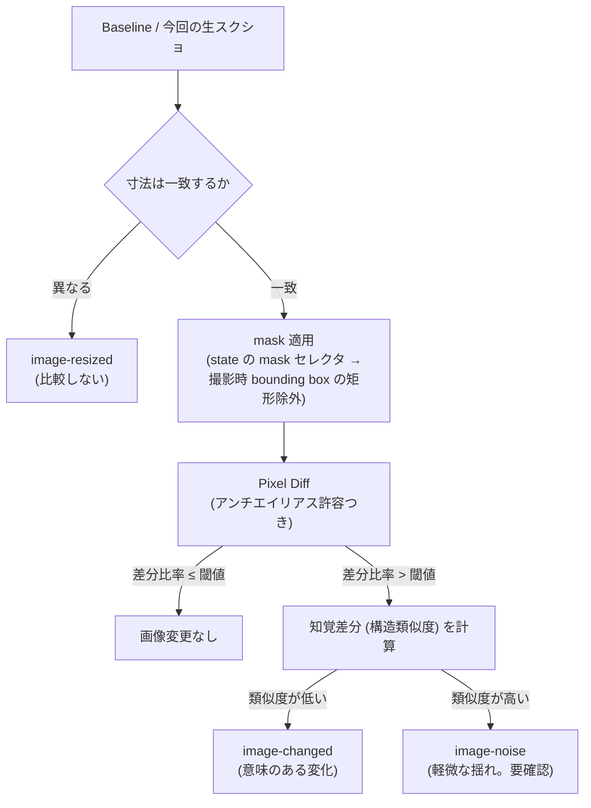
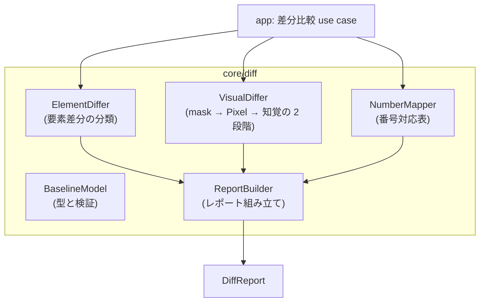

# Feature 設計: 変更差分検知 (core/diff)

Feature 単位の設計 doc。仕様 (What) をどう実現するか (How) を、データ構造・フロー単位で記述する。責務・範囲・方針の層に留め、実装レベルの手順は spec へ委譲する。全体像は [design/DesignDoc.md](../../DesignDoc.md)、横断規約は [context/](../../../context/) を参照する。

**現在の設計だけを書く。** 判断の経緯は ADR を参照する ([adr/0007](../../../adr/0007-visual-diff.md))。

## 概要

core/diff は「前回の承認済み結果 (Baseline) と今回の実行結果を比べ、変更を分類して提示する」機能の中核である。本書は次の 4 つを定義する。

1. **Baseline の構造** — 何を比較の基準として保存し、いつ更新されるか。
2. **要素差分の分類語彙** — Locator 未解決・Role 変更・文言変更・位置変更などをどう区別するか。
3. **画像差分の判定** — 生スクリーンショットに対する Pixel Diff → 知覚差分の 2 段階判定と mask。
4. **差分レポート** — 分類済み差分と番号対応表をどうまとめて返すか。

core/diff は純粋ロジックであり、Baseline と実行結果を入力値として受け取る (保存・読み出しは app が Store Port 経由で行う)。差分は分類して提示するまでが責務で、承認 (Baseline の更新) は人間の承認ゲートに委ねる。

## 背景・要件解釈

- Selector が解決できなくなっても仕様書の更新まで検知されない・画面変更後も古い定義が残る問題を、実行のたびの機械的な比較で解消する (DesignDoc の Why)。
- 本設計が満たすべき成功条件 (DesignDoc の What から):
  - Locator の未解決、複数一致、Role 変更、文言変更、位置変更、画像変更を区別して検知できる。
  - 再実行時に前回の Baseline と比較し、変更内容を分類して提示する。
  - 変更がない成果物は書き換えず、変更がある成果物だけを更新候補とする (書き換え抑止自体は artifact-generation)。

## スコープ

### やること

- Baseline の構造 (保存内容・単位) と更新の契機
- 要素差分の分類語彙と判定規則
- 画像差分の 2 段階判定 (Pixel Diff → 知覚差分)、閾値、mask の適用
- 番号対応表 (badges の旧 → 新) の生成
- 差分レポートの構造 (状態ごとの分類済み一覧)

### やらないこと

- Baseline・実行結果の保存 → Store Port 経由で app が行う (core/diff は入力値として受け取る)
- 差分の承認 UI・表示 → web-editor feature
- 承認による Baseline 更新の編成 → app 層の use case (承認ゲートは DesignDoc の前提)
- 成果物の書き換え抑止 → artifact-generation feature (差分検知とは別の、生成入力の同一性判定)
- CI 上での定期実行・PR 連携 → Future Work (本 feature は比較と分類のみを提供する)

## 設計

### Baseline の構造

Baseline は「人間が承認した時点の実行結果セット」である。

**識別子は `(screen, state, authProfile, generation)` とする** ([adr/0022](../../../adr/0022-auth-state-storage.md))。認証プロファイルを識別子に含めないと、**ログインした利用者の権限差に由来する差分が検知結果を占め、検知したい変更が埋もれる**。匿名実行も 1 つのプロファイルとして区別する。

`generation` は認証状態を取り込んだ世代である。プロファイル名は可変で、同じ名前へ別のアカウントの状態を入れられるため、名前だけでは分けきれない。**古い generation の Baseline は上書きせず残す。** 捨てると、取り込み直した直後に「Baseline 未作成」へ戻り、差分検知が一度使えなくなる。

識別子ごとに次を持つ。

| 内容                                                             | 用途                                                          |
| ---------------------------------------------------------------- | ------------------------------------------------------------- |
| 生スクリーンショット (`clip` 適用後、バッジ合成前)               | 画像差分の基準 ([adr/0007](../../../adr/0007-visual-diff.md)) |
| Snapshot (Accessibility ツリー) と各要素の解決結果・bounding box | 要素差分の基準                                                |
| badges (構成番号の並び)                                          | 番号対応表の基準                                              |
| 由来する Screen IR (正規化済みの内容そのもの)                    | DSL 由来の変更と画面由来の変化の区別                          |

- Baseline の更新は**人間の承認 (Baseline 確定) によってのみ**起きる。実行のたびに自動更新しない。
- Baseline が存在しない状態 (初回) は「全要素が新規」ではなく「Baseline 未作成」として報告し、初回承認を促す。
- 比較は**同じ `authProfile` の Baseline とだけ**行う。異なるプロファイルの結果を突き合わせない。DiffReport には比較に使った `authProfile` を含める。

**DSL の版はハッシュではなく Screen IR の内容そのものを保存する。** ハッシュは変わったかどうかしか示せず、`def-modified` の旧値を復元できない。要素定義の追加・削除・変更を要素単位で分類するには、旧側の内容が要る。

### 要素差分の分類語彙

要素 ID を基準に、Baseline と今回の実行結果を突き合わせて分類する。

| 分類                                         | 判定                                                                                      |
| -------------------------------------------- | ----------------------------------------------------------------------------------------- |
| `locator-unresolved`                         | Baseline では解決できた Locator が `not-found` になった (要素の消失または Locator の破損) |
| `locator-ambiguous`                          | 解決結果が `ambiguous` になった (一意性の喪失)                                            |
| `role-changed`                               | 解決した要素の role が変わった                                                            |
| `text-changed`                               | Accessible Name・表示文言が変わった                                                       |
| `moved`                                      | bounding box の移動・サイズ変化が許容値 (設定) を超えた                                   |
| `def-added` / `def-removed` / `def-modified` | DSL 側の要素定義の追加・削除・変更 (DSL 版の差から判定し、画面由来の変化と区別する)       |
| `image-resized`                              | `clip` 後の画像の寸法が Baseline と異なる (画像差分は計算しない。後述)                    |

- 1 要素に複数の分類が同時に付きうる (例: `text-changed` + `moved`)。
- 分類は事実の報告であり、良し悪しの判定 (仕様変更か破損か) はしない。判断は人間またはエージェントが差分レポートを見て行う。

### 画像差分の 2 段階判定

対象は**生スクリーンショット** (バッジ合成前)。注釈済み画像は比較しない ([adr/0007](../../../adr/0007-visual-diff.md))。

**寸法が異なる場合は比較しない。** `clip` は selector の bounding box で決まるため、画面変更で切り抜きの寸法が変わりうる。pixelmatch も ssim も同寸法を前提とするため、そのまま渡すと例外になるか、無意味な結果を返す。

| 状況           | 扱い                                                  |
| -------------- | ----------------------------------------------------- |
| 寸法が一致する | 2 段階判定へ進む                                      |
| 寸法が異なる   | **画像差分を計算せず `image-resized` として分類する** |

引き伸ばしや余白の追加で寸法を揃えない。揃えると、寸法変化そのものが差分比率へ紛れ込み、**「切り抜き領域が変わった」という事実が失われる**。寸法差はそれ自体が報告すべき変化である。

- 閾値 (差分ピクセル比率) と知覚差分の類似閾値は既定値をシステム設定に持ち、**状態単位で上書きできる**。既定の数値は fixture 対象アプリでの実測と合わせて実装時に確定する ([adr/0025](../../../adr/0025-image-diff-library.md))。根拠のない数値を先に決めない。
- `mask` は DSL の state に宣言した除外領域 (セレクタ列)。撮影時に解決した bounding box の矩形として適用し、**適用した領域をレポートに明示する** (黙って無視しない)。
- 判定結果には両指標 (差分比率・類似度) と差分ヒートマップ画像の参照を含める。
- 比較アルゴリズムは自作せず既存ライブラリを部品として使う。Pixel Diff は pixelmatch、知覚差分は ssim.js とする ([adr/0025](../../../adr/0025-image-diff-library.md))。自作するのは mask 適用 → 段階判定 → 分類という編成ロジックのみ。

### 番号対応表

Baseline と今回の badges を要素 ID で突き合わせ、状態ごとに「旧番号 → 新番号」の対応表を作る。番号の変化は要素差分とは独立に報告する (再採番は画面の変化ではないため)。

### 差分レポート

状態ごとに、分類済みの差分をまとめた構造化レポートを返す。

- 内容: 要素差分の一覧 (分類・要素 ID・新旧の値・Snapshot 参照)、画像差分の判定 (両指標・ヒートマップ参照・mask 適用領域)、番号対応表、比較した Baseline と実行の識別子。
- 消費者: web-editor (差分承認画面)、agent interface (`diff.compare`)、実行履歴 (永続化)。3 者とも同じ構造を受け取る。
- 「差分なし」も明示的な結果として返す (実行履歴に「比較した事実」が残る)。

### コンポーネント構成 (C4 L3)

## 主要シナリオ / フロー

- 画面改修後に再実行すると、文言が変わったボタンが `text-changed`、消えたバナーが `locator-unresolved` として分類され、状態ごとのレポートで提示される。
- 差分を確認した利用者が承認し、今回の実行結果が新しい Baseline になる (承認は app / web-editor の責務)。
- 日時表示を `mask` で除外した状態では、日時の変化が画像差分に現れず、mask 適用領域がレポートに明示される。
- フォントレンダリングの揺れで Pixel Diff の閾値を超えたが、知覚差分で類似度が高く `image-noise` として提示され、利用者は一目で無視できる。
- エージェントが `diff.compare` でレポートを取得し、`locator-unresolved` の要素に対する Locator 修正の draft を作る。

## テスト観点

- 横断規約は [context/testing.md](../../../context/testing.md)。core/diff は純粋ロジックとして unit test の主対象。
- 要素差分: 各分類の判定境界 (moved の許容値ちょうど等)、複数分類の同時付与、DSL 由来と画面由来の区別。
- 画像差分: mask の矩形適用、閾値ちょうどの境界、2 段階の分岐 (noise / changed)、同一入力での判定の決定性。**寸法が異なる場合に比較せず image-resized になること。**
- 番号対応表: 再採番・要素の追加削除を含むケースでの対応の正しさ。
- レポート: 「差分なし」の明示、mask 適用領域の記載、3 つの消費者が同じ構造で読めること。
- Baseline 未作成 (初回) の扱い。
- 認証プロファイルが異なる Baseline と比較しないこと。DiffReport に比較した authProfile が入ること。
