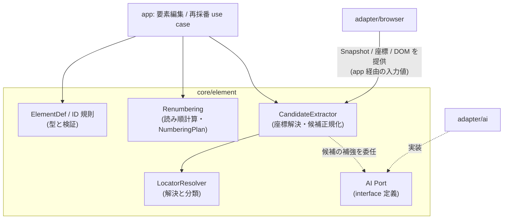
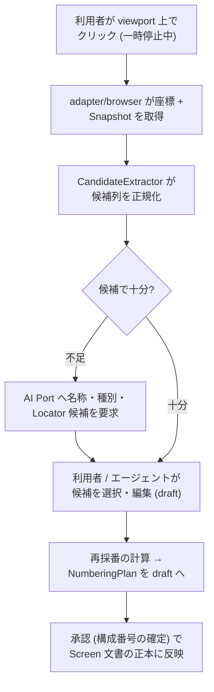

# Feature 設計: 画面要素マッピング (core/element)

Feature 単位の設計 doc。仕様 (What) をどう実現するか (How) を、データ構造・フロー単位で記述する。責務・範囲・方針の層に留め、実装レベルの手順は spec へ委譲する。全体像は [design/DesignDoc.md](../../DesignDoc.md)、横断規約は [context/](../../../context/) を参照する。

**現在の設計だけを書く。** 判断の経緯は ADR を参照する ([adr/0005](../../../adr/0005-renumbering.md))。

## 概要

core/element は「画面上の実要素と、仕様書上の要素定義を対応づける」機能の中核である。本書は次の 4 つを定義する。

1. **永続要素 ID と Locator モデル** — 要素の同一性をどう表し、画面上の実要素をどう見つけるか。
2. **構成番号の再採番** — 読み順 (左上 → 右 → 下) で 1..N を計算し、DSL へ書き戻す規則。
3. **要素候補の正規化** — 撮影した Snapshot・DOM の生データから、要素定義の候補を作る規則。
4. **AI Port の契約** — 要素名・種別・Locator の候補生成を外部 AI へ委ねるための interface。

core/element は純粋ロジックであり、ブラウザや AI サービスへ直接アクセスしない。Snapshot・座標・DOM 情報は入力値として受け取り、AI への問い合わせは AI Port の背後に置く。

## 背景・要件解釈

- 同じ要素へ異なる構成番号や名称が割り当てられる・画面変更後も古い要素定義が残る問題を、永続 ID と機械的な採番で解消する (DesignDoc の Why)。
- 本設計が満たすべき成功条件 (DesignDoc の What から):
  - 画面要素には、表示用の構成番号とは別に永続的な要素 ID を付与できる。
  - Web UI 上で画面要素を選択し、名称、種別、構成番号、Locator を編集できる。
  - Accessibility Snapshot と DOM 情報を使った要素候補抽出ができる。
  - AI による要素名、種別、Locator 候補は draft として扱い、確定は人間の承認を経る。

## スコープ

### やること

- 永続要素 ID の規則 (一意性、生成、変更禁止)
- Locator モデル (Semantic Locator の語彙と優先順位) と解決結果の分類
- 要素種別 (type) の語彙 (固定 enum + 拡張枠)
- 読み順の導出規則と状態単位の再採番 (`badges` リストの計算。optional / child_doc の除外を含む)
- 座標 (クリック位置) から要素候補への解決規則
- Snapshot・DOM 生データからの要素候補の正規化
- AI Port の契約 (入力・出力・draft としての扱い)

### やらないこと

- 番号・要素定義を DSL のどこに書くか → workflow-dsl feature ([DesignDoc_workflow-dsl.md](../workflow-dsl/DesignDoc_workflow-dsl.md))
- Locator 解決の実行時評価 (Expectation の評価) → execution feature
- Snapshot・DOM・座標の取得方法 → adapter/browser (core/element は入力値として受け取る)
- AI サービスの選定・認証 → adapter/ai (Open Question: 認証方式)
- 番号バッジの描画・テーブル出力 → artifact-generation feature
- 要素差分の分類 (Role 変更・文言変更等) → change-detection feature

## 設計

### データ構造 / コンテンツモデル

| 型               | 内容                                                                                        | 備考                                                    |
| ---------------- | ------------------------------------------------------------------------------------------- | ------------------------------------------------------- |
| ElementDef       | 永続 ID、名称、種別、Locator、初出状態、表示区分 (badges 掲載 / optional / child_doc)       | 正本は Screen 文書。core/element は型と規則を定義する   |
| Locator          | Semantic Locator の記述 (後述)                                                              | 要素定義の中に置く。Expectation からは `ref` 経由で参照 |
| ElementCandidate | 候補抽出の出力。Locator 候補列、推定名称・種別、幾何情報、由来 (Snapshot ノード)            | 正規化済み。draft への反映は利用者 / エージェントの操作 |
| NumberingPlan    | 再採番の計算結果。状態ごとの `badges` 並びと、旧番号との対応表 (要素 ID 基準)               | draft として DSL へ書き戻す                             |
| ResolutionResult | Locator 解決の分類: `resolved` (一意に解決) / `not-found` (未解決) / `ambiguous` (複数一致) | 分類の消費は execution / change-detection               |

### 永続要素 ID の規則

- 画面 (Screen 文書) 内で一意。形式は人間可読の slug (`el-username` 等) を推奨し、Schema では一意性のみを強制する。
- 一度割り当てた ID は変更しない。要素の意味が変わった場合は削除して新 ID を作る (版間の追跡が別要素として記録される)。
- ID は仕様書には表示しない。表示は構成番号と名称が担う。

### Locator モデル

Semantic Locator を優先する (DesignDoc の前提)。1 つの Locator は次の属性の組で表す。

| 属性            | 例                             | 優先順位                               |
| --------------- | ------------------------------ | -------------------------------------- |
| `role` + `name` | `{ role: button, name: 送信 }` | 1 (最優先)                             |
| `label`         | `{ label: ユーザー名 }`        | 2                                      |
| `testid`        | `{ testid: submit-btn }`       | 3                                      |
| `text`          | `{ text: ログインする }`       | 4                                      |
| `css`           | `{ css: ".footer > a" }`       | 5 (最後の手段。候補生成では提案しない) |

- 解決は宣言された属性すべての AND で行う。結果は `resolved / not-found / ambiguous` に分類する。
- **`index`**: 同一 Locator が複数一致する場合の 1 始まりの序数指定。一覧の行要素など、Semantic Locator で絞り切れない対象の明示的な逃げ道とする (DOM 順依存で脆いため、絞り込みでは解決できない場合に限る)。
- **`all`**: 該当全件を 1 つの要素定義として扱い、同じ構成番号のバッジを全件に描く (データ件数分並ぶ繰り返し要素用)。
- `index` / `all` の指定がない `ambiguous` は、Locator の絞り込み (属性追加) を促すエラーとして扱う。
- **優先順位ポリシー**: 上表の優先順位は既定値であり、対象プロダクト単位の設定で入れ替えられる。`data-testid` を規約として振っているプロダクトでは testid が最も安定 (文言変更・i18n で壊れない契約として付与されている) なため、`testid > role+name > label > …` に変更する。ポリシーが影響するのは候補生成の提案順だけで、解決の意味論 (属性 AND・分類) は変わらない。testid の無いプロダクトでは semantic 優先の既定のまま、候補生成が一意に解決できる語彙へ自動で寄る。
- agent-browser の一時的な要素参照 (`@e1` 等) は DSL に保存しない (DesignDoc の前提)。Locator は毎回の Snapshot に対して解決する。

### 要素種別 (type) の語彙

固定 enum + 拡張枠とする: `input / button / link / text / image / dialog / table / list / checkbox / radio / select / tab / menu` を基本語彙とし、プロジェクト固有の種別は `custom:<名前>` で拡張する。仕様書の表記と差分判定を安定させるため、自由文字列は許さない。

### 読み順の導出と再採番 (状態単位)

構成番号は状態単位で採番し、state の `badges` 順序リストを正本とする。再採番は「計算 → draft 書き戻し → 承認」の操作である ([adr/0005](../../../adr/0005-renumbering.md))。計算規則:

1. **対象の抽出**: その状態に現れる要素 (継承規則の展開結果) のうち、`optional` / `child_doc` を除いたバッジ対象を集める。
2. **読み順の整列**: その状態の撮影結果から要素の bounding box を取り、y 座標を許容幅 (設定値。既定は要素高さ中央値の 1/2) で行バンドにまとめ、バンド順 → バンド内 x 昇順で並べる。
3. **書き戻し**: 並び順を state の `badges` リストとして draft に反映する。リストの位置がそのまま構成番号 (1..N) になる。
4. **対応表**: 旧 `badges` との差分から番号対応表 (要素 ID 基準の旧 → 新) を作り、差分成果物に含める。

- 同じ撮影結果と設定からは常に同じ並びが出る (決定性)。
- 幾何情報が無い要素 (非表示のまま定義された等) はリスト末尾に置き、警告を付ける。
- `badges` の適用は app 層の use case が行い、構成番号の確定 (承認ゲート) を経て正本になる。

### 座標からの要素解決と候補の正規化

Web UI の要素選択 (viewport 上のクリック) を要素候補に変える規則:

1. 入力: クリック座標 + その時点の Snapshot (Accessibility ツリー + 各ノードの bounding box + 補助 DOM 情報)。取得は adapter/browser の責務。
2. 座標を含むノードのうち、操作可能・意味のある role を持つ最小のノードを第一候補とし、祖先方向の候補列を付ける (「ボタンではなくカード全体を選びたい」場合の切り替え用)。
3. 各候補について Locator 候補列を生成する: 優先順位ポリシー (既定は role+name → label → testid) の順で、その Snapshot 内で一意に解決できるものだけを提案する。一意にならない場合は属性を追加して絞り込み、それでも曖昧なら `css` を提案せず「曖昧」と明示する。
4. 名称・種別の推定: Accessible Name と role から機械的に初期値を作る。より良い候補が必要な場合は AI Port に委ねる。

### AI Port の契約 (core/element が定義)

| 項目 | 契約                                                                                                                                                                                    |
| ---- | --------------------------------------------------------------------------------------------------------------------------------------------------------------------------------------- |
| 入力 | 対象要素の Snapshot 断片 (Accessibility ノード + 周辺文脈)、画面のメタ情報 (タイトル・状態 id)、既存の要素定義一覧 (命名の一貫性のため)                                                 |
| 出力 | 構造化された候補: 名称・種別・Locator の候補列 (それぞれ確信度つき)。自由文は返さない                                                                                                   |
| 制約 | 出力は常に draft への提案であり、AI Port の実装が DSL を直接変更することはない。何を AI サービスへ送ってよいか (画像・DOM の可否) は Open Question「AI サービスへ送信できる情報」に従う |

### コンポーネント構成 (C4 L3)

### フロー / シーケンス (要素選択 → 定義の draft 化)

## 主要シナリオ / フロー

- 利用者が再生を一時停止し、viewport 上でボタンをクリックすると、role+name の Locator・名称・種別が候補として提示され、承認すると要素定義と番号が draft に入る。
- クリックした位置に複数の候補 (ボタン / カード全体) があり、利用者が祖先方向の候補列から選び直す。
- エージェントが Snapshot を読んで要素定義の draft を一括作成し、再採番案を添えて人間の承認を求める。
- 画面改修で要素を 1 つ削除し、再採番を実行すると、読み順の連番が draft として提示され、承認後の差分に番号対応表が記録される。
- Locator が複数一致 (`ambiguous`) になり、属性の追加候補が提示される。

## テスト観点

- 横断規約は [context/testing.md](../../../context/testing.md)。core/element は純粋ロジックとして unit test の主対象。
- 読み順計算: 同一入力に対する決定性、行バンドの境界ケース (許容幅ちょうど・高さ違いの混在)、幾何情報なし要素の末尾配置、optional / child_doc の除外。
- 再採番: 追加・削除・移動それぞれで状態ごとの badges と対応表が正しいこと。
- Locator 解決: resolved / not-found / ambiguous の分類、属性 AND の一致規則、index の序数解決、all の全件列挙。
- 候補抽出: 座標 → 最小ノード選択、祖先候補列の順序、一意にならない Locator を提案しないこと。
- AI Port: 出力 Schema の検証 (自由文・未知種別の拒否)、draft 以外へ書き込まないこと (fake 実装で検証)。
