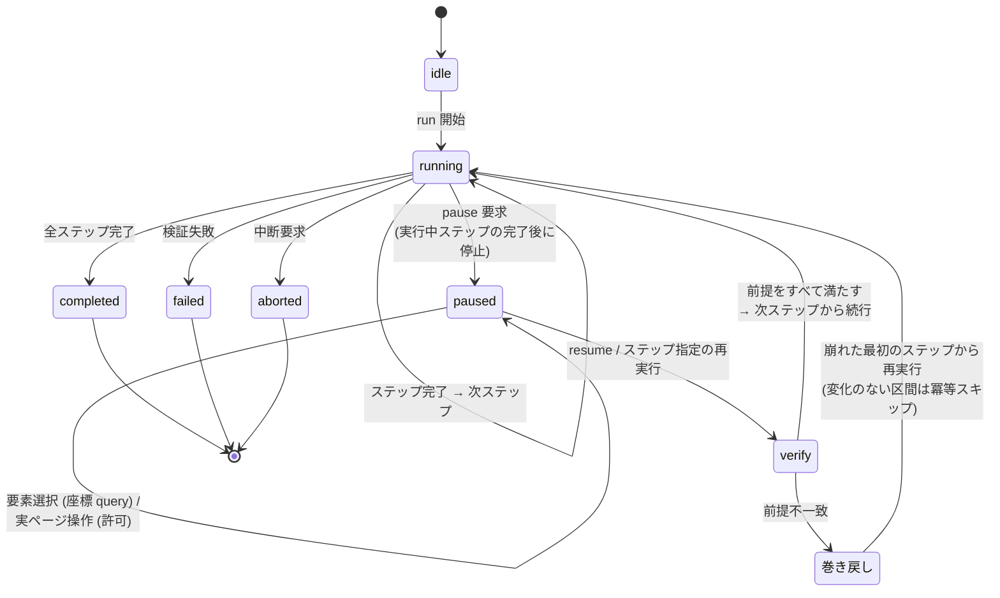
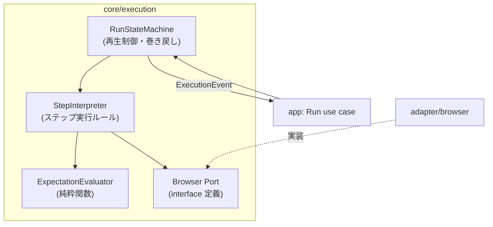
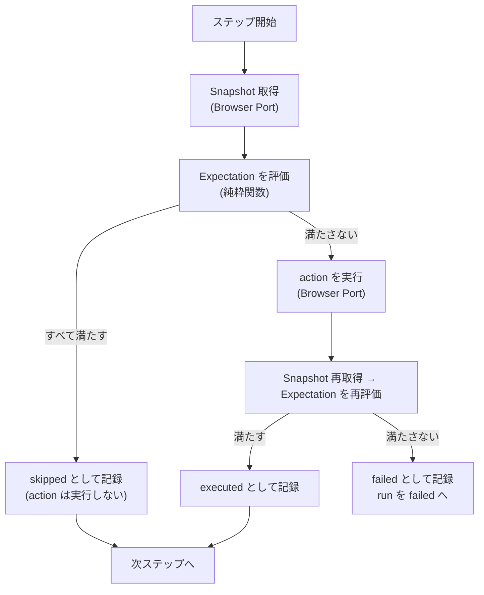

# Feature 設計: 冪等実行と再生制御 (core/execution)

Feature 単位の設計 doc。仕様 (What) をどう実現するか (How) を、データ構造・フロー単位で記述する。責務・範囲・方針の層に留め、実装レベルの手順は spec へ委譲する。全体像は [design/DesignDoc.md](../../DesignDoc.md)、横断規約は [context/](../../../context/) を参照する。

**現在の設計だけを書く。** 判断の経緯は ADR を参照する ([adr/0002](../../../adr/0002-pause-semantics.md))。

## 概要

core/execution は「DSL に書かれたステップ列を、ブラウザ上で再現可能に実行する」機能の中核である。本書は次の 4 つを定義する。

1. **ステップ実行のルール** — 各ステップを「期待状態を確認してから操作する」形で処理し、既に満たされていれば操作しない (冪等スキップ)。
2. **実行状態と再生制御** — 実行がどの状態を取り、一時停止・再開・巻き戻し・再実行でどう遷移するか。
3. **Browser Port の契約** — ブラウザ操作を外部 (agent-browser) へ委ねるために core が定める interface。
4. **実行イベント** — 実行の進行を UI・エージェント・実行履歴へ伝える通知の語彙。

本書で使う **Workflow IR** (Intermediate Representation) とは、YAML で書かれた DSL を実行しやすい形へ正規化した内部表現である。core/workflow が DSL の検証と正規化を行って IR を生成し、core/execution は YAML を直接読まず、IR のステップ列だけを入力に取る。IR の構造そのものは workflow-dsl feature が定義する。

## 背景・要件解釈

- ブラウザ操作の再現が担当者の手順に依存する問題を、DSL の宣言的実行で解消する (DesignDoc の Why)。
- 本設計が満たすべき成功条件 (DesignDoc の What から):
  - 同じ初期状態と入力で同じ DSL を実行した場合、同じ期待状態へ到達する。
  - 既に期待状態を満たしている操作は再実行せず、変更なしとして記録する (冪等実行)。
  - DSL の実行をステップ単位で自動再生し、任意のステップで一時停止・再開・再実行できる。
  - 各実行について、入力、ステップ結果、Snapshot、スクリーンショット、差分結果を追跡できる。

## スコープ

### やること

- ステップ実行のルール (期待状態の評価 → 冪等スキップ判定 → 操作 → 検証)
- 実行状態と遷移 (run / step が取りうる状態、一時停止・再開・巻き戻し・ステップ単位の再実行)
- Browser Port の契約 (セッションライフサイクル、型付きコマンド、Snapshot / スクリーンショット取得)
- 実行イベントの語彙と発行順序 (web / agent interface / 実行履歴が共通に購読する)
- 実行履歴として永続化する記録内容の定義 (保存自体は Store Port 経由で app が行う)

### やらないこと

- DSL の構文と期待状態の宣言語彙 → workflow-dsl feature (core/execution は正規化済みの Workflow IR だけを受け取り、YAML を直接扱わない)
- 要素の同一性・採番 → element-mapping feature
- 成果物生成・差分検知 → artifact-generation / change-detection feature
- 再生 UI の表現・ライブ映像の描画 → web-editor feature
- イベントの外部公開形式 (WebSocket / MCP notification 等) → agent-interface feature
- 分散実行・複数ブラウザ並列 (DesignDoc の Lower-Priority Goals)

## 設計

### データ構造 / コンテンツモデル

| 型             | 内容                                                                                                                             | 備考                                          |
| -------------- | -------------------------------------------------------------------------------------------------------------------------------- | --------------------------------------------- |
| Run            | 1 回の実行。workflow 参照、入力、RunStatus、StepResult の列                                                                      | 実行履歴の単位                                |
| RunStatus      | `idle → running → paused → (running…) → completed / failed / aborted`                                                            | 遷移は後述の「実行状態と再生制御」            |
| Step (IR)      | 操作 (action) と期待状態 (expectation) の組。core/workflow が正規化して渡す                                                      | core/execution は IR を変更しない             |
| Expectation    | 実行後に満たされるべき宣言的条件の集合                                                                                           | 語彙は workflow-dsl が定義。評価は本 feature  |
| StepResult     | outcome (`skipped / executed / failed`)、評価した Expectation の結果、実行前後の Snapshot 参照、スクリーンショット参照、所要時間 | `skipped` = 冪等スキップ (「変更なし」の記録) |
| ExecutionEvent | 実行中に発行するイベント (後述)                                                                                                  | append-only。順序は決定的                     |

### ステップ実行のルール

各ステップを次の手順で処理する。

1. **評価**: 現在の画面状態に対して Expectation を評価する。
2. **冪等スキップ**: すべて満たしていれば action を実行せず `skipped` として記録する。
3. **実行**: 満たしていなければ action を Browser Port 経由で実行する。
4. **検証**: 実行後に Expectation を再評価する。満たせば `executed`、満たさなければ `failed` として run を `failed` に遷移する。

Expectation の評価は Snapshot (Accessibility ツリー + 補助情報) を入力とする純粋関数として実装し、Browser Port は Snapshot の取得までを担う。同じ Snapshot に対する評価結果は常に同じである (再現性の要)。

### 実行状態と再生制御

run の状態遷移を示す。

- **一時停止はステップ境界でのみ効く**。pause 要求は「実行中ステップの完了後に停止する」予約として扱う。
- **一時停止中の実ページ操作は許可する**。要素選択のための座標問い合わせ (Element Inspector への query) は操作に含めず、常に可能。
- **再開時は前提を再検証する**: それまでに通過したステップの Expectation を再評価し、
  - すべて満たしていれば次のステップから続行する。
  - 満たさないステップがあれば、**満たさなくなった最初のステップまで巻き戻して再実行する** (冪等スキップがあるため、変わっていない区間は skipped で高速に通過する)。
- **ステップ単位の再実行**: 利用者は一時停止中に任意の通過済みステップを指定して再実行できる。指定ステップ以降の StepResult は無効化し、そこから再生し直す。

### Browser Port の契約 (core/execution が定義)

| 区分       | 契約                                                                                                                                                                                   |
| ---------- | -------------------------------------------------------------------------------------------------------------------------------------------------------------------------------------- |
| セッション | `createSession / closeSession / keepalive`。セッションはページ状態・要素参照を保持する第一級の抽象。一時停止中もセッションを生存させる (keepalive は adapter の責務として契約に含める) |
| コマンド   | 型付きの action 実行。CLI / SDK の呼び出し形式・JSON パースは adapter 内に閉じ、Port は型付き結果のみ返す                                                                              |
| 取得       | Snapshot (Accessibility ツリー)、スクリーンショット (バイナリ参照)、現在 URL 等の状態取得                                                                                              |
| 配信       | ライブ映像ストリームのハンドル取得 (描画は web-editor、転送は adapter/browser の責務)                                                                                                  |

### コンポーネント構成 (C4 L3)

### フロー / シーケンス (1 ステップの処理)

### 実行イベント

発行順序が決定的な append-only のイベント列。web (再生表示の同期)、agent interface (エージェントへの通知)、実行履歴 (永続化) が同じ列を購読する。

`run-started / step-started / expectation-evaluated / step-skipped / step-executed / step-failed / paused / resumed / rolled-back / run-completed / run-failed / run-aborted`

イベントには step id、Expectation の評価結果、Snapshot / スクリーンショット参照を含め、UI 側がアノテーション表示に必要な情報をイベントだけで組み立てられるようにする。

## 主要シナリオ / フロー

- 利用者 (または AI エージェント) が run を開始し、全ステップが自動再生され、各ステップのアノテーションがライブ表示される。
- 2 回目の実行で画面状態が既に期待状態を満たしており、全ステップが skipped で完了し「変更なし」と記録される。
- 利用者が一時停止し、要素を選択して要素定義を編集し、再開する。ページ状態が変わっていなければそのまま続行される。
- 利用者が一時停止中にドロップダウンを開くなどの探索操作を行い、再開時に前提が崩れたステップから自動で巻き戻し再実行される。
- ステップの Expectation が実行後も満たされず、run が failed になり、失敗ステップと評価結果がイベントで提示される。

## テスト観点

- 横断規約は [context/testing.md](../../../context/testing.md)。core/execution は純粋ロジックとして unit test の主対象。
- ExpectationEvaluator: 同一 Snapshot 入力に対する評価の決定性。満たす / 満たさない / 評価不能 (Locator 未解決) の分岐。
- 冪等スキップ判定: 満たしているときに action が呼ばれないこと (fake Browser Port で検証)。
- 状態遷移: pause 予約がステップ境界まで遅延すること、resume 時の巻き戻し先の決定 (不一致が複数ある場合は最初のステップ)。
- ステップ再実行: 指定ステップ以降の StepResult 無効化とイベントの整合。
- イベント: 発行順序の決定性と、履歴から run を再構成できること。
