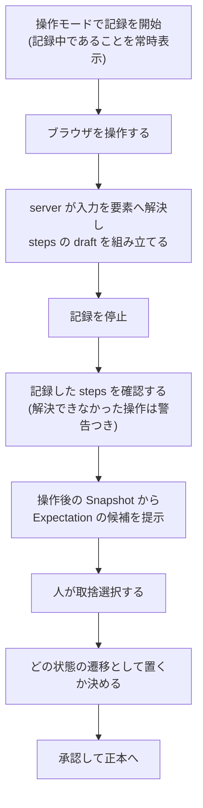
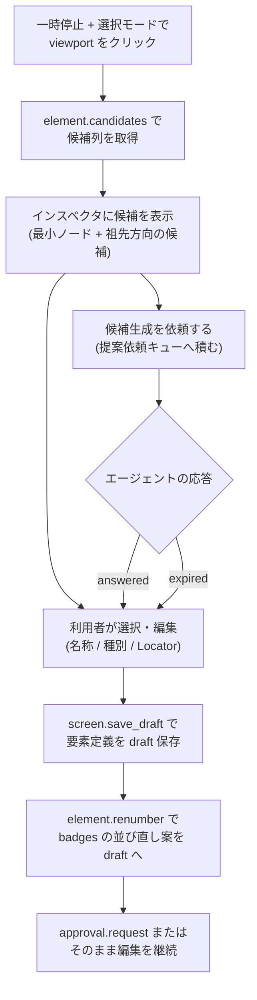
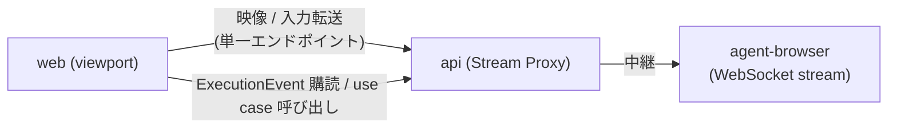

# Feature 設計: Web UI (web)

Feature 単位の設計 doc。仕様 (What) をどう実現するか (How) を、データ構造・画面・フロー単位で記述する。責務・範囲・方針の層に留め、実装レベルの手順は spec へ委譲する。全体像は [design/DesignDoc.md](../../DesignDoc.md)、横断規約は [context/](../../../context/) を参照する。

**現在の設計だけを書く。** 判断の経緯は ADR を参照する ([adr/0008](../../../adr/0008-stream-proxy.md)、framework 選定は [adr/0001](../../../adr/0001-tech-stack.md)、dashboard 非 fork は [adr/0015](../../../adr/0015-web-ui-own-implementation.md))。

## 概要

web は、人間の利用者が本システムを操作するための interface 層である。本書は次の 4 つを定義する。

1. **画面構成** — エディタを中心とした画面の分割と、各画面が担う操作。
2. **再生 UI と同期** — 実行イベント (ExecutionEvent) をどう購読し、viewport 上の注釈とタイムラインへ反映するか。
3. **選択モードと操作モード** — 一時停止中のクリックを「要素選択の座標 query」と「実ページ操作」に振り分ける仕組み。
4. **Stream の接続構成** — ライブ映像と入力転送の経路 (Workflow Server 経由の Proxy)。

web はドメインロジックを持たず、すべての操作は api 経由で app 層の use case を呼ぶ (agent interface と同じ use case。DesignDoc の設計方針)。framework は TanStack Start、live viewport の実装は agent-browser dashboard のパターンを参考にする (DesignDoc の Background)。

## 背景・要件解釈

- 本設計が満たすべき成功条件 (DesignDoc の What から):
  - Web UI 上で画面要素を選択し、名称、種別、構成番号、Locator を編集できる。
  - DSL の実行をステップ単位で自動再生し、対象要素と検証結果をライブ映像上に注釈表示できる。
  - 再生を任意のステップで一時停止し、要素定義を編集した後、そのステップから再開または再実行できる。
  - Baseline と構成番号の確定 (承認) は Web UI 上の人間だけが行える。

## スコープ

### やること

- 画面構成 (一覧 / エディタ / 承認キュー / 差分ビュー) と各画面の責務
- live viewport の表示・入力転送と、選択モード / 操作モードの切替
- 再生 UI (タイムライン・注釈) と実行イベントの同期方法
- 要素選択 → 候補提示 → draft 反映 → 再採番のフロー
- 承認 (DSL 変更 / NumberingPlan / Baseline) と差し戻しの UI フロー
- client 状態の持ち方 (正本を持たない、の具体化)

### やらないこと

- use case・ドメインロジック → app / core (web は呼ぶだけ)
- HTTP / WebSocket エンドポイントの定義 → api (本書は接続構成のみ示す)
- 要素候補の解決規則 → element-mapping feature
- 差分の分類規則 → change-detection feature
- 認可の実装配置と secret の置き場 → [context/infrastructure.md](../../../context/infrastructure.md) (本書は接続時の要件だけを示す)
- 視覚デザイン (配色・コンポーネントの見た目) → 実装時に確定する

## 設計

### 画面構成

| 画面                   | 責務                                                                                                      |
| ---------------------- | --------------------------------------------------------------------------------------------------------- |
| Screens (一覧)         | Screen 文書の一覧・draft / 正本の別・最終実行結果の表示。エディタへの入口                                 |
| Editor (エディタ)      | 中心画面。live viewport + タイムライン + インスペクタの 3 領域 (後述)                                     |
| Approvals (承認キュー) | 承認待ち draft (DSL 変更 / NumberingPlan / Baseline) の一覧と、承認・差し戻し                             |
| Diff (差分ビュー)      | DiffReport の表示: 要素差分テーブル、画像比較 (Baseline / 今回 / ヒートマップ)、番号対応表、mask 適用領域 |

Editor の 3 領域:

- **viewport (中央)**: ライブ映像。要素の bounding box と番号バッジを **UI 上のオーバーレイ**として重ね描きする (成果物の注釈画像とは別物。オーバーレイは表示専用で保存しない)。
- **タイムライン (下)**: 実行ステップ列と各ステップの結果 (skipped / executed / failed)。再生・一時停止・再開・ステップ指定の再実行の操作点。
- **インスペクタ (右)**: 選択中の要素の定義編集 (名称・種別・Locator・note)、状態の切替と badges の並び確認、要素候補列の提示。

URL は `screen / state / run` を表し、リロードしても同じ文脈に戻れる (client 状態の節)。

### 再生 UI と実行イベントの同期

- web は run の ExecutionEvent 列を api 経由で購読し、イベントだけからタイムラインと注釈を更新する (イベントに必要情報を含める契約は execution feature)。
- 巻き戻し (`rolled-back`) を受けたらタイムラインの該当区間を無効表示に戻す。切断時はカーソル付き取得で追いつく (agent interface の `run.events` と同じ仕組み)。
- 注釈は「現在ステップの対象要素」「検証した Expectation の結果」を bounding box + バッジで示す。

### 選択モードと操作モード

一時停止中のクリックには 2 つの意味がありうるため、**明示のモード切替**で振り分ける (暗黙の判定はしない)。

| モード            | クリックの意味                 | 実装                                                                                            |
| ----------------- | ------------------------------ | ----------------------------------------------------------------------------------------------- |
| 選択モード (既定) | 要素選択。実ページへ転送しない | 座標を `element.candidates` の query に使う (execution の「座標 query は操作に含まない」に対応) |
| 操作モード        | 実ページ操作。転送する         | 入力を Stream 経路で agent-browser へ転送 (再開時の前提再検証は execution の責務)               |

操作モードには**記録の入り / 切り**がある ([adr/0026](../../../adr/0026-operation-recording.md))。既定は切りとする。操作モードの主用途は探索であり、探索のたびに steps が増えると draft が汚れるためである。

- 再生中 (running) は viewport への入力を受け付けない (閲覧のみ)。モード切替は一時停止中だけ有効。
- 操作モード中は「再開時に前提の再検証が走る」ことを UI 上に明示する (黙って巻き戻さない)。
- **選択モードで要素定義を編集した場合も同じ明示を出す。** 編集した run を再開すると Workflow IR の版が差し替わり、前提の再検証と巻き戻しが起きる ([adr/0018](../../../adr/0018-ir-version-pinning.md))。操作モードだけの注意にすると、編集による巻き戻しが不意打ちになる。

### 操作の記録 → draft のフロー

DSL を書けない利用者でも画面仕様を起こせるようにする ([adr/0026](../../../adr/0026-operation-recording.md))。**操作して、Expectation を選び、承認する**だけで正本ができる。

UI 上の要点を挙げる。

- **記録中であることを常時表示する。** 黙って記録しない。停止も明示操作とする。
- 一意な Locator へ解決できなかった操作は `clickPoint` として残り、**警告を出す**。無視して承認できるが、脆い DSL になることを示す。
- **Expectation を選ばずに承認できてしまう点を明示する。** 選ばないと期待状態を持たないステップになり、冪等スキップが効かず毎回実行される ([execution feature](../execution/DesignDoc_execution.md))。
- 記録した steps をどの状態の遷移として置くかは機械的に決まらない。**人が選ぶ**。

### 要素選択 → draft → 再採番のフロー

候補生成は**人間が依頼を出し、エージェントが取りに来る** pull 型である ([adr/0020](../../../adr/0020-suggestion-pull-queue.md))。Web UI は依頼を積んで状態を表示する。

`expired` になったら、**手動で名付ける導線へ戻す**。待ち続けさせない。AI が居なくても作業が完結することは本プロダクトの要件であり、UI がそれを担保する。

### 承認と差し戻し

- Approvals には承認待ちが由来 (人間の編集 / エージェントの依頼) を問わず並ぶ。対象は DSL 変更・NumberingPlan・Baseline 更新の 3 種。
- 承認の前に対象の差分を必ず表示する (DSL 変更はテキスト差分、NumberingPlan は番号対応表、Baseline は DiffReport)。
- 差し戻しには構造化コメントを付け、エージェント由来の依頼には agent interface 経由で返す (承認フローの契約は agent-interface feature)。

### Stream の接続構成 (Proxy)

- web の接続先は Workflow Server (api) の単一エンドポイントのみ ([adr/0008](../../../adr/0008-stream-proxy.md))。agent-browser のポートには接続しない。
- 映像はフレーム列の中継、入力転送は操作モード時のみ逆方向に流す。
- **入力転送は server 側でも検証する。** 対象 run が `paused` かつ操作モードであることを Workflow Server が確かめてから中継する ([adr/0008](../../../adr/0008-stream-proxy.md))。client 側の制御だけでは、認証を通したクライアントが Proxy へ直接送って迂回できる。破棄した入力はイベントとして残す。

#### 接続時の認証

Web UI もローカルトークンを要求される ([adr/0021](../../../adr/0021-agent-interface-authz.md))。ただし**ブラウザはトークンファイルを読めない**。受け渡しは Workflow Server が配信する HTML への埋め込みで行い、置き場と受け渡しの契約は [context/infrastructure.md](../../../context/infrastructure.md) を正本とする。

**トークンを URL の query に載せない。** URL はブラウザの履歴・`Referer`・サーバのアクセスログに残る。WebSocket は任意のヘッダを付けられないため、接続後の最初のフレームで認証する。

#### 映像と重ね描きの対応付け

bounding box とバッジは映像フレームの上に重ねる。**フレームと Snapshot が別経路で届くため、対応関係を明示的に持つ。**

| 付ける情報                | 用途                                          |
| ------------------------- | --------------------------------------------- |
| session / frame の識別子  | どの映像フレームかを一意に決める              |
| viewport の版と寸法       | 座標系が変わったフレームへ古い box を重ねない |
| Snapshot が対応する frame | 重ね描きしてよい組み合わせを判定する          |

対応が取れない組み合わせは**描画しない**。持たないと、フレームの欠落や到着順の入れ替わりで、別の画面に box を重ねて誤った要素を選択させる。座標 query も同じ理由で、対応の取れたフレームからのみ発行する。

### client 状態の持ち方

- 正本 (DSL・Baseline・実行履歴) は client に持たない。表示に使うデータはすべて api から再取得できる ([context/architecture.md](../../../context/architecture.md) の State Boundary)。
- client が持つのは表示状態のみ: 選択中の要素・モード・タイムラインのスクロール位置など。リロードで失われてよいものに限る。
- 編集中の未保存入力はフォーム内の一時状態とし、保存 = draft 反映 (`save_draft`) を明示操作にする。

## 主要シナリオ / フロー

- 利用者が一覧から Screen を開き、再生を開始してライブ映像とタイムラインで進行を追う。
- 一時停止して選択モードで要素をクリックし、候補から Locator を選んで名称を整え、draft 保存 → 再採番案を確認する。
- 操作モードに切り替えてドロップダウンを開き (探索)、再開時に前提再検証で巻き戻ることを UI の明示で理解した上で再開する。
- エージェントが依頼した承認 (DSL 変更) を Approvals で開き、テキスト差分を確認して差し戻しコメントを返す。
- 画面改修後の DiffReport を差分ビューで確認し、Baseline 更新を承認する。

## テスト観点

- 横断規約は [context/testing.md](../../../context/testing.md)。web の unit test は表示ロジックの純粋な部分に絞る。
- イベント → タイムライン / 注釈の reducer: 同じイベント列から同じ表示状態になること (決定性)、`rolled-back` の巻き戻し表示。
- オーバーレイの座標変換: viewport の表示倍率・clip・スクロールに対する bounding box の写像。
- モード切替: 選択モードでクリックが転送されないこと、再生中に入力が無効なこと。
- 承認フロー: 差分表示なしに承認ボタンが押せないこと、差し戻しコメントの伝搬。
- 切断・再接続: イベントの取りこぼしなしに表示が追いつくこと。
