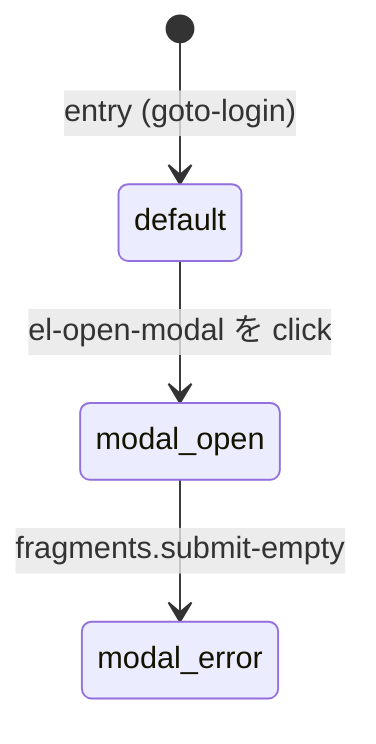
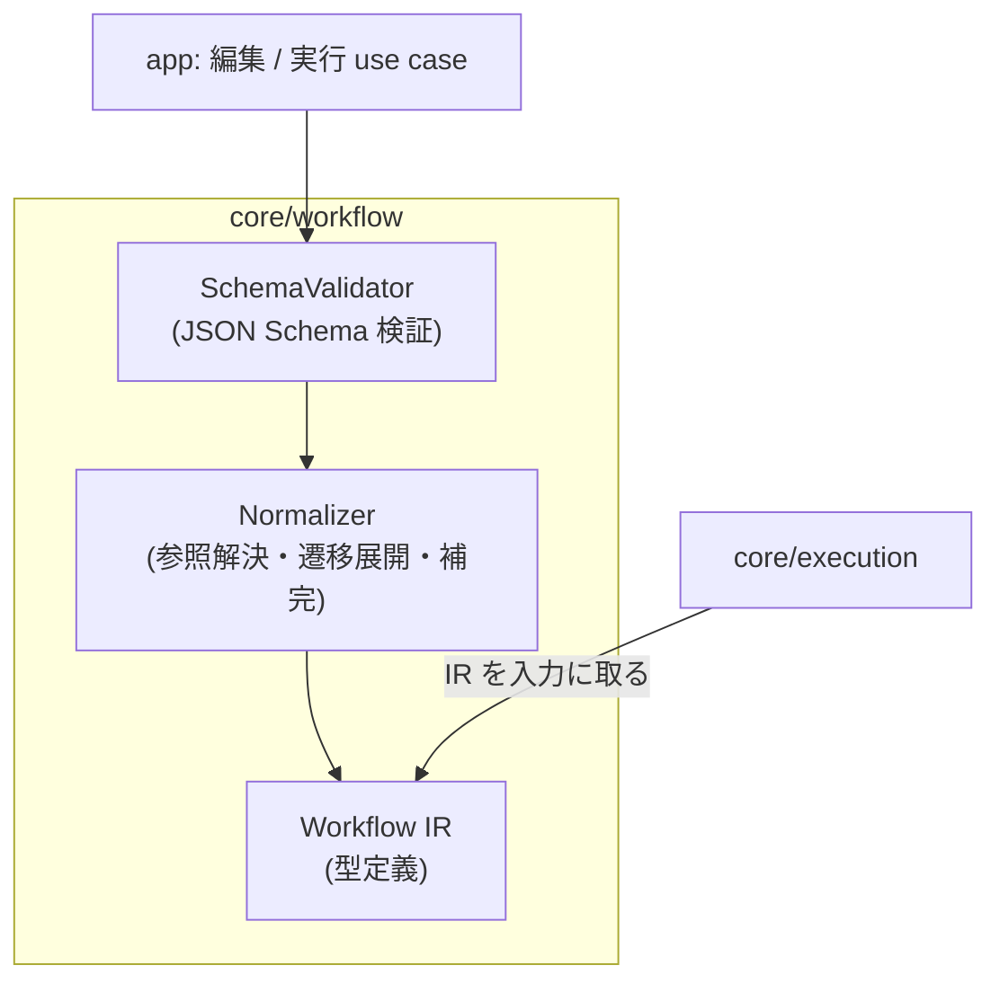
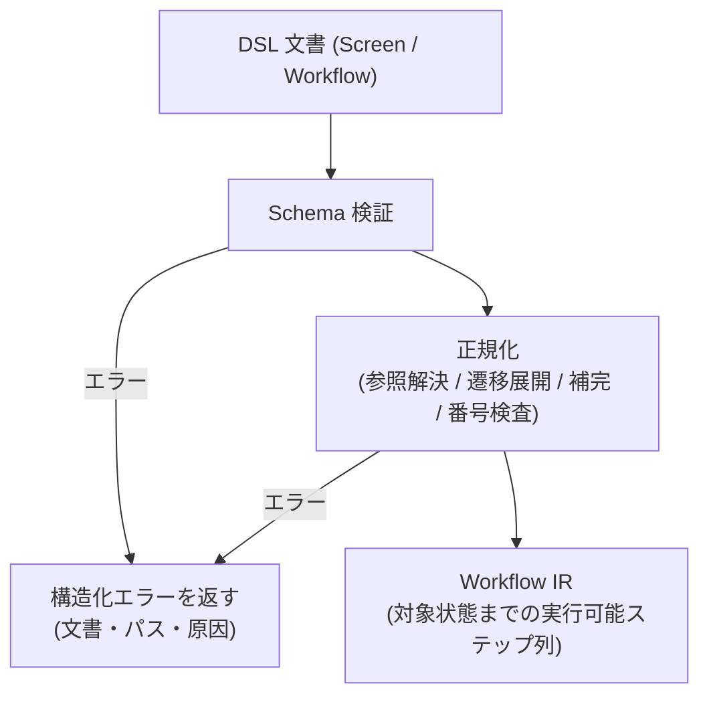

# Feature 設計: ワークフロー定義 (core/workflow)

Feature 単位の設計 doc。仕様 (What) をどう実現するか (How) を、データ構造・フロー単位で記述する。責務・範囲・方針の層に留め、実装レベルの手順は spec へ委譲する。全体像は [design/DesignDoc.md](../../DesignDoc.md)、横断規約は [context/](../../../context/) を参照する。

**現在の設計だけを書く。** 判断の経緯は ADR を参照する ([adr/0003](../../../adr/0003-dsl-structure.md))。

## 概要

core/workflow は「利用者・エージェントが書いた YAML を、実行と成果物生成の正本にする」機能の中核である。本書は次の 4 つを定義する。

1. **DSL の文書構造** — Screen (画面) と Workflow (操作列) の 2 種類の文書と、その関係。
2. **Expectation の宣言語彙** — 「画面がこの状態であるべき」を宣言する条件の種類。
3. **Workflow IR への正規化** — YAML を実行しやすい内部表現 (IR) に変換する規則。
4. **Schema 検証とバージョン** — 不正な DSL を実行前に弾く仕組みと、DSL の版管理。

Screen は画面仕様書の生成単位 (1 画面 = 1 文書 = 1 仕様書) であり、要素定義と構成番号を持つ。Workflow は画面に到達する・画面をまたぐ操作列であり、Screen から参照して再利用する。

## 背景・要件解釈

- 画像・Markdown・操作スクリプトがそれぞれ別の正本になる問題を、DSL を唯一の正本にすることで解消する (DesignDoc の Why)。
- 本設計が満たすべき成功条件 (DesignDoc の What から):
  - DSL は YAML で記述し、Schema で検証できる。
  - 画面要素には、表示用の構成番号とは別に永続的な要素 ID を付与できる。
  - 実行系は YAML を直接扱わず、正規化された Workflow IR を使用する。
  - AI エージェントが draft として自由に作成・編集できる (機械可読で、部分編集が安全な構造)。

## スコープ

### やること

- Screen 文書と Workflow 文書の構造 (項目、参照関係、記述例)
- 画面状態 (state) と状態遷移 step の宣言方法
- 要素定義の置き場と構成番号の記述規則 (画面単位の採番、永久欠番)
- Expectation の宣言語彙 (MVP の条件セット)
- Workflow IR への正規化規則 (参照解決、状態遷移の展開、既定値の補完)
- JSON Schema による検証と `version` フィールドによる版管理

### やらないこと

- Expectation の評価と実行 → execution feature ([DesignDoc_execution.md](../execution/DesignDoc_execution.md))
- Locator の解決・要素同一性の判定・採番規則の詳細 → element-mapping feature (DSL は「どこに書くか」だけを定める)
- 成果物のレイアウト → artifact-generation feature
- DSL の編集 UI → web-editor feature
- 複数画面をまたぐ検証シナリオの実行 (Workflow の参照は MVP では画面到達の再利用に限る)

## 設計

### 文書構造 — Screen と Workflow の分離

DSL は 2 種類の文書からなる。

| 文書     | 単位                  | 持つもの                                                          | 成果物との関係                                            |
| -------- | --------------------- | ----------------------------------------------------------------- | --------------------------------------------------------- |
| Screen   | 1 画面 = 1 ファイル   | 到達手順 (Workflow 参照)、画面状態と遷移 step、要素定義、構成番号 | 画面仕様書 (注釈画像 + テーブル) の生成単位               |
| Workflow | 1 操作列 = 1 ファイル | ステップ列 (action + expectation)                                 | 単体では成果物を生成しない。Screen から参照する再利用単位 |

分離しつつ、**状態遷移のための step は Screen 側にも持つ**。「モーダルを開いた状態」のような画面内の状態は、その画面の関心事であり、Screen 文書内で自己完結して宣言する。

Screen 文書の例 (構造を示すための抜粋。項目名は Schema 確定時に最終化する):

```yaml
version: 1
screen:
  id: login
  title: ログイン画面
  entry: # この画面に到達する手順。Workflow を参照する
    workflow: goto-login
  states:
    - id: default # 到達直後の状態。遷移 step を持たない
      expect:
        - url: { path: /login }
        - element: { ref: el-username, visible: true }
    - id: modal-open # 画面内の別状態
      from: default # 遷移元の状態
      steps: # 遷移元からこの状態に至る操作列
        - action: { click: { ref: el-open-modal } }
      expect:
        - element: { ref: el-modal, visible: true }
    - id: modal-error # ネストした状態 (モーダルを開いた状態でのエラートースト)
      from: modal-open # ネストは from の連鎖で表す
      steps:
        - use: submit-empty # 名前付き step 断片の参照
      expect:
        - element: { ref: el-toast, visible: true }
  fragments: # 画面内で再利用する名前付き step 断片
    submit-empty:
      - action: { click: { ref: el-modal-submit } }
  elements:
    - id: el-username # 永続要素 ID (画面内で一意。変更しない)
      number: 1 # 構成番号 (画面単位で採番。削除しても再利用しない)
      name: ユーザー名入力
      type: input
      locator: { role: textbox, name: ユーザー名 }
    - id: el-modal
      number: 4
      name: 設定モーダル
      type: dialog
      locator: { role: dialog }
      states: [modal-open] # 初出の状態だけ書く。子孫状態へは継承される
    - id: el-toast
      number: 5
      name: エラートースト
      type: text
      locator: { role: alert }
      states: [modal-error]
```

Workflow 文書の例:

```yaml
version: 1
workflow:
  id: goto-login
  steps:
    - action: { open: { url: "{{ base_url }}/login" } }
      expect:
        - url: { path: /login }
```

### 状態モデル — default を根とする木

画面状態は **`default` を根とする木**として宣言する (判断は [adr/0004](../../../adr/0004-state-model.md))。上の Screen 例は次の木になる。



- `default` 状態は entry の完了直後の状態であり、遷移 step を持たない。
- `default` 以外の状態は `from` (遷移元) と `steps` (遷移手順) を必ず持つ。遷移元をたどると必ず `default` に到達できること (循環・孤立を Schema 検証後の正規化で検査する)。
- **ネストした状態** (モーダルを開いた状態でのエラートースト等) は `from` の連鎖の深さで表す (`default → modal-open → modal-error`)。専用の入れ子構文は持たない。
- 直交する軸の組み合わせ (モーダル × トースト等) を自動合成する演算は持たない。仕様書に載せる状態は木のノードとして明示的に列挙する。
- 状態遷移の step の語彙は Workflow の step と同一。書ける場所が違うだけで、実行時は同じ IR ステップになる。

**要素の継承**: 状態は遷移元 (`from`) の状態に現れる要素をすべて継承する。`elements` の `states` には要素が**初めて現れる状態だけ**を書けばよく、その子孫状態には自動で引き継がれる (モーダルは画面の上に要素を「足す」という UI の実態に合わせる)。子孫状態で消える要素は `hidden-in: [<state>]` で除外を宣言する。

**名前付き step 断片 (`fragments`)**: 複数の状態遷移で同じ操作列を使う場合、画面内に名前付き断片を定義し `use` で参照する。参照解決は entry の Workflow 参照と同じ機構で行い、断片は状態の意味論に影響しない (単なる展開)。

### 要素定義と構成番号の記述規則

- 要素 ID (`id`) は画面内で一意の永続識別子。要素の同一性判定に使い、変更しない。
- 構成番号 (`number`) は**画面単位で採番**する。同じ画面の別状態でも同じ要素は同じ番号を保つ。
- 削除した要素の番号は**永久欠番**とし、再利用しない。DSL 上は要素の削除 = エントリの削除であり、欠番は採番時に「過去に使った最大番号より先」を割り当てることで守る (欠番管理の正本は element-mapping feature)。
- 番号の一意性・連番性の検証は Schema でなく正規化時に行う (欠番を許すため連番は要求しない)。

### Expectation の宣言語彙 (MVP)

| 条件      | 内容                                                       |
| --------- | ---------------------------------------------------------- |
| `url`     | path / query の一致                                        |
| `title`   | ページタイトルの一致                                       |
| `element` | `ref` (要素 ID) で指す要素の存在・可視性・テキスト・入力値 |
| `count`   | Locator に一致する要素数                                   |

- `element` 条件は要素 ID で参照し、Locator を直接書かない (Locator の正本は要素定義)。
- 語彙の追加は `version` の互換規則に従う (後述)。評価の仕方は execution feature が定義する。

### Workflow IR への正規化

IR は「実行可能なステップ列 + 検証済みのメタ情報」であり、core/workflow が次を行って生成する。

1. **Schema 検証**: JSON Schema で構文・型を検証する。
2. **参照解決**: `entry.workflow` の Workflow 参照、`use` の断片参照、`ref` の要素参照を解決し、未解決参照をエラーにする。
3. **状態遷移の展開**: 対象の画面状態に至るステップ列を `entry → default → … → 対象状態` の順で平坦化する。各状態に現れる要素の集合も、継承規則 (`states` + `hidden-in`) を展開して確定する。
4. **既定値の補完と変数展開**: 省略項目の既定値、`{{ base_url }}` 等の入力変数を確定する。
5. **番号・ID の検査**: 要素 ID の一意性、構成番号の重複を検査する。

IR のステップは `action + expectation + 由来 (どの文書のどの宣言から来たか)` を持つ。由来情報により、実行イベントや差分を DSL の該当箇所へ逆引きできる。

### Schema 検証とバージョン

- Schema は JSON Schema として core/workflow が保持し、DSL 文書の `version` フィールドで対応する版を選ぶ。
- 互換規則: 語彙の追加はマイナー互換 (旧文書はそのまま読める)。構造の変更はメジャー版を上げ、旧版の読み込みは正規化時の変換で吸収する。
- 検証エラーは「文書名・パス・原因」を構造化して返す (エージェントが自己修正に使えるよう、人間向け文言と機械可読コードの両方を持つ)。

### コンポーネント構成 (C4 L3)



### フロー / シーケンス (DSL → IR)



## 主要シナリオ / フロー

- 利用者 (または AI エージェント) が Screen 文書を新規作成し、entry に既存 Workflow を参照して、対象画面の default 状態を宣言する。
- 利用者がモーダル表示状態を `states` に追加し、遷移 step と表示要素を宣言する。実行すると対象状態まで自動再生される。
- エージェントが不正な参照 (`ref` の綴り間違い) を含む draft を保存しようとし、正規化エラーの機械可読コードを受け取って自己修正する。
- 要素を削除した Screen 文書を再実行しても、残った要素の構成番号は変わらず、削除番号は欠番のまま成果物に反映される。

## テスト観点

- 横断規約は [context/testing.md](../../../context/testing.md)。core/workflow は純粋ロジックとして unit test の主対象。
- Schema 検証: 正常系 / 型不一致 / 必須欠落 / 未知の version。
- 正規化: 参照解決 (正常・未解決)、状態遷移の展開順序、循環・孤立状態の検出、番号重複の検出。
- 決定性: 同じ文書と入力から常に同じ IR が生成されること (IR の比較で検証)。
- 互換性: 旧 version 文書の読み込みが変換規則どおりに動くこと。
