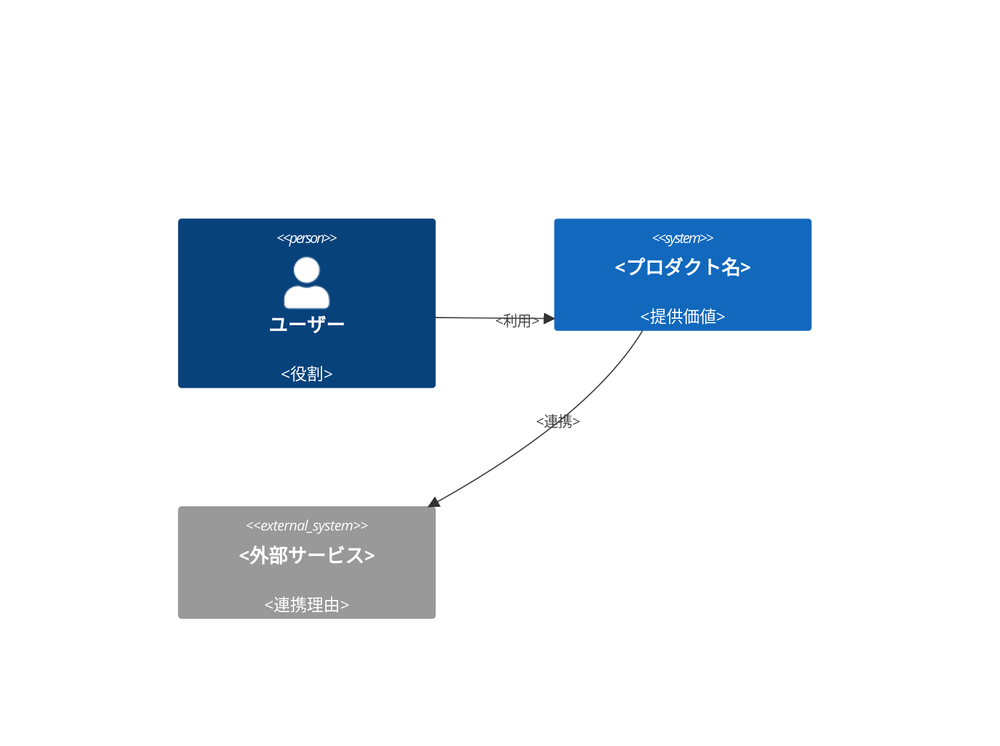
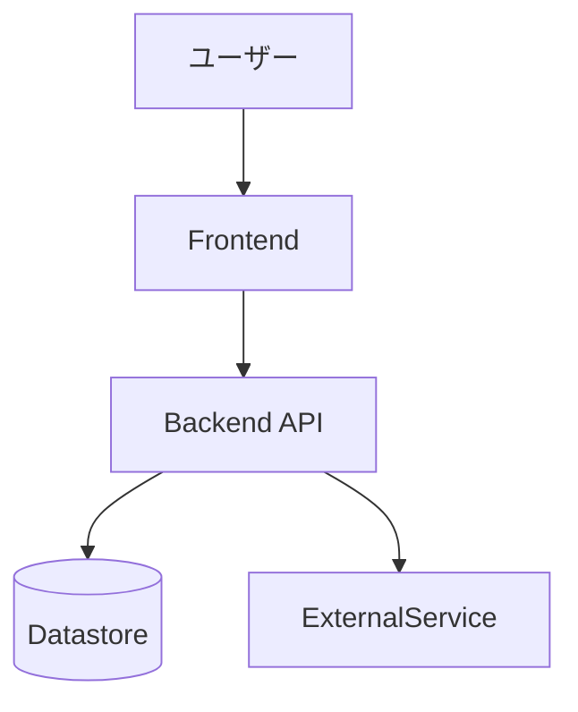
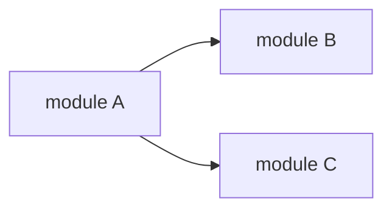

# <プロダクト名> Design Doc

**Document Status:** Draft <!-- Draft | In Review | Approved のいずれか 1 つ -->
**Development Status:** TBD <!-- TBD | In Progress | Done のいずれか 1 つ -->

本 Design Doc は <プロダクト名> の **全体像 (system landscape)** を扱う。Why/What の所在 → Goal → アーキテクチャ概観 → モジュール責務の順に示し、feature 単位の詳細は [design/features/](../features/)、技術規約は [context/](../../context/)、個別判断は [adr/](../../adr/) へ委譲する。

<!--
このファイルは design-doc skill が本テンプレートから生成・更新する。
モード選択 (design-doc skill が判定):
- 分離モード: 下の「## Why / What」節を削除し、「## Related PRD」に PRD.md へのリンクを置く。
- 統合モード: 「## Related PRD」を削除し、「## Why / What」節に PRD 相当の内容を埋める。
どちらの場合も Why/What/How の所在が一意に定まること。
図ルール: 本 doc は C4 L1 (System Context) と L2 (Container) を描く。L3 (Component) は feature doc、Sequence/Flowchart は spec が担う。
-->

## 概要 (Summary)

<!-- レビュー者が数文で「何を・なぜ作るか」を掴めるよう 3〜4 文で要約する。 -->

## Related PRD

- [PRD.md](../../PRD.md)

## Why / What

<!-- 統合モードのときだけ残す。背景・課題・対象ユーザー・提供価値・成功条件・スコープを簡潔に。 -->

### 背景・課題 (Why)

### 提供価値 / 成功条件 (What)

### スコープ

## Goal

<!-- この Design Doc が何を提供するか。-->

## Lower-Priority Goals

<!-- 将来的には提供したいが現バージョンでは優先しないもの。Non Goals (意図的な恒久スコープ外) とは区別する。-->

## Non Goals

<!-- 意図的にスコープ外とするもののみ書く。「この doc では触れない詳細」「他 doc を参照」は Non-Goal ではない (別 doc が担う領域は委譲先リンクで示す)。-->

## Background

### 背景

### 設計上の前提

<!-- 前提用語が多い場合のみ「### 前提用語」を追加する。少数なら本文中で定義する。 -->

## アーキテクチャ概観 (Overview)

システムの全体像を **C4 で 2 段** 示す。詳細コンポーネントは feature doc、内部シーケンスは spec へ委譲する。

### System Context (C4 L1) — 誰が・何のために使うか

<!-- C4Context が GitHub 上で崩れる場合は、上の Container 図と同じ flowchart 記法で代替してよい。 -->

### Container (C4 L2) — 主要な実行単位とデータの流れ

## モジュール責務

各モジュールの責務・境界を示す。依存方向は下図、実装レベルの規約は [context/architecture.md](../../context/architecture.md) を正本とする。

| モジュール | 責務 | 公開境界 | 依存先 |
| ---------- | ---- | -------- | ------ |
|            |      |          |        |

## 詳細の所在 (委譲先)

landscape より下の詳細は以下を正本とする。本 doc には重複させず、抜けと意図的委譲を区別するためリンクのみ置く。

### Feature 設計 (How: feature)

feature 単位の設計 (データ構造・画面・主要シナリオ / フロー) は [design/features/](../features/) を正本とする。

| Feature | 文書 | 状態 |
| ------- | ---- | ---- |
|         |      |      |

### Engineering Context (How: 横断規約)

技術スタック規約・codebase architecture・運用契約は [context/](../../context/) ライブラリを正本とする。プロジェクト固有値は [context/project.yml](../../context/project.yml)。

| トピック                                    | 文書                                                         |
| ------------------------------------------- | ------------------------------------------------------------ |
| package / runtime / state boundary          | [context/architecture.md](../../context/architecture.md)     |
| toolchain・build・scaffold policy           | [context/toolchain.md](../../context/toolchain.md)           |
| root task / shared config / quality gate    | [context/engineering.md](../../context/engineering.md)       |
| test 方針                                   | [context/testing.md](../../context/testing.md)               |
| infra / deployment / environment / security | [context/infrastructure.md](../../context/infrastructure.md) |

### Related ADRs / 代替案 (Why: 判断)

確定した技術判断・却下した代替案は [adr/](../../adr/) を正本とする。本 doc では一覧のみ持つ。

| ADR | 決定 | 関連ドキュメント |
| --- | ---- | ---------------- |
|     |      |                  |

## Open Questions / Future Work

<!-- 未決の論点 (担当者・期限付き) と、今回スコープ外だが将来検討する項目を分けて書く。 -->
