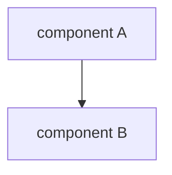
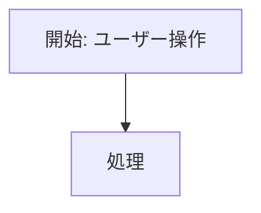

# Feature 設計: <feature 名>

Feature 単位の設計 doc。仕様 (What) をどう実現するか (How) を、データ構造・画面・フロー単位で記述する。責務・範囲・方針の層に留め、ファイル配置・directive・テスト手順などの実装レベルの手順は spec へ委譲する。全体像は [design/DesignDoc.md](../../DesignDoc.md)、横断規約は [context/](../../../context/) を参照する。

**現在の設計だけを書く。** 「なぜそうしたか」「どう変えてきたか」「どの issue で決めたか」は書かず、判断は ADR へ起こしてその場に 1 行参照する (`spec-lifecycle` の `references/spec-contract.md` の正本境界)。

## 背景・要件解釈

- なぜこの feature が必要か (PRD の Why からの落とし込み)。
- 本設計が満たすべき What (要求・成功条件)。

## スコープ

### やること

-

### やらないこと

-

## 設計

### データ構造 / コンテンツモデル

-

### 画面・デザイン

-

### コンポーネント構成 (C4 L3)

feature を構成する主要コンポーネントと依存を示す。全体像 (L1/L2) は [DesignDoc](../../DesignDoc.md)、内部シーケンスは spec へ委譲する。

### フロー / シーケンス

## 主要シナリオ / フロー

アクター視点の使用シナリオ (誰が何を達成するか) を記述する。実装手順 (ファイル配置・directive・テスト手順など) は spec の User Flow / 実装分割へ委譲する。

-

## テスト観点

- 横断規約は [context/testing.md](../../../context/testing.md)。本 feature 固有の観点を記す。
-
